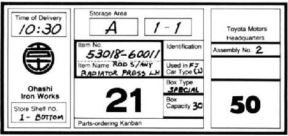

# KANBAN

At this point we are going to talk about KANBAN and some good practices.

## Index
* [Definition of kanban](#definition-of-kanban)
* [Core Properties](#core-properties)
* [Kanban Board](#kanban-board)
* [Iterations](#iterations)
* [Planning](#planning)
* [Optimization and improvement](#optimization-and-improvement)
* [Good habits for Kanban teams](#good-habits-for-kanban-teams)
* [References](#references)

### Definition of Kanban

The Wikipedia's definition of Kanban is:
> Kanban is a method for managing knowledge work with an emphasis on just-in-time delivery while not overloading the team members. In this approach, the process, from definition of a task to its delivery to the customer, is displayed for participants to see. Team members pull work from a queue.

> Kanban in the context of software development can mean a visual process-management system that tells what to produce, when to produce it, and how much to produce - inspired by the Toyota Production System and by Lean manufacturing.

The word kanban comes from the japanese, it means card. The Toyota Production System is based on cards used for control the production system. That cards contains all the information needed for make the pieces needed in each moment.

### Core Properties

There are four Core Properties on Kanban Method:

 1. **Visualize the work**: Make work visible for better management as well as to identify queues and bottlenecks (or personal procrastination on specific tasks).
 2. **Limit the Work in Progress (WIP)**: Increase focus and set priorities, manage overload (keep enough margin). With the right amount of work in progress, the team can be in the flow instead of facing anxiety or boredom.
 3. **Measure and optimize the workflow**: Analyze the workflow to increase productivity and constantly try to improve the smoothness of the flow.
 4. **Make the policies visible and explicit**: All the team member must know the policies defined for the process.

### Kanban Board

The main tool for following the Core Properties of Kanban is the Kanban board. A Kanban board has to represent correctly the workflow of a task or history from the moment of it is conception till the moment that it is completed and delivered.

A Kanban board could bee a phisical board or a collaborative digital one. In both cases we have to maintain some diferent good habits:
* **Keep the Kanban board updated**: The board must represent the actual state of the work.
* ** Show the policies adquired**: The board is good place to visualize the policies committed.
* **Show explicit the Work in progress limit**: In each column must be shown the WIP limit associated with each column.
* **Begin with a simple board**: In the first stadiums of the project it is recommended to use a board as simple as you can. For example:

> | To Do | In Process | Done |
> |:-----:|:----------:|:----:|
> |       |            |      | |

  Then you begin to know what is your workflow you can improve your process and add new columns that represent the workflow more realistic. For example:

> | To Do | Plan | Develop | Test | Deploy | Done|
> |:-----:|:----:|:-------:|:----:|:------:|:---:|
> |       |      | In progress / Done | | | | |

* **Bottlenecks**: The board is the tool used for detect bottleneck. When a task cannot advance in the workflow defined we can have a bottleneck. It is important to pay attention to that kind of tasks and see the opportunity of improve the process.

* **Ready Indicators**: In addition to the visual workflow you can use Indicators to visualize when a task can change to the next state on the workflow.

* **Blocked Indicators**: Equals as the ready indicator you can use another one to visualize when a task is blocked and cannot be done or advance in the workflow.

* **Classes of service**: Its interesant to define diferent class of services depending of the nature of the tasks. It is not the same to resolve a bug or to make a new functionality or a change. Each team must have each own definition of classes of service but you can begin having your task classified within this recommendation:
  * Expedite: Very important task that cannont wait to be done.
  * Fixed delivery date: A task that must be delivered at a fixed time.
  * Standard class: A normal task which describes funciontality and can be estimated.
  * Intangible class: Tasks that cannot be estimated.

* **Policies**: The Kanban board is a good place to visualize your policies defined. You can define general policies but also it is important to define explicit policies for each Class of service.

### Iterations

* In Kanban **there is no iterations**. It's a continuous iteration, and the backlog is feed by demand.
* The increment of the work finished is planned and the funcionality done is released frequently.
* Cause there are no iterations defined, we don't have the common metrics used in other methodologies like Burdown charts, but we can measure the ***cycle time***.

### Planning

* There is no planning meeting defined on Kanban.
* The product backlog must be ordered by priority and value
* When a member of the group is free, he begin with the next Item of the Backlog.
* The backlog is fed by demand.
* The team pull the backlog when need more tasks in which work.
* The estimation of the tasks is done when it is possible and when the task is added to the Kanban board.

### Optimization and improvement

* There is no retrospective meeting planned on Kanban.
* Retrospective is done when the team members detects a problem and see an opportunity to improve the process.

### Good habits for Kanban teams

* Kanban is recommended for Cross teams
* It is recommended that the team is seated together in order to facilitate the communication.
* There are no roles defined in Kanban Method but it is recommended to have:
  * Bussiness or Product Owner
  * Kanban Coach or Agile Coach
* A kanban team is only focused on the work that's actively in progress
*  The team's goal is to reduce the amount of time an issue takes to move through the entire process

### References
* [Wikipedia](http://tinyurl.com/4nrxsk6)
* [Kanban - David J. Anderson](http://www.amazon.es/dp/0984521402)
* [Agile Coaching - Rachel Davies](http://www.amazon.es/dp/1934356433)
