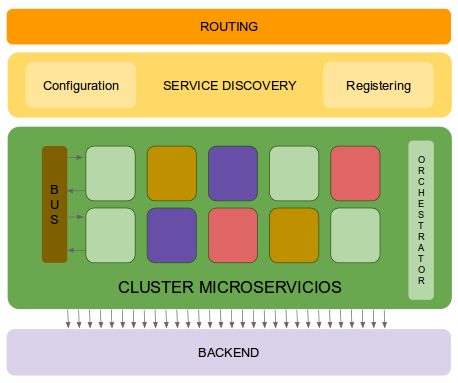
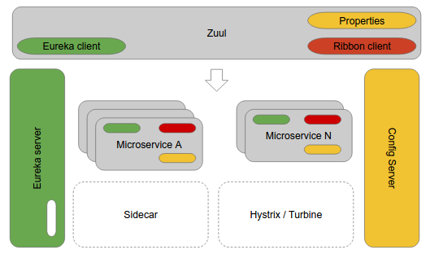
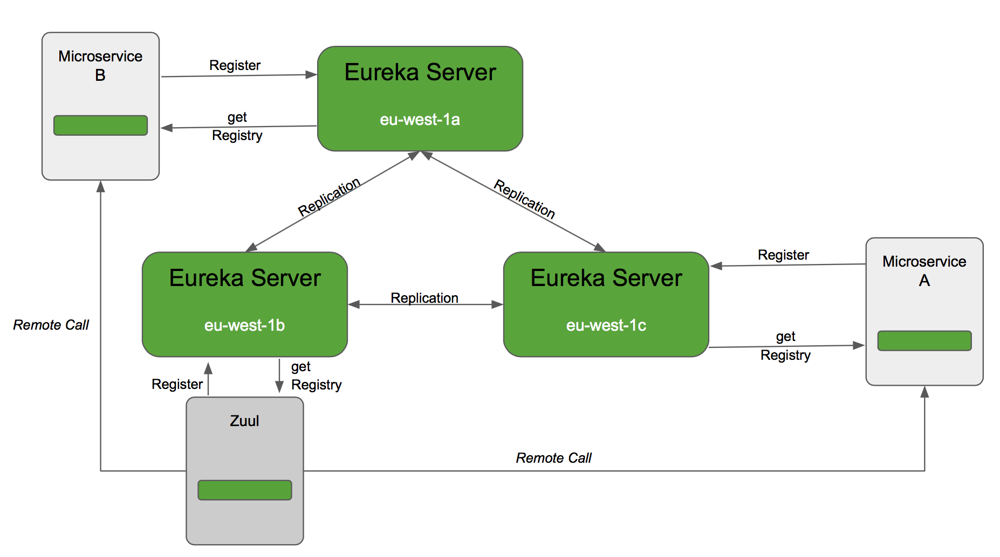
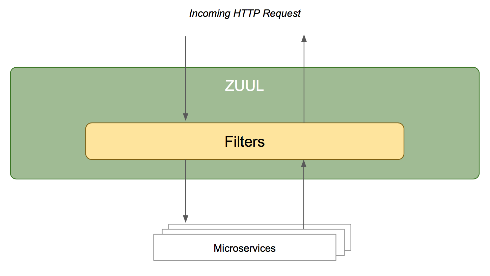
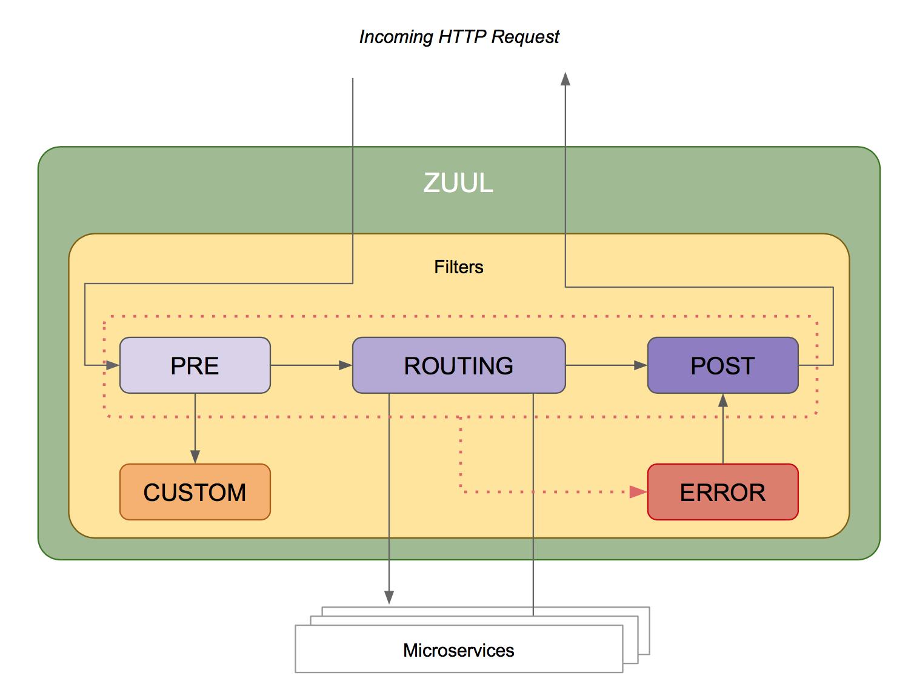
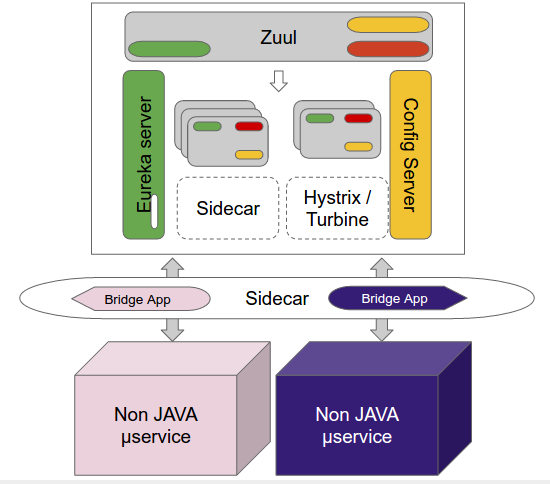
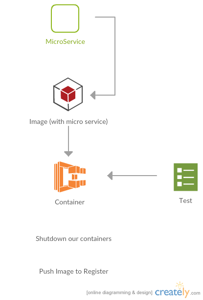

# Microservices Best Practices

This is how we work with Microservices at BEEVA.


## Index

1. [Introduction to microservices](#1-introduction-to-microservices)

2. [Microservice architecture](#2-microservice-architecture)

    2.1. [Overview for a microservice architecture](#21-overview-for-a-microservice-architecture)

    2.2. [Components for a microservice architecture](#22-components-for-a-microservice-architecture)

    2.3. [Communication between microservices](#23-communication-between-microservices)

3. [Microservices with Spring Cloud](#3-microservices-with-spring-cloud)

    3.1. [Introduction](#31-introduction)

    3.2. [Config Server](#32-config-server)

    3.3. [Eureka](#33-eureka)

    3.4. [Zuul](#34-zuul)

    3.5. [Ribbon](#35-ribbon)

    3.6. [Bus](#36-bus)

    3.7. [Sidecar](#37-sidecar)

4. [Using docker to deploy microservices](#4-using-docker-to-deploy-microservices)

5. [A reference architecture for microservices in AWS](#5-a-reference-architecture-for-microservices-in-aws)

6. [References](#6-references)

## 1. Introduction to microservices
---

A microservice is an independent process with a series of characteristics:
- Loosely coupled
- Small logic
- Single purpose
- Deployed independently
- Deployed in an automated way

Applications built with a microservice-oriented architecture have a set of advantages:

- Logic isolated in functional blocks
- Easier maintenance
- Selective deploys without outages
- Easier integration with cloud platforms (for example, fine grained scalation)

This document addresses some of the challenges that arise when using an architecture based on microservices:

- Microservice discovery : how many microservices exist and where are they?
- Central configuration
- Error resiliency and failover

All these challenges are addressed using a good infrastructure, able to orchestrate all existing microservices in our application.

## 2. Microservice architecture
---

"*As small as possible but as big as necessary*"

### 2.1 Overview for a microservice architecture

**Definition**: A software architecture design pattern in which complex applications are composed of small, independent processes communicating with each other using language-agnostic APIs.

#### 2.1.1. Monolithic vs Microservice architecture

|   | Monolithic  | Microservice  |
|---|---|---|
| Architecture  | Built as a single logical executable (typically the server-side part of a three tier client-server-database architecture)  | Built as a suite of small services, each running separately and communicating with lightweight mechanisms  |
| Modularity  | Based on language features  | Based on business capabilities  |
| Agility  | Changes to the system involve building and deploying a new version of the entire application  | Changes can be applied to each service independently  |
| Scaling  | Entire application scaled horizontally behind a load-balancer  | Each service scaled independently when needed  |
| Implementation  | Typically written in one language  | Each service implemented in the language that best fits the need  |
| Maintainability  | Large code base intimidating to new developpers  | Smaller code base easier to manage  |
| Transaction  | ACID  | BASE  |

#### 2.1.2. SOA vs MSA

Service-Oriented Architecture (SOA) sprung up during the first few years of this century, and microservice architecture (MSA) bears a number of similarities. Both types are a way of structuring many related applications to work together, rather than trying to solve all problems in one application. Traditional SOA, however, is a broader framework and can mean a wide variety of things.  Some microservices advocates reject the SOA tag altogether, while others consider microservices to be simply an ideal, refined form of SOA.
 
The typical SOA model usually depends on ESBs while microservices use faster messaging mechanisms. SOA also focuses on imperative programming, whereas microservices architecture focuses on a responsive-actor programming style. Moreover, SOA models tend to have an outsized relational database, while microservices frequently use NoSQL or micro-SQL databases. But the real difference has to do with the architecture methods used to arrive at an integrated set of services in the first place. 
 
Since everything changes in the digital world, agile development techniques that can keep up with the demands of software evolution are invaluable. Most of the practices used in microservices architecture come from developers who have created software applications for large enterprise organizations, and who know that today’s end users expect dynamic yet consistent experiences across a wide range of devices. Scalable, adaptable, modular, and quickly accessible cloud-based applications are in high demand. And this has led many developers to change their approach.

#### 2.1.3. Perks of the microservices approach

##### 2.1.3.1. Complexity

* Scalability and Reliability:

Constrain the size limit of individual cases and allow to have in mind all the behaviors.

Technical debt is kept under control, and the code is thus able to evolve. Go through service calls to communicate with other areas formalizes exchanges.

Interface contracts are then more strict, and it is easier to consider all cases, including cases of errors.

* Horizontal Scalability:

With applications of limited size, it is easier to increase the scalability by refactoring the code or by rewriting it completely based on new requirements.

##### 2.1.3.2. Innovation

* Technological innovation:

Code bases and teams are independent and can therefore make technical choices according to their own needs.

* Business innovation:

If all the information system is structured in services, it is easy to experiment by starting a new project based on others’ data and easier to remove features because it is the whole project that will be deleted.

#### 2.1.4. Requirements and limitations

If microservices architecture has many advantages, it has many requirements and a certain number of limitations.

The microservices being a variation of the classic SOA architecture, we will find the same characteristics, but with an additional level of criticality.

* **The system becomes distributed**

Conventional architectures make it possible to ensure to have independent states between different applications: everyone is the master of his business field.
When switching to microservices, the system becomes widely distributed. This introduces new particularly difficult issues.

The most complicated case is about transactions: each time a transaction is shared between two applications, we must manage transactions in two phases or manage cancellations. In a system based on services, there is no tool that allows to take it into account in an automated way. We must do it manually at each location of the code.

And even when you can bypass transaction: there are always references to cross-application data, and therefore a management system of asynchronous events or cache to be implemented to ensure data consistency.

Then there is the case of external services unavailability. Because using services of another application means to depend on it. The design for failure approach allows to limit risks but require to have a rigorous engineering.

It is also important to master all the service quality (SLA) for different applications in order not to be surprised.

Eventually the system becomes more difficult to test: integration tests increase, and require to prepare the data and be well equipped to test cases of technical and business errors.

* **Value-added services**

Although the REST approach suggests to handle simple features, there is always a proportion of calls with “value-added” that involve multiple business areas.

Regarding microservices, it means dial calls between several applications.

This has the effect of multiplying cases of errors to manage (problem of distributed systems) and adding network latencies.

In the most critical cases, it becomes necessary to add specific services in different applications or add data caches, causing consistency issues.

* **DevOps and provisioning**

Multiply applications means multiply the number of deployments and server instances.

To avoid error and excessive additional costs, we need a very efficient workflow in terms of tools and processes with as much automated deployments as possible. This is even more true for tests and POCs where we want temporary environments as sandbox.

#### 2.1.5. Go / no go

##### 2.1.5.1 Do we need it?

The fundamental SOA approach is to keep control of organisational and business complexity by distributing it.

By separating the projects, the complexity is reduced on some axes in exchange for an extra cost in other places, including having a distributed system.

You can have well organized monolithics, scalable, evolutive…, but it requires strong discipline at all times. Microservices architecture chooses not to take those risks to make sure to keep control.

However, if this is implemented in an unsuitable environment or in a bad way, we will combine disadvantages without enjoying the benefits, and we therefore take much higher risks than in conventional service architecture.

So, do not tell yourself that you need microservices, ask yourself:

* If you have issues that this approach solves
* If you have necessary requirements, or if you are ready to reach them before starting the migration

Only in this case ask yourself this question.

And do not forget that an architecture is a tool that we adapt to our need and not a dogma to follow: if what suits you is a hybrid solution taking some microservices ideas and not others, go for it!

##### 2.1.5.2. How do I go there?

Once decided that a microservices architecture is the right solution, we need to find a way to setting it up.

If there is no magic solution, some approaches seem to emerge.

THE DIFFICULT CASE: FROM SCRATCH

The most attractive situation is to create a new system from scratch, nothing to challenge or to manage, this seems the ideal situation.
Unfortunately, build microservices from scratch is the most difficult case:

* It is complicated to determine, so it seems, the limits where we need to cut out the different projects because it is not clear how the system will evolve.
* As we have already seen, the evolutions are more costly because you have to make cross-project refactoring.

Unless to be already mature on a subject, it is better to go for a monolith approach to begin with.

THE FAVORABLE CASE: PEEL A MONOLITH

The most favorable case is the monolith that we “peel”. In reviewing its organisation and its structure, we will outsource pieces to the edge of the system following the cutting lines that emerged naturally.

The goal is not to end up with 50 mini-projects but rather:

* One or several “core” applications of average size, consistent with each other
* Microservices moving around, which are going to move away with time

This operation is made easier as the initial application is well structured in technical layers, business bricks and that this reorganisation is respected. The best practices of software developments allow to have “microservices-ready” projects. Otherwise, it takes a lot of investigation to extract some parts of the code.

Automated tests are essential to limit risks. In their absence, it is necessary to consider the application as a legacy and use the proper techniques to remove the technical debt.

Before getting into the “cutting” phase, we must examine the data distribution issues: this is the most structural element and can make the operation impossible.

Finally, we must avoid to be dogmatic considering that the operation is necessarily one-sided.

If later, others projects evolution are getting close to each other and more issues arise by separating them than they are solving, we must not hesitate to merge them back. Merge two projects back is not an admission of failure but rather a good sign because it shows that when your business evolves, your information system is able to adapt.

### 2.2 Components for a microservice architecture

#### 2.2.1. How microservice architecture works

How do your services find each other?

A microservices application is a distributed system, the components have to interact with each other in order to achieve a common goal. What is a better way to overcome the challenges in order for one microservice to find another? You have two solutions: service discovery protocol and a centralized router. Both require high availability and scalability. 



* Centralized Router

The centralized router works between the systems, it is actually proxying all the traffic and ensure load balancing. This router exposed externally.

* Service Discovery Protocol

In order to make a request to an API, your code needs to know the network location (IP address and port) of a service instance. In a traditional application running on physical hardware, the network locations of service instances are relatively static. For example, your code can read the network locations from a configuration file that is occasionally updated.

In a modern, cloud-based microservices application, however, this is a much more difficult problem. 

Service instances have dynamically assigned network locations. Moreover, the set of service instances changes dynamically because of auto-scaling, failures, and upgrades. Service discovery is a mechanism which allows for an automatic detection of services offered and directs one service toward the other. 

There are two main service discovery patterns: client-side discovery and server-side discovery. 

#### 2.2.2. Tools and technologies used to build microservice stack

Highly interdependent services requires :

* a very good monitoring flows tool to find out quickly where problems arise
* great operating maturity because it will multiply outages
* a status state available for services consumers so they can understand where outages come from when they have consequences for them

Technology choices happening in every team in a decentralized way, it is easier to make mistakes: The trade-offs between innovation and sustainability are more difficult. Enable innovation to meet new requirements means accepting to make mistakes sometimes.

There is also the risk of neglecting good development practices because there are fewer challenges and risks.

Finally, smaller applications have more often break periods during which there is no evolution to develop, with for instance a  change to TMA mode (Third-Party Application Maintenance). In this case, team members are spread elsewhere and the risk of loss of consciousness is important.

Below is a list of some technologies which are often used in microservice architecture:

* ROUTING: Apache, HAProxy, Zuul, DNS, ELB
* CONFIGURATION: Consul, Zookeeper, Spring Config Server, Etcd
* REGISTRING: Consul, Zookeeper, Eureka, DNS, Registrator
* PACKAGING: Tradicional, Docker
* CONTAINER ORCHESTRATION: Marathon, Kubernetes, ECS
* CLUSTER: Swarm, Kubernetes, ECS
* LANGUAGES: Java, Python, Node.JS

### 2.3 Communication between microservices

Since each part works independently, there is the risk of latency when each piece is brought together. While the whole point of microservices is that they are able to work independently, they need to work together, which can be a repeated challenge. Particularly when many services are making calls to many others, you can have a “dogpile” of information — when one service goes down while the other connecting services don’t have any time-out mechanisms, eventually the entire app will collapse.

#### 2.3.1. Coordination and Dumb Pipes

Let’s take a closer look at what makes something a microservice as opposed to a traditional SOA. Perhaps the most important distinction is side effects. Microservices avoid them because they are based on an older approach: Unix pipes.

Composing small pieces of functionality relies on repeatable results, a standard mechanism for input and output, and an exit code for a program to indicate success or lack thereof.  We know this works from observational evidence, and we also know that a Unix pipe is a “dumb” interface because it has no control statements. The pipe pushs data from A to B, and it’s up to members of the pipeline to decide if the input is unacceptable.

A change in a service may lead to a snowball of dependent changes that must be deployed at the same moment, making changes to a module requires approval of other teams. Pay attention to defining you business capabilities (microservices) in such a manner that autonomy is maximised, it will give you both organisational and technical advantages. 

Services communicate using either synchronous protocols such as HTTP/REST or asynchronous protocols such as AMQP.

#### 2.3.2. Synchronous communication

Synchronous dependencies between services imply that the calling service is blocked and waiting for a response by the called service before continuing it's operation. This is tight coupling, does not scale very well, and the calling service may be impacted by errors in the called service. When necesary measures can be taken but it requires extra effort.

For example a circuit breaker acts like a discovery service, where one microservice realizes another is “sick” and notifies the main circuit breaker. From that point on, a microservice will be able to check the service discovery to determine if the microservice it is connected to is broken in order to prevent calls being made to or from said microservice. 

#### 2.3.3. Aynchronous communication

An other alternative is to use asynchronous communication. In this pattern the calling service simply publishes it's request (or data) and continues with other work (unrelated to this request). The service has a separate thread listening for incoming responses (or data) and processes these when they come in. It is not blocking and waiting for a response after it sent a request, this improves scalability. Problems in another service will not break this service. If other services are temporarily broken the calling service might not be able to complete a process completely, but the calling service is not broken itself. Thus using the asynchronous pattern the services are more decoupled compared to the synchronous pattern and which preserves the autonomy of the service.

## 3. Microservices with Spring Cloud
---

### 3.1 Introduction

Rather than starting from the scratch, we have some reference architectures already working. One of them is the Netflix architecture, that was released as Open Source as part of the Netflix OSS stack.

This architecture has been proven to be a very successful architecture and for this reason Spring decided to wrap its components in a Spring project, called Spring Cloud.

Together with Spring Boot, Spring Cloud offers a really easy way to deploy the infrastructure's core needed for orchestrate a microservice-based application, including:

 - A centralized configuration server
 - A service discovery component (Eureka)
 - A router (Zuul)
 - A load balancer module (Ribbon)

Complemented with some additional components that enhance the features offered:

 - A failover mechanism based on the circuit breaker pattern (Hystrix)
 - A communication bus to send messages to all microservices (Spring Cloud bus)
 - A bridge module to allow polyglot microservices, implemented in programming languages different than Java (Sidecar)

The picture below illustrates a general overview of this architecture:



### 3.2 Config Server

One of the most important orchestration modules is the Config Server. Its main purpose is to centralize the configuration for all microservices using the architecture.

We recommend to use git as source for the properties and to have an optimal file organization, we provide some hints:

- Use an isolated repository for spring cloud components (zuul, eureka)
- Use folders to categorize property files instead of a flat folder for every file
- Use profiles to swap easily between environment configurations.
- Do not duplicate properties, group the common ones and store them in files at the root level
- If you need to use several GIT repositories, associate them to microservice name patterns

Additionally, we recommend to avoid Single Points Of Failure (SPOF) providing several configuration servers behind a load balancer (see section 5 for details).

#### A sample configuration

 A sample configuration file (bootstrap.yml) for a Spring Cloud Config Server is shown below:

 ``` YAML
 spring:
   application:
       name: configsrv
   cloud:
       config:
         server:
           git:
             uri: git@mydomain:mygroup/mydefaultrepository.git
             repos:
               myrepository1:
                 pattern: project1-*
                 uri: git@mydomain:mygroup/myrepository1.git
                 searchPaths: functionality-*
               myrepository2:
                 pattern: project2-*
                 uri: git@mydomain:mygroup/myrepository2.git
                 searchPaths: functionality-*
           defaultLabel: master
 ```

 and the associated file structure for one of the repositories, according to the previous configuration is listed below:

``` java
    application.yml
    application-local.yml
    application-pre.yml
    application-pro.yml
    project1-arbitraryname/functionality-1/microservice1.yml
    project1-arbitraryname/functionality-1/microservice1-local.yml
    project1-arbitraryname/functionality-1/microservice1-pre.yml
    project1-arbitraryname/functionality-1/microservice1-pro.yml
    project2-anotherarbitraryname/functionality-2/microservice2.yml
    project2-anotherarbitraryname/functionality-2/microservice2-local.yml
    project2-anotherarbitraryname/functionality-2/microservice2-pre.yml
    project2-anotherarbitraryname/functionality-2/microservice2-pro.yml
```

> When a microservice with name _microservice1_ starts with profile 'local', it will request to the config server all needed configuration files. According to the configuration above, config server will server the following files:

    - application.yml
    - application-local.yml
    - microservice1.yml
    - microservice1-local.yml


### 3.3 Eureka

Eureka is the module responsible for both service registering and service discovering.

It is divided into two diferent modules:
- Eureka Server
- Eureka Client

#### Eureka Server

It is a REST service that is used for service discovery, load balancing and failover of middle-tier servers. For a complete reference of all Eureka REST operations, see the next link: https://github.com/Netflix/eureka/wiki/Eureka-REST-operations

Eureka Server can be deployed in a Single Instance configuration or (recommended) in a Cluster Configuration.

When Eureka is deployed as a Cluster, all the nodes in the cluster needs to communicate with each other to synchronize their metadata, so when a new microservice registers with one of the Eureka Server nodes, all of the metadata information will be replicated along the cluster. Each Eureka Server node shares the same information for each microservice. To do that, each Eureka Node stores a Registry with the information of each registered microservice. Thereby, each microservice is responsible for providing a heartbeat to let Eureka knows that it is up and running. When some microservice fails in providing this heartbeat signal, it is removed from the registry.

A high level example of a cluster configuration, can be seen below:



Eureka server exposes the information of all of the microservices registered throughout the REST API (`/eureka/apps`) and the Web UI.

Eureka server is included in Spring Cloud as an annotation: @EnableEurekaServer

```java
@SpringBootApplication
@EnableEurekaServer
public class EurekaServer {

    public static void main(String[] args){

        new SpringApplicationBuilder(EurekaServer.class).web(true).run(args);
    }
}
```

Eureka Server Standalone configuration

```YAML
server:
  port: 8761

eureka:
  client:
    registerWithEureka: false
    fetchRegistry: false
  server:
    waitTimeInMsWhenSyncEmpty: 0
  instance:
    leaseRenewalIntervalInSeconds: 30

```

Eureka server AWS configuration

```YAML
server:
  port: 8761

eureka:
  client:
    region: eu-west-1
    preferSameZone: false
    registerWithEureka: true
    fetchRegistry: true
    useDnsForFetchingServiceUrls: true
    eurekaServerDNSName: eureka.internal.com
    eurekaServerPort: 8761
    eurekaServerURLContext: eureka
  server:
    waitTimeInMsWhenSyncEmpty: 0
  instance:
    leaseRenewalIntervalInSeconds: 30
```

#### Eureka Client

It is a Java-based client component that wraps all the neccesary requests up to interact with the REST API from the Eureka Server.

When a microservice wants to register in Eureka Server, it has to provide some metadata information as host and port, health URI, etc...
As mentioned above it has to also provide a heartbeat every 30 seconds to let the cluster knows that is up and running. These 30 seconds can be configured and adapted to the required needs.

This eureka client is included in Spring Cloud as an annotation: @EnableEurekaClient

#### Communication between Eureka Clients And Eureka Servers

The key point to understand the behaviour of Eureka is to know how clients and server communicate with each others.
At this point we have seen a few different actors that are involved in this game:
- Eureka Server
- Eureka Clients
- Ribbon Clients

All of them use different cache mechanisms, so it is interesting to know the different steps that are carried out when a microservice is registered in Eureka Server, and how long it takes this microservice to be avaible to recieve requests.

Both @EnableEurekaServer and @EnableEurekaClient provide an implementation of Eureka Client, along with an implementation of Ribbon Load Balancer. So, even when we are not directly using some of these clients, they are there for us.

```java
@SpringBootApplication
@EnableEurekaClient
public class HelloApplication {

    public static void main(String[] args){

        new SpringApplicationBuilder(HelloApplication.class).run(args);
    }
}
```

Eureka Client AWS Configuration

```YAML
eureka:
  client:
    region: eu-west-1
    preferSameZone: false
    registerWithEureka: true
    fetchRegistry: true
    useDnsForFetchingServiceUrls: true
    eurekaServerDNSName: eureka.internal.com
    eurekaServerPort: 8761
    eurekaServerURLContext: eureka
    initialInstanceInfoReplicationIntervalSeconds: 10
    instanceInfoReplicationIntervalSeconds: 5
    serviceUrl:
      defaultZone: http://eureka.internal.com:8761/eureka
    registryFetchIntervalSeconds: 5
    availabilityZones: 
      default: defaultZone
  instance:
    metadataMap:
      instanceId: ${spring.application.name}:${spring.application.instance_id:${random.value}}
```

##### Step 1: Microservice registration in Eureka Server

When the Microservice starts up it sends the first heartbeat to Eureka Server. At this point, the server still doesn't know anything about the microservice so it sends back a response with the **404** status code. The microservice is forced to be registered so it sends a **new request** containing all the necessary information like host, port, etc...

Now, the microservice is registered in Eureka Server, but it is not available yet to receive incoming requests. The microservice is not ready until it sends the heartbeat again to the server. This sending happens, by default, **30 seconds** after registration, so the microservice will not appear in the Eureka registry and it will not be reachable before this time. This default time can be configured in the microservice eureka client through the property: **`eureka.instance.leaseRenewalIntervalInSeconds`**

##### Step 2: Server Response and Cached Items

It is important to note that Eureka Server mantains a cache containing all the responses sent back to clients, which is refreshed by default every **30 seconds**. So, it can happen that even when the microservice is registered in Eureka Server, it will not appear in the results of the invokation to `/eureka/apps` endpoint right away.

This behaviour can be configured through the property: **`eureka.server.response-cache-update-interval-ms`**

##### Step 3: Client Cache

Each one of the Eureka Client mantains a local cache to avoid to send too many requests to the Server, to fetch the Eureka Registry. By default, this cache is refreshed every **30 seconds**. Again, this can be configured through the property: **`eureka.client.registryFetchIntervalSeconds`**

For example, Zuul (talk about it below) can benefit from this property to early detect new microservice instances.

##### Step 4: Ribbon LoadBalancer Cache

As mentioned above each Spring Cloud microservice has an implementacion of Ribbon LoadBalancer. This ribbon implementation retrieves its information from the local Eureka Client, but it also mantains a local cache to avoid to overload the discovery client in Eureka. As imagined, this property is set by default to **30 seconds**. We can custom this value through the property: **`ribbon.serverListRefreshInterval`**

It is important that these two last properties be in sync so that the different caches be refreshed in the correct order.

> To know more about this interaction between clients and server, there is an open discussion in both [Spring Cloud's Github](https://github.com/spring-cloud/spring-cloud-netflix/issues/373) and [Stackoverflow](http://stackoverflow.com/questions/33921557/understanding-spring-cloud-eureka-server-self-preservation-and-renew-threshold)

### 3.4 Zuul

Zuul is the main entrypoint to the microservice architecture. It is responsible for routing each request to the corresponding microservice. Zuul is built to enable dynamic routing, monitoring, resiliency and security.



As part of the Spring Cloud framework, Zuul has both an **Eureka Client** and a **Ribbon client** built-in implementation. By default, this Ribbon implementation uses a Round Robbin algorithm for routing requests, but this algorithm can be changed and customized based on the needs. For example we can implement a routing algorithm based on the latency of the responses or based on the geographical location of each microservice.

#### Zuul Filter Types

Zuul consists of filters that are responsible for different tasks based on the type of each one of them. These filters are written in Groovy, but Zuul supports any JVM-language.

There are four standard types of filters that are related to the lifecycle of a request (see the diagram below):

- **PRE Filter**: These type of filters are executed before the request arrives at the destination
- **ROUTING Filter**: These type of filters handle routing request to an origin. Here is where **Ribbon Client** acts
- **POST Filter**: These type of filters are executed after the request has been routed to the destination. For example, we can modify some aspects of the response as headers, before sending it back to clients
- **ERROR Filter**: When there an error arises from one of the previous described filters, this type of filter comes into action

There is another type of filter that allows us to create new and **custom** filters that executes explicitly, that is, these filters respond the request by themselves and prevent the request from spreading to the microservices. This behaviour can be useful to define some endpoints for health checking purposes.



> If You want to know more about how Zuul and Filters work, check the official Netflix Github documentation at: [Zuul - How it Works](https://github.com/Netflix/zuul/wiki/How-it-Works)

#### Spring Cloud Zuul Example

Zuul is included in Spring Cloud as an annotation: **@EnableZuulProxy**

```java
@SpringBootApplication
@EnableZuulProxy
public class ZuulServer {

    public static void main(String[] args){
        new SpringApplicationBuilder((ZuulServer.class)).web(true).run(args);
    }
}
```

#### Spring Cloud Zuul Properties Example

```YAML
spring:
    application:
        name: zuul

server:
    port: 8989

eureka:
  client:
    registryFetchIntervalSeconds: 5
    serviceUrl:
      defaultZone: http://localhost:8761/eureka/
  instance:
    leaseRenewalIntervalInSeconds: 5
    healthCheckUrlPath: /health
```

### 3.5 Ribbon

Ribbon is a client side library to communicate microservices, Eureka, Zuul and the rest of the components with each other.

It provides the following features:

- Load Balancing: The main purpose that we are explaning in this guide
- Fault Tolerance: We can reintent some request if something went wrong
- Multiple Protocol (HTTP, TCP, UDP) Async or Reactive
- Caching as mentioned above

As we have seen before, Ribbon is widely used in Zuul, Eureka and Microservices implementation.

An example of a Ribbon configuration for Zuul:

```YAML
zuul:
  ribbon:
    ServerListRefreshInterval: 1000
    ReadTimeout: 20000
    ConnectTimeout: 5000
```

> If you want to know more about Ribbon, check the official Netflix Github documentation at: [Ribbon](https://github.com/Netflix/ribbon)

### 3.6 Bus

Spring Cloud Bus enables communication between nodes in a distributed system throughout a message broker using asynchronous protocols such as AMQP.

In that way, when a microservice wants to send a message to another microservice, it can send it throughout the bus straight to the microservice (all nodes of one microservice as defined in Eureka), or it can broadcast that message to all of the microservices listening in the bus. Each microservice can process the message or ignore it.

Currently there is only one implementation for Spring Bus and is based in an AMQP broker as the transport. By default it uses Rabbit MQ as a `ConnectionFactory`, so we must take care in having Rabbit MQ installed and ready.

To enabled Spring Bus we have to add the dependency `spring-cloud-starter-bus-amqp` and Spring Boot will automatically load the configuration. We can, additionally, configure some parameters as shown:

```YAML
spring:
  rabbitmq:
    addresses: amqp://localhost:5672
```

Or

```YAML
spring:
  rabbitmq:
    host: localhost
    port: 5672
    username: user
    password: secret
```

This kind of communication between microservices is really useful, for example when we want all the microservices to read a new property available in the Config Server. To allow this feature in a Microservice, we have to annotate that microservice with: **@RefreshScope** Spring Cloud annotation.

> If you want to know more about Spring Cloud Bus, check the official Spring Cloud Github documentation at: [Spring Cloud Bus](https://github.com/spring-cloud/spring-cloud-bus)

### 3.7 Sidecar

So far, we have only considered microservices implemented in JAVA programming language. What could I do if we want to build a microservice in a different programming language? the answer is : use the Sidecar module of Spring Cloud, based on Netflix Prana.



A bridge application, hosted in the same machine that the microservice is responsible of communicating the microservice with the Spring Cloud architecture.

We have to enable an endpoint inside our microservice to allow Eureka to monitor and register the microservice into the architecture. For communications in the other direction, the microservice can retrieve information from Spring Cloud via the bridge application.

> http://[bridge_domain]:[bridge_port]/hosts/[serviceId]

But config server will not be accessible this way unless we register it in Zuul (which is not the default behaviour).

#### Example : Bridge Application

Suppose we configure a bridge application in port 10001.

**Application.java**
```java

    package com.demo;

    import org.springframework.boot.SpringApplication;
    import org.springframework.boot.autoconfigure.SpringBootApplication;
    import org.springframework.cloud.netflix.eureka.EnableEurekaClient;
    import org.springframework.cloud.netflix.sidecar.EnableSidecar;

    @SpringBootApplication
    @EnableEurekaClient
    @EnableSidecar
    public class Application
    {
        public static void main( String[] args )
        {
            SpringApplication.run(Application.class, args);
        }

    }

```

**application.yml**
```YAML

    server:
      port: 10001 # Port used by bridge application

    spring:
      application:
        name: microservice-sidecar-bridge # Name that will be registered in eureka for the bridge application

    sidecar:
      port: 3000 # Microservice's port
      health-uri: http://localhost:${sidecar.port}/health # Microservice's heartbeat url
```

#### Example : Microservice in node.js

**app.js**
```javascript

    var express = require('express');
    var bodyParser = require('body-parser');
    var app = express();
    app.use(bodyParser.json());
    app.use(bodyParser.urlencoded({ extended: false }));

    var session = require('express-session');

    // Populates req.session
    app.use(session({
        resave: false,
        saveUninitialized: false,
        secret: 'atomic mouse'
    }));

    var path = require('path');
    var favicon = require('serve-favicon');
    var cookieParser = require('cookie-parser');

    var swig = require('swig');
    var util = require('util');
    var restify = require('restify');

    // App engine
    app.engine('html', swig.renderFile);

    // view engine setup
    app.set('views', path.join(__dirname, 'views'));
    app.set('view engine', 'html');

    app.use(cookieParser());
    app.use(express.static(path.join(__dirname, 'public')));

    var port = 3000;

    // Start server
    app.listen(port);

    // Exports the configuration
    module.exports = {
        app: app,
    };

    //Add routes to detect the enabled endpoints
    require('./routes/index');
```

**/routes/index.js**
```javascript

    var appJs = require('../app.js');

    /* GET home page. */
    appJs.app.route('/').get(function(req, res) {
      res.send("This is the home page of node.js application");
    });

    appJs.app.route('/health').get(function(req,res){
        res.set("Content-Type","application/json");
        res.status(200).send({
            "status":"UP"
        });
    });
```

Assuming that Zuul is started at port 8989 and with name _zuul_, an invocation to the node.js microservice would be possible :

> http://localhost:8989/microservice-sidecar-bridge

and from the node.js microservice, retrieval of information about zuul would be possible through:

> http://localhost:10001/hosts/zuul

## 4. Using docker to deploy microservices
---

Docker is all about making it easier to create, deploy, and run applications by using containers. Containers allow a developer to package up an application with all of the parts it needs, such as libraries and other dependencies, and ship it all out as one package. By doing so, thanks to the container, the developer can rest assured that the application will run on any other Linux machine regardless of any customized settings that machine might have that could differ from the machine used for writing and testing the code.

In a way, Docker is a bit like a virtual machine. But unlike a virtual machine, rather than creating a whole virtual operating system, Docker allows applications to use the same Linux kernel as the system that they're running on and only requires applications be shipped with things not already running on the host computer. This gives a significant performance boost and reduces the size of the application.

### 4.1 Images
An image is an inert, immutable, file that's essentially a snapshot of a container. Images are created with the build command, and they'll produce a container when started with run. Images are stored in a Docker registry such as registry.hub.docker.com. Because they can become quite large, images are designed to be composed of layers of other images, allowing a miminal amount of data to be sent when transferring images over the network.

#### Create and image with your build tool

 In order for Java developers to test their applications in containers they typically have to build their code, create an image and run a container. You can use the Docker command line interface to manage images and containers.
There are actually several Maven plugins for Docker.  A [rhuss/docker-maven-plugin](https://github.com/rhuss/docker-maven-plugin)  simple configuration for this task

```xml
<plugin>
  <groupId>org.jolokia</groupId>
  <artifactId>docker-maven-plugin</artifactId>
  <version>0.13.4</version>
  <configuration>
    <images>
      <image>
        <names>simple-service-app</names>
        <alias></alias>
        <build>
          <assembly>                  
        <mode>dir</mode>              
            <basedir>${basedir}/target</basedir>
            <dockerFileDir>${basedir}/target</dockerfileFDir>
          </assembly>  
         </build>
         <run>
           <ports>
             <port>8080:8080</port>
             <port>433:433</port> 
          </ports>
         </run>
       </image>
     </images>
   </configuration>
</plugin>

```
With this plugin you can configure run expecific docker commands an tune different docker settings as logs, tags, names... even execute commands. 
We can add inside <image> tag a <cmd> where we can execute commands to run our app
```
<cmd>
    <shell>java -jar /maven/${project.build.finalName}.jar server /maven/docker-config.yml</shell>
</cmd>    
```

#### Execute Goals

With the plugin you can build images and run containers and also easily remove these again which is especially important in the iterative development phase.

Build image:
> mvn docker:build

Run container:
> mvn docker:start

Stop and remove container:
> mvn docker:stop

Remove image:
> mvn -Ddocker.removeAll docker:remove

### 4.2 Containers

With a programming metaphor, if an image is a class, then a container is an instance of a class—a runtime object. They are lightweight and portable encapsulations of an environment in which to run applications.

### 4.3 DockerFile
Each Dockerfile is a script, composed of various commands (instructions) and arguments listed successively to automatically perform actions on a base image in order to create (or form) a new one. They are used for organizing things and greatly help with deployments by simplifying the process start-to-finish.

Dockerfiles begin with defining an image FROM which the build process starts. Followed by various other methods, commands and arguments (or conditions), in return, provide a new image which is to be used for creating docker containers.

A docker file looks like 

```
#
# Oracle Java 8 Dockerfile
#
# https://github.com/dockerfile/java
# https://github.com/dockerfile/java/tree/master/oracle-java8
#

# Pull base image.
FROM dockerfile/ubuntu

# Install Java.
RUN \
  echo oracle-java8-installer shared/accepted-oracle-license-v1-1 select true | debconf-set-selections && \
  add-apt-repository -y ppa:webupd8team/java && \
  apt-get update && \
  apt-get install -y oracle-java8-installer && \
  rm -rf /var/lib/apt/lists/* && \
  rm -rf /var/cache/oracle-jdk8-installer


# Define working directory.
WORKDIR /data

# Define commonly used JAVA_HOME variable
ENV JAVA_HOME /usr/lib/jvm/java-8-oracle

# Define default command.
CMD ["bash"]
```
### 4.4 continuous integration
One option to release a docker image inside our software process is :

#### Link
Linking allows containers to exchange information (like IPs or ports) without exposing them on the host system. Fortunately, the docker-maven-plugin allows us to comfortably link containers together. The only thing we have to do is to add an element in the <run> block of our microservice image configuration.
```
<image>
    <alias>mongodb</alias>
    <name>mongo:2.6.11</name>
    <run>
        <namingStrategy>alias</namingStrategy>
        <cmd>--smallfiles</cmd>
        <wait>
            <log>waiting for connections on port</log>
            <time>10000</time>
        </wait>
        <log>
            <prefix>MongoDB</prefix>
            <color>yellow</color>
        </log>
    </run>
</image>


<run>
    ...
    <links>
        <link>mongodb:db</link>
    </links>
</run>
```
#### Deploy
```
<execution>
    <id>push-to-docker-registry</id>
    <phase>deploy</phase>
    <goals>
        <goal>push</goal>
    </goals>
</execution>
```
 
> mvn -Ddocker.username=<username> -Ddocker.password=<password> deploy

To push your image to your own registry instead of Docker Hub just set the docker.registry.name property. Let’s assume your docker registry runs on your local machine on port 5000:
> <docker.registry.name>localhost:5000/</docker.registry.name>


## 6. References
---

* [Introduction to Microservices](https://www.nginx.com/blog/introduction-to-microservices/) 
* [Wikipedia](https://en.wikipedia.org/wiki/Microservices) 
* [Spring Cloud Project Website](http://projects.spring.io/spring-cloud/)
* [Spring Boot](http://projects.spring.io/spring-boot/)
* [How we ended up with microservices](http://philcalcado.com/2015/09/08/how_we_ended_up_with_microservices.html) 
* [Microservices. The good, the bad and the ugly](http://sanderhoogendoorn.com/blog/index.php/microservices-the-good-the-bad-and-the-ugly/) 
* [Monolith First](http://martinfowler.com/bliki/MonolithFirst.html) 
* [Xebia Blog](http://blog.xebia.com/) 

___

[BEEVA](http://www.beeva.com) | 2016
