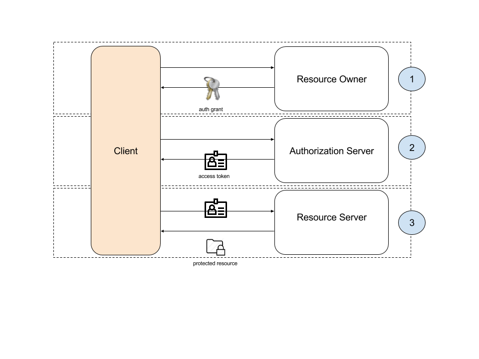

# REST Best Practices
At this point we're going to talk about...

[Replace this logo] 

## Index

* [Introduction](#rest-introduction)
* [URL construction](#url-construction)
* [Operations over resources](#operations-over-resources)
* [Status codes](#status-codes)
* [Payload formatting](#payload-formatting)
* [Filters](#filters)
* [Pagination](#pagination)
* [HATEOAS](#hateoas)
* [API Versioning](#api-versioning)
* [API throughput restrictions](api-throughput-restrictions)
* [OAuth](#oauth)
* [Errors](#errors)
* [Status and Health endpoints](#status-and-health-endpoints)
* [References](#references)

## Introduction
---

## URL Construction
---

## Operations over resources
---

## Status codes
---

## Payload formatting
---

## Filters
---

## Pagination
---

## HATEOAS
---

## API Versioning
---

## API throughput restrictions
---

## OAuth
---

### Introduction

The OAuth authorization framework enables a third-party application to obtain limited access to an HTTP service, either on behalf of a resource owner by orchestrating an approval interaction between the resource owner and the HTTP service, or by allowing the third-party application to obtain access on its own behalf.

This is a very brief introduction, please refer to [OAuth RFC 6749](https://tools.ietf.org/html/rfc6749) for a detailed documentation.

### Roles

It is very important to know the involved roles for the sake of this section understanding:

OAuth defines four roles:

   * resource owner : An entity capable of granting access to a protected resource. When the resource owner is a person, it is referred to as an end-user.
   * resource server : The server hosting the protected resources, capable of accepting and responding to protected resource requests using access tokens.
   * client : An application making protected resource requests on behalf of the resource owner and with its authorization.  The term "client" does not imply any particular implementation characteristics (e.g., whether the application executes on a server, a desktop, or other devices).
   * authorization server : The server issuing access tokens to the client after successfully authenticating the resource owner and obtaining authorization. The authorization server may be the same server as the resource server or a separate entity. A single authorization server may issue access tokens accepted by multiple resource servers.

### OAuth Authentication Flow

The image below describes the authentication flow (usually referred as OAuth handshake or negotiation).

We can observe 3 separated blocks in this negotiation:

1. **Authorization request to access protected resources from a resource owner**, there are several granting types to use, see references for further details

> We recommend to delegate this authorization process to an authorization server, but it could be handled directly by the resource owner

2. **Access token request**, using the authorization grant obtained in the previous step the client obtains a valid OAuth access token
3. **Retrieval of protected resources**, using OAuth access token obtained in previous step

This scenario can be referred as **3-legged OAuth**. There is a special case when resource owner and client is the same entity, this is called **2-legged OAuth** because there is no need of authorization request from resource owner.

### Scopes

Access tokens are associated to a set of scopes that represent permissions on how and which resources are available for a given token. We recommend to carefully define a rich set of scopes that enable a fine grained set of permissions to restrict client's access and operations to protected resources.

### Token expiration and refresh

Access tokens should have an expiration time defined. It is not a good practice to allow a token to last forever. If a client need to extend the expiration time, a "refresh token" endpoint should be available. In this case, in step 2 of protocol flow a refresh token is provided along with the access token. This refresh token should be used by the client for refreshing the expiration time of a token. See RFC for further details.

### Caching access tokens

A good practice to avoid an unnecesary traffic overhead to the authorization server is to enable caching in clients. This access token will not change until expires.

### Use of TLS/SSL

Client credentials should never travel as plain text without using SSL on requests. This way credentials are protected from eavesdropping and man-in-the-middle attacks.

However, even with the use of TLS/SSL credentials could be sent to the wrong server using OAuth 2.0 - either by misconfiguration or because the server has been compromised. If this is critical for us, maybe the credentials should not travel as plain text, but signed. This sacrifices complexity over protocol requests for a higher security.

### Examples

Below is a list of sample implementations of OAuth 2.0:

* [Google APIs](https://developers.google.com/identity/protocols/OAuth2)
* [Twitter APIs](https://dev.twitter.com/oauth/overview/introduction)

## Errors
---

## Status and Health endpoints
---

## References
---

* [OAuth RFC 6749] (https://tools.ietf.org/html/rfc6749) OAuth RFC 6749 defined by IETF

___

[BEEVA](http://www.beeva.com) | 2015
