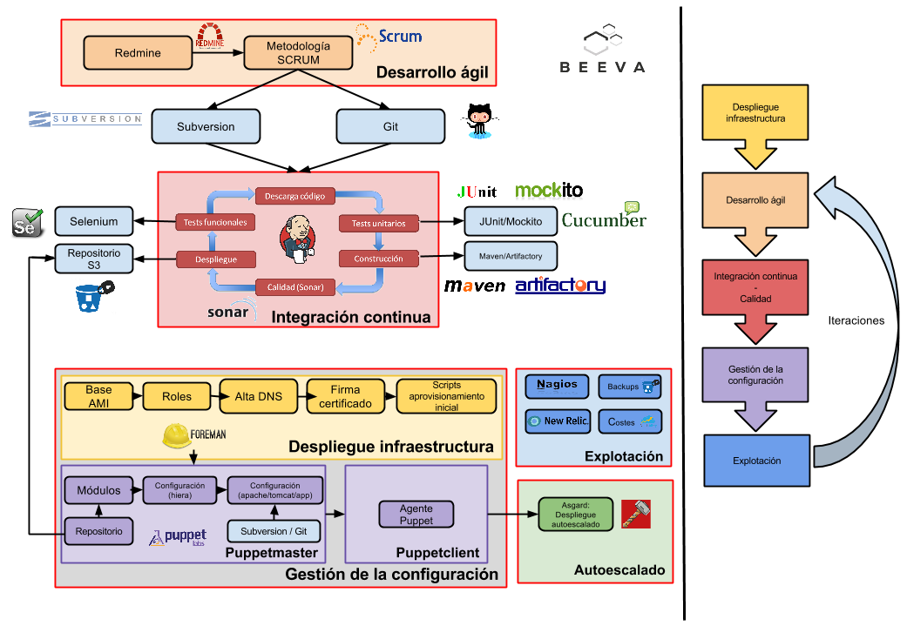
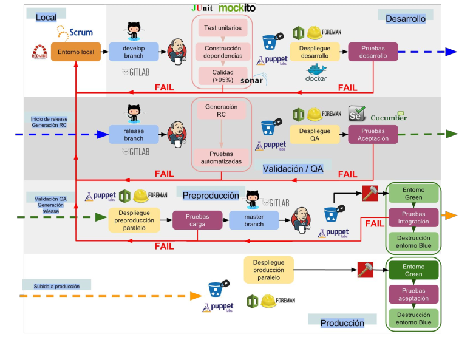
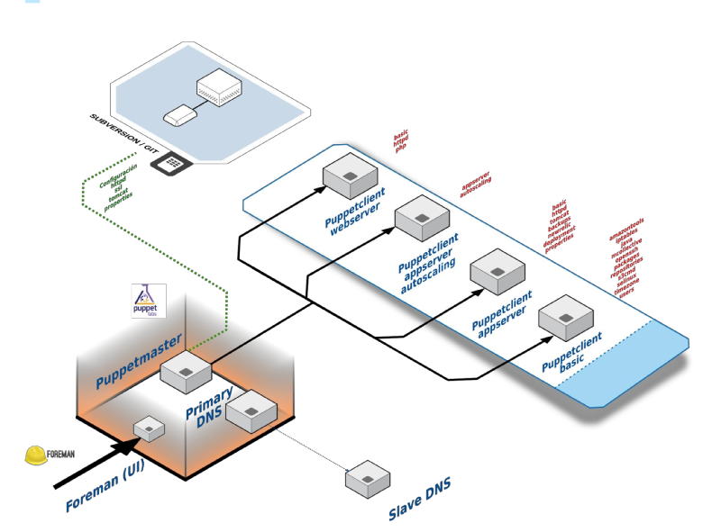
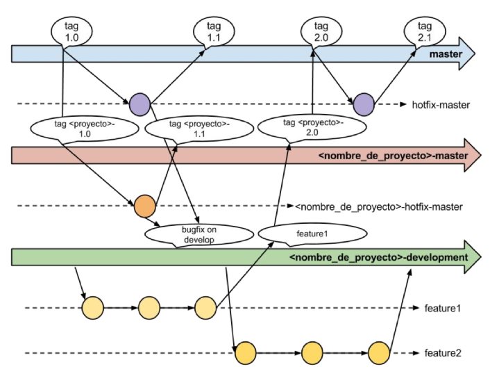
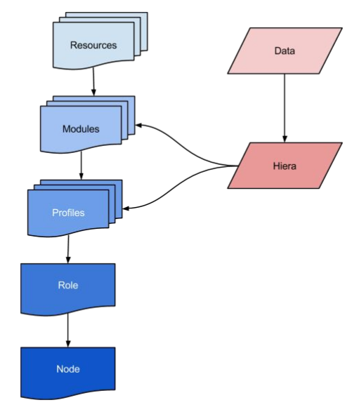

# Configuration Management

Configuration Management is the set of processes that are used to ensure proper operation of the Informational Systems as they were previously defined, in an automated and repeatable way.

Using CM we will be able to keep versioned changes that we make in our infrastructure and applications to automatically transfer this changes between environments quickly and safely.

To do this work, there are a variety of tools available which facilitate the task of managing the lifecycle of the infrastructure, both physical and virtual (eg,  [TheForeman](www.theforeman.org)), and tools for automating software and services installation and configuration (eg, [Puppet](puppetlabs.com)).


# Index

* [Objectives](#objectives)
* [Architecture, technologies and tools](#)
	* [Puppet](#puppet)
	* [Foreman](#foreman)
	* [r10k](#r10k)
	* [Cloudformation](#cloudformation)
	* [Yafct](#yafct)
* [Preparing the environment](#preparing-the-environment)
	* [Puppet Modules](#puppet-modules)
		* [Proposed architecture](#proposed-architecture)
		* [Git workflow](#git-workflow)
		* [Roles and Profiles](#roles-and-profiles)
	* [Dynamic environments r10k](#dynamic-environments-r10k)
		* [Puppetfile](#puppetfile)
		* [Hieradata](#hieradata)
			* [When to use hiera](#when-to-use-hiera)
			* [Interpolation of variables in hiera](#interpolation-of-variables-in-hiera)
	* [Hiera Encryption](#hiera-encryption)
		* [Introduction and purpose](#introduction-and-purpose)
		* [Creating Puppetmaster keys and Hiera configuration](#creating-puppetmaster-keys-and-hiera-configuration)
		* [Eyaml files process encryption](#eyaml-files-process-encryption)
			* [Password encryption](#password-encryption)
			* [File encryption](#file-encryption)
			* [Application properties encryption](#application-properties-encryption)
	* [Deployment of static files](#deployment-of-static-files)
		* [Installation and purpose](#installation-and-purpose)
	* [Example Hiera hierarchy](#example-hiera-hierarchy)
* [Foreman Stack creation](#foreman-stack-creation)
	* [Extra definitions](#extra-definitions)
	* [Hostgroups (runlist)](#hostgroups-runlist)
	* [Hosts (runlist)](#hosts-runlist)
		* [Templates](#templates)
		* [Init Script](#init-script)
* [Puppet Module Documentation](#puppet-module-documentation)


## Objectives

This document aims at make a complete description of the continuous delivery architecture used in BEEVA projects, from the provisioning stage of infrastructure to the tasks configuration in the continuous integration, passing through the configuration management processes.


## Architecture, technologies and tools

Next you can see a resume of the proposed architecture of continuous delivery:



This work philosophy bets for communication between all the teams involved, extending the reach of the traditional agile development to other fields like quality and exploitation, developing intelligent systems that can evolve easily in time.

Since the main difference of this method is the quick adaptation to changes, it starts deploying the infrastructure in parallel at the very first stages of development. In order to do that, it uses the infrastructure as code paradigm, where it involves the use of the infrastructure like one more piece of code. In this stage it makes use of Cloudformation, a modified version of Yactf (foreman-python), Foreman and Puppet.

In the develop stage, it uses SCRUM as methodology, encouraging the  evolutive iterative development in small Sprints coordinated by Redmine.

All the code is pushed to Subversion or Git repositories to keep a ordenated version control system and improve the traceability of changes.

For this document it's supposed that, in new projects, starting from a Git configured project following the standard defined in the Open Platform *Software Management* document:

[https://docs.google.com/a/bbva.com/document/d/1g2dpCixAczQ66S3cgLfDq0I4l_sE5nSkhzkVv9wdtos/edit?usp=sharing](https://docs.google.com/a/bbva.com/document/d/1g2dpCixAczQ66S3cgLfDq0I4l_sE5nSkhzkVv9wdtos/edit?usp=sharing)

Every time a sprint ends it makes use of continuous integration tools like Jenkins and quality assurance (unit tests, Cucumber, Sonar, Selenium) for building the project.

For deploying to the different environments doing it from a orchestrated way and minimizing the human error, the applications are independents from environment and they get packet in a common repository to all environments.

So, in the configuration management stage, it uses Puppet to the application deploying and the configurations related to that machine in an automated way in the architecture. The system is ready to rollback applications or packages that contain some error and, with tools like Asgard can be changed between different versions without any loss of service.

In parallel it uses different exploitation tools to monitoring the platform (New Relic and Nagios), as well as backups in S3.

All the process iterates so many times as necessary, and some task are simultaneously executed, decreasing the project time delivery and favoring the error detection at first develop stages.

The continuous delivery flow resumes in the next picture:



Detailed resume of every stage:

[https://docs.google.com/presentation/d/1RD6PimpW1QatzY1bz2rLhCgJOrZjN6fRJagZ0GHXnLE/edit#slide=id.g98d42a7a0_0_48](https://docs.google.com/presentation/d/1RD6PimpW1QatzY1bz2rLhCgJOrZjN6fRJagZ0GHXnLE/edit#slide=id.g98d42a7a0_0_48)

Below there is a list of basic information technologies used in the process.


### Puppet

Puppet is a configuration system management based in Ruby that allows, using a easy declarative language, to describe the desired configuration in a server.

One of the main features is the idempotency (making multiple identical requests has the same effect as making a single request), that although it applies a Puppet catalog, no changes are done if the system don't requires them. To do that it defines a final state, desired state, and the resources abstraction layer is in charge of translating the necessary orders according the used system.

More information:

[http://puppetlabs.com/] (http://puppetlabs.com/)


### Foreman

It's a Opensource project developed by Red Hat, as an orchestration graphic interface of instances, very integrated with Puppet services. It allows multicloud deploying instances and a very useful API Rest to interact with the system.

More information

[http://theforeman.org/] (http://theforeman.org)

### r10k

The most used system for deploying dynamic environments with Puppet is based in resolving the different versions of each module in a easy Puppetfile archive. To do that, it has a git repository for the r10k files, and a repository for each of the created modules.

More information

[http://garylarizza.com/blog/2014/18/puppet-workflow-part3/] (http://garylarizza.com/blog/2014/18/puppet-workflow-part3/)

### Cloudformation

The Amazon Web Services  JSON templates system for infrastructure deploying allows to deploy all type of resources, although Foreman will be used to deploy instances.

More information
[http://aws.amazon.com/es/cloudfront/] (http://aws.amazon.com/es/cloudfront/)

### Yafct
Templates system based in YAML, JSON and Python for Foreman. It has been needed to modify the code, hosted in GitHub, to extend the functionality of the component and adapt it to the proposed standard.

More information
[https://github.com/ITV/YAFCT] (https://github.com/ITV/YAFCT)

## Preparing the environment

Starting from the great documentation supplied by a PuppetLabs engineer about building a correct workflow for Puppet working. This work method is the standard to work with Puppet complex environments:

[http://garylarizza.com/blog/2014/02/17/puppet-workflow-part-1/](http://garylarizza.com/blog/2014/02/17/puppet-workflow-part-1/)

[http://garylarizza.com/blog/2014/02/17/puppet-workflow-part-2/](http://garylarizza.com/blog/2014/02/17/puppet-workflow-part-2/)

[http://garylarizza.com/blog/2014/02/18/puppet-workflow-part-3/](http://garylarizza.com/blog/2014/02/18/puppet-workflow-part-3/)

[http://garylarizza.com/blog/2014/03/07/puppet-workflow-part-3b/](http://garylarizza.com/blog/2014/03/07/puppet-workflow-part-3b/)

[http://garylarizza.com/blog/2014/10/24/puppet-workflows-4-using-hiera-in-anger/](http://garylarizza.com/blog/2014/10/24/puppet-workflows-4-using-hiera-in-anger/)

[http://garylarizza.com/blog/2014/03/26/random-r10k-workflow-ideas/](http://garylarizza.com/blog/2014/03/26/random-r10k-workflow-ideas/)


It is recommended to watch the half and hour video about the work flow previously mentioned, with a very complete presentation:

[https://puppetlabs.com/presentations/workshop-doing-refactor-dance-making-your-puppet-modules-more-modular-gary-larizza](https://puppetlabs.com/presentations/workshop-doing-refactor-dance-making-your-puppet-modules-more-modular-gary-larizza)

### Puppet Modules

#### Proposed architecture



For configuration management, in general, it start from a Puppetmaster server, the certifier authority, the primary DNS and the user interface provided by Foreman, as well as PuppetDB and MCollective. If the infrastructure is big enough, it's possible to create multiple Puppetmasters  communicated with primary Foreman through a smart-proxy.

In addition, it is used a secondary DNS (has to be specified, joined to an Amazon DNS, in the DCHP Option Sets of the AWS VPC) and the Puppet modules taken from Git through r10k.

It is being considered to migrate the DNS to Route53 if AWS is used.

Puppet Modules has been created for most of the necessary actions in a typical infrastructure creation. Besides, thanks to r10k (watch specific section) it is possible to resolv extern modules from PuppetForce. Amongst the developed modules, available in git.beeva.com, are:

_amazontools:_ the amazontools module installation

_autoscaling:_ installation and configuration of the autoscaling start script 

_backups:_ backups configuration (Databases and code)

_crontab:_ cron tasks configuration

_deployment:_ application deploying (developing)

_factertags:_ Facter tags creation to consultation from Foreman

_httpd:_ Apache installation and configuration. VirtualHost, SSL, httpd.conf.

_iptables:_ Iptables configuration.

_java:_ Java installation and configuration.

_mcollective:_ Mcollective installation and configuration.

_mysql:_ Installation and configuration.

_nagios:_ Installation an configuration of the Nagios server and plugins  (developing).

_newrelic:_ Installation and configuration of the NewRelic agent (server and java)

_nsupdate:_ systems date.

_openssh:_ Installation an configuration.

_packages:_ Installation packages Interface.

_repositories:_ Install a personalized repository in s3

_role:_ Define the instances role.

_s3cmd:_ Installation and configuration

_selinux:_ Configuration.

_sshkey:_ Configuration of  SSH keys for users.

_stdlib:_ Puppet additional library.

_sudoers:_ Configuration of  privileged users permissions.

_timezone:_ System timezone.

_tomcat:_ installation and configuration.

_users:_ system users configuration.

_vcsdeploy:_ Additional module to deploy SVN or git files.

_properties:_ Deploy of Properties files for java, PHP and nodejs (developing) files.


#### Git workflow

The proposed workflow for each module, to encourage the use in different projects without influence their productive environments is the following (although it is recommended to use the _develop_ notation instead of _development_ notation, more standard, for developing environments)




Since there are a lot of projects using each module and parallel developing can happen, _it is proposed that the master branch has not be used in any productive environment_ and  be a place where add the new features that each project includes, in relation to create generic modules.

In this way, any new project that requires starting to use the Puppet modules will know from what timeline it must start, downloading a concrete tag from master.

It will be created a stable version tag in master (for example 1.0) and, if bugs are found that need to be fixed they will be fixed tagging the new version like 1.1 (in a finite branch to *hotfix*)

When certain projects insert new features, a merge request will be made to add the changes to the master branch, changing the version to 2.0.

For each of the projects, there will be two infinite timelines, following a similar schema to the [proposed] (http://nvie.com/posts/a-successful-git-branching-model/)

``
<project_name>-master (for example openp-master)
<project_name>-master (for example openp-develop)

``
Can be created infinite parallel branches to isolate each new feature if parallel developments exists, integrating the new feature to the ``<name_project>-develop branch.``

Once developed the corresponding features to specified development sprint and tested their correct behavior, they will be merged in the 
````
<project_name>-master, tagging with the name 
<project_name>-<version_number>
````

When one change become interesting for the global main branch, it will requested to merge and changes will be integrated in a new main branch tag.

The next picture shows the work proposed in various projects (for example, Genoa and OpenPlatform). Each tag corresponding to a master version of a project will be integrated into the global master version and the rest of the projects can integrate into their development branch (dotted arrow).

Notice again the use of development name, instead of develop, to refer to development branch. To approach more to the git standard programming it is recommended to use the name _develop_ when possible.

![Branches] (static/branch2.png "Branches")

#### Roles and Profiles

Complementary documentation:

[http://www.craigdunn.org/2012/05/239/](http://www.craigdunn.org/2012/05/239/)
[http://garylarizza.com/blog/2014/02/17/puppet-workflow-part-2/](http://garylarizza.com/blog/2014/02/17/puppet-workflow-part-2/)
[http://puppetlabs.com/presentations/designing-puppet-rolesprofiles-pattern](http://puppetlabs.com/presentations/designing-puppet-rolesprofiles-pattern)




Image based in http://www.craigdunn.org/2012/05/239/


When a Puppet module is developed is necessary try to abstract from its dependencies to get it independent and can be shared with others modules when they change version or technology.

For example, if in one project implementation we want to install tomcat and, to do that, a module can be programmed dependent on  the repositories, on the java to be installed in the machine and apache to shield the security.

The most intuitive way (_but no recommended_) is the next one:
```
class tomcat (
$parameter = undef,
...
){
include '::repositories'
include '::users'
include '::java'
include '::httpd'
include '::tomcat::install'
include '::tomcat::config'
include '::tomcat::service'

case $tomcat ::ensure  {
   present:  {
      Class ['::repositories'] ->
      Class ['::users'] ->
      Class ['::java'] ->
      Class ['::tomcat::install'] ->
      Class ['::tomcat::config'] ~>
      Class ['::tomcat::service'] ->
      Class ['::tomcat']
   }
...
  }
}
```

As can be observed, with this criterion the problem is creating unnecessary external dependencies and it forces to keep controlled the versions of the modules. What happens if it's needed to change httpd for nginx? It is necessary to change the tomcat module too, affecting other environments still using httpd. To avoid scenarios like that the roles and profiles systems is used.

In this system dependencies of every module are isolated, that only the necessary for this concrete module is configured. For example, in the tomcat previous example:

````
class tomcat(
   $parameter = undef,
){

include '::tomcat::install'
include '::tomcat::config'
include '::tomcat::service'

case $::tomcat::ensure  {

 present: {
   Class [ '::tomcat::install' ] ->
   Class [ '::tomcat::config' ] ~>
   Class [ '::tomcat::service' ] ->
   Class [ '::tomcat' ]
   }
 }
}
````

Notice that the dependencies to other services have been extracted, so only the sub-modules that install and configure tomcat are called.

But then, following this system, How can the dependencies with other modules be specified? Through roles and profiles.

*Profiles*

The dependencies implementation between environments and the entering of values is realized in a new module called profile. It is a Puppet module (like the tomcat one, apache and others) that reflects _the particular implementation of project dependencies_ needed to deploy.

For example, if all the machines in certain environment will have some included classes by default, it is possible to create a profile like the next:

````
class profiles::base  {

 $u_repo  = hiera_hash( 'repositories::repos::install::u_repo' )
 $u_hash  = hiera_hash( 'users::u_name' )

 include '::awscli'
 include '::factertags'
 include '::groups'
 include '::iptables'
 include '::java'
 include '::mcollective'
 include '::ntp'
 include '::openssh'
 include '::packages'
 include '::puppet_agent'
 include '::repositories'
 include '::selinux'
 include '::sudoers_roles'
 include '::timezone'

 Yumrepo  <| |> -> Package ​ <| |>

 class  { ':: users ':
   u_name => $u_hash ,
 }
}

````

As can be observed in the previous example the profile level is _where the specific lookups to hiera are made, the particular implementation of a system and and the module depedencies.  
Using the hiera_hash allows concadenate values of this variable in all the values of the hiera hierarchy._

For example, for the a profile implementation that configures tomcat can be used:

````
class profiles::tomcat  {
   include '::repositories'
   include '::java'
   include '::httpd'
   include '::tomcat'

   $user_hash = hiera_hash( 'users::u_name' )

   if $user_hash [tomcat][username] == 'tomcat' and
   $user_hash [tomcat][ ensure ] == 'present'  {

      User ['tomcat' ] -> 
      Class [ '::tomcat' ]

}
 else {
   notify { "Verify the tomcat user state.
      Username: ${user_hash[tomcat][username]}
      | Ensure: ${user_hash[tomcat][ensure]}":  }
 }
}
````

In that easy way it has become independent the module from the modules and necessary order, and set abstracted to a superior level, the profiles one. If, for example, now it's desired to change httpd by nginx a new profile can be create that changes the httpd class, or modify the tomcat profile without affecting the tomcat module.

What profiles purpose is that the code of a concrete module can be shared with others without sharing details of this particular module implementation within the organization, while the profile contains this particular implementation inside a project or organization.

_The general recommendation is that the profile respond to certain technology (tomcat, java, jenkins, httpd, etc) and they contain the necessary implementation to work a defined function inside the project. All the hiera references must been in the profile layer, so a concrete module can work with or without installed hiera._

If a defined project requires a different implementation it is possible to create a sub-classe that creates this function starting from the main profile (or create a new one).

For example, to deploy a java application in certain project can be used something like the next, starting on main profiles (note the sub-clase clienapi in profiles::_clientapi_::deploy_java_app):

````
class profiles::clientapi::deploy_java_app  {
   $java_properties = hiera_hash( 'app_properties::java' )
   $java_apps = hiera_hash( 'app_to_deploy::java' )
   $tomcat_project_name  = hiera( 'tomcat::project_name' )
   $properties_owner  = hiera( 'properties::owner' )
   $properties_group  = hiera( 'properties::group' )
   $properties_dir_mode  = hiera( 'properties::properties_dir_mode' )
   $first = { tag => 'first'  }
   $last = { tag => 'last'  }
  
   include '::profiles::clientapi::base'
   include '::profiles::tomcat'

   file{ "/var/properties/":
      ensure => directory,
      owner => $properties_owner ,
      group => $properties_group ,
      mode => $properties_properties_dir_mode ,
   }  

   create_resources( ::profiles::properties, $java_properties , $first )
   create_resources( ::profiles::java_app , $java_apps , $last )

   Class [ '::profiles::tomcat' ] -> 
   File [ "/var/properties/" ] ->
   File [ "/etc/init.d/${tomcat_project_name}" ] ->
   Package <| tag == 'first' |> ~> Service  [ 'tomcat' ] -> Package  <| tag == 'last'  |> ->
   Class [ '::profiles::clientapi::deploy_java_app' ]
}
````

*Roles*

The last level of abstraction are the roles, that simply agglutinate in a Puppet module different profiles. _Every instance has one Role (and only one). If one instance is equal to another but slightly different a new role will be created that reflects the state_ with the different profiles. In this level no new data is inserted, only includes to profiles and, at most, order dependencies.

For example, for the role clientapi-portal:

````
class roles::clientapi::clientapi-portal  {
   include '::profiles::clientapi::base'
   include '::profiles::clientapi::monitoring'
   include '::profiles::clientapi::nodejs'
   include '::profiles::clientapi::deploy_java_app'
}
````

In Foreman (or the used ENC) simply will be needed to specify a associate class to every machine: the appropiate role one.

Thanks to this method it's easy to search a fail when it happens, following the next process:

1. Search the associated role to the instance.

2. Check what profiles includes.

3. In the failed profile, check all the data coming from hiera and the included classes called.

4. Browse through the hiera hierarchy until arrive to the data that are being applied.

5. Go down to the code level corresponding to the module.

### Dynamic environments r10k

With the proposed system it is provided a independent git repository with a workflow separated by Puppet module. It is necessary a system that allows to specify what version of every module will deploy in a specified environment.

The dynamic way of environment management is made through the r10k tool. Installing it with the following command:

````
[root@foremandv ~]# gem install r10k
````

R10k will be used to manage the Puppet modules and the configuration files in each of the environments.

To do that it is necessary to use the dynamic environments property, that Puppet as Hiera, provide in his configuration files. This a so used feature that Puppet has included by default, deprecating this configuration style from Version 3.6 of Puppet.

[https://github.com/adrienthebo/r10k/blob/master/doc/dynamic-environments/master-configuration.mkd](https://github.com/adrienthebo/r10k/blob/master/doc/dynamic-environments/master-configuration.mkd)


The configuration file is found in /etc/r10k.yaml and will contain the following information:

````
[root@foremandev ~]# cat /etc/r10k.yaml
   ---
   :cachedir: '/var/cache/r10k'
   :sources:
      :puppet:
         remote: 'git@gitlab.beeva.com:puppet/r10kpuppetfile.git'
         basedir: '/etc/puppet/environments'
      :hiera:
         remote: 'git@gitlab.beeva.com:hiera/r10khieradata.git'
         basedir: '/var/lib/hiera'
````

_Is important to know that all environment or configuration file not directly configured to operate with r10k will be erased form the system, consecuently is recommended to backup in starting from a configured environment._

As you can check in the previous configured file, it must been created a repository for the r10k module configurations and another for the hiera data. It's possible to configure all in a unique repository, but it is convenient to divide code and data.

#### Puppetfile

Since that can be incompatibilities between different versions of two modules, it is proposed using a master repository for the dependency managament of the modules.

Created a repository so-called r10kpuppetfile that only contains a file, named Puppetfile. This file, used for the r10k program, contains all the module dependencies and versions that will be used for creating the Puppetmaster environment.

Each branch inside this repository matches one environment that can be deployed in the Puppetmaster, with references to all the Puppet modules that this environment contains and his versions. Also the own git modules, can be used Puppetlabs modules through the the external dependencies.

The Puppetfile file for an environment take the following configurations:

````
# track master
mod 'filemapper',
   :git => 'git://github.com/adrienthebo/puppet-filemapper.git'

# Install the filemapper module and track the 1.1.x branch
mod 'filemapper',
   :git => 'git://github.com/adrienthebo/puppet-filemapper.git',
   :ref => '1.1.x'

# Install filemapper and use the 1.1.1 tag
mod 'filemapper',
   :git => 'git://github.com/adrienthebo/puppet-filemapper.git',
   :ref => '1.1.1'

# Install filemapper and use a specific git commit
mod 'filemapper',
   :git => 'git://github.com/adrienthebo/puppet-filemapper.git',
   :ref => 'ec2a06d287f744e324cca4e4c8dd65c38bc996e2'
````

The previous code shows the options to reference the code desired for these module, according the branch name, a regular expression for a versioned tag or a concrete commit.

The name of the branches will be the deployed environment in the Puppetmaster. As a suggestion, it is proposed to use a branch for the development version and, to no affect the productive environments, a branch for each minor version that will be deployed:
````
master (global Puppetfile, not used in any productive environment)
<project1>_<environment>_<version>
  openp_develop
  openp_pro_3_4_0
  openp_pro_3_5_0
<project2>_>environment>_<version>
  genoa_develop
  genoa_pro_1_0_0
````
As a general rule, dots can't be used to separate versions, since that files will be deployed as folders inside Puppetmaster and Puppet will not understand them. It is recommended to use underscore characters to separate versions-

In the module references it is not necessary to all the Puppetfile modules target the development module versions, only when its necesary. The only recommended rule is not to pull pre and pro files targeting to branch no being a tag in the master project.

For example, a Puppetfile for a development environment example can be:

````
#############################################
#
#
r10k Puppetfile clientapi_development
#
#############################################

forge "http://forge.puppetlabs.com"

mod "adagios_client",
   :git => "git@gitlab.beeva.com:puppet/adagios_client.git",
   :ref => 'genoa-1.0'

mod "amazontools",
   :git => "git@gitlab.beeva.com:puppet/amazontools.git",
   :ref => 'genoa-1.0'

mod "autoscaling",
   :git => "git@gitlab.beeva.com:puppet/autoscaling.git",
   :ref => 'genoa-1.3'

mod "awscli",
   :git => "git@gitlab.beeva.com:puppet/awscli.git",
   :ref => 'openp-1.0'

mod "crontab",
   :git => "git@gitlab.beeva.com:puppet/crontab.git",
   :ref => 'baas-1.0'

mod "backups",
   :git => "git@gitlab.beeva.com:puppet/backups.git",
   :ref => 'genoa-1.0'

mod "elasticsearch",
   :git => "git@gitlab.beeva.com:puppet/elasticsearch.git",
   :ref => 'openp-1.0'

mod "factertags",
   :git => "git@gitlab.beeva.com:puppet/factertags.git",
   :ref => 'openp-development'

mod "groups",
   :git => "git@gitlab.beeva.com:puppet/puppet_groups.git",
   :ref => 'genoa-1.0'

mod "logagent",
   :git => "git@gitlab.beeva.com:puppet/genoa-logagent.git",
   :ref => 'genoa-1.0'

mod "java",
   :git => "git@gitlab.beeva.com:puppet/java.git",
   :ref => 'openp-1.0'

mod "iptables",
   :git => "git@gitlab.beeva.com:puppet/iptables.git",
   :ref => 'openp-1.0'

mod "httpd",
   :git => "git@gitlab.beeva.com:puppet/httpd.git",
   :ref => 'openp-develop'

mod "liferay",
   :git => "git@gitlab.beeva.com:puppet/liferay.git",
   :ref => 'genoa-1.0'

mod "logrotate",
   :git => "git@gitlab.beeva.com:puppet/logrotate.git",
   :ref => 'genoa-1.0'

mod "logstash",
   :git => "git@gitlab.beeva.com:puppet/logstash.git",
   :ref => 'openp-1.0'

mod "memcached",
   :git => "git@gitlab.beeva.com:puppet/memcached.git",
   :ref => 'genoa-1.0'

mod "mcollective",
   :git => "git@gitlab.beeva.com:puppet/mcollective.git",
   :ref => 'openp-1.0'

mod "mongodb",
   :git => "git@gitlab.beeva.com:puppet/mongodb.git",
   :ref => 'openp-1.0'

mod "newrelic",
   :git => "git@gitlab.beeva.com:puppet/newrelic.git",
   :ref => 'genoa-1.0'

mod "nodejs",
   :git => "git@gitlab.beeva.com:puppet/nodejs.git",
   :ref => 'opencustomer-1.4'

mod "ntpd",
   :git => "git@gitlab.beeva.com:puppet/ntpd.git",
   :ref => 'genoa-1.0'

mod "openssh",
   :git => "git@gitlab.beeva.com:puppet/openssh.git",
   :ref => 'genoa-1.0'

mod "packages",
   :git => "git@gitlab.beeva.com:puppet/packages.git",
   :ref => 'genoa-1.0'

mod "profiles",
   :git => "git@gitlab.beeva.com:puppet/profiles.git",
   :ref => 'develop'

mod "properties",
   :git => "git@gitlab.beeva.com:puppet/properties.git",
   :ref => 'openp-1.2'

mod "puppet_agent",
   :git => "git@gitlab.beeva.com:puppet/puppet_agent.git",
   :ref => 'genoa-1.0'

mod "redis",
   :git => "git@gitlab.beeva.com:puppet/redis.git",
   :ref => 'openp-1.1'

mod "repositories",
   :git => "git@gitlab.beeva.com:puppet/repositories.git",
   :ref => 'openp-1.1'

mod "roles",
   :git => "git@gitlab.beeva.com:puppet/roles.git",
   :ref => 'develop'

mod "security_layer",
   :git => "git@gitlab.beeva.com:puppet/security_layer.git",
   :ref => 'openp-1.0'

mod "selinux",
   :git => "git@gitlab.beeva.com:puppet/selinux.git",
   :ref => 'openp-1.0'

mod "sudoers_roles",
   :git => "git@gitlab.beeva.com:puppet/sudoers_roles.git",
   :ref => 'genoa-1.0'

mod "timezone",
   :git => "git@gitlab.beeva.com:puppet/timezone.git",
   :ref => 'openp-1.0'

mod "tomcat",
   :git => "git@gitlab.beeva.com:puppet/tomcat.git",
   :ref => 'openp-develop'

mod "users",
   :git => "git@gitlab.beeva.com:puppet/puppet_users.git",
   :ref => 'genoa-1.1'

mod "theforeman/concat_native", "1.3.0"

mod "puppetlabs/stdlib", "3.2.1"

mod "puppetlabs/ntp", "3.0.3"


````

Note that all modules are configured with a tag (like openp-1.0 or genoa-1.1) and, those in what a new feature is being developed, change the develop branch (like httpd, tomcat, roles or profiles). When deploying this environment all will be like in the productive environment (modules from tag) except those desired modules to be changed, and launched from other branches.

Among others advantages this system is useful to integrate new features and branches developed by other teams in a true dynamic environment that allows easily set dependencies and test new features.

Finally, in last lines there are references to modules (and their corresponding version) no corresponding to the private developed modules. That system is perfect too for integrate extern modules from Puppetforge in the project.

To see available modules it is recommended going to:

[https://forge.puppetlabs.com/](https://forge.puppetlabs.com/)

#### Hieradata

To have a truly dynamic working it integrates the Hiera data too through r10k. Following the recommended best practices by Puppetlabs engineers, an additional repository is created that contains the Hiera data for each of the Puppet environments. To be this system compatible with the proposed workflow _the branch names of r10khieradata repositories and the r10kpuppetfile must be equals._

In this document it is considered the following hiera hierarchy in the Puppetmaster:

````
[root@foremandev ~]# cat /etc/puppet/hiera.yaml
­­­ 
---
:backends: 
  ­- eyaml 
  ­- yaml 
  ­- file 
:hierarchy: 
# EYAML and YAML CONFIGURATIONS 
  ­- “%{::app_tier}/%{::hostname}” 
  ­- “%{::app_tier}/%{::fqdn}” 
  ­- “%{::app_tier}/%{::rol}/%{::version}” 
  ­- “%{::app_tier}/%{::rol}” 
  ­- “%{::app_tier}/%{::proyecto}” 
  ­- “%{::app_tier}/common” 
 
# HIERA­FILE CONFIGURATIONS 
  ­ - “%{::hostname}” 
  ­ - “%{::fqdn}” 
  ­ - “%{::rol}/%{::version}” 
  ­ - “%{::rol}” 
  ­ - “%{::proyecto}” 
 
# COMMON CONFIGS SUCH AS VATS 
  ­-  common 
 
 
:eyaml: 
  :datadir: "/var/lib/hiera/%{::environment}" 
  :pkcs7_private_key: /etc/puppet/secure/keys/foremandev_private_key.pkcs7.pem 
  :pkcs7_public_key:  /etc/puppet/secure/keys/foremandev_public_key.pkcs7.pem 
 
:yaml: 
 :datadir: "/var/lib/hiera/%{::environment}" 
 
:file: 
  :datadir: "/var/lib/hiera/%{::environment}/%{::app_tier}/files/%{calling_module}" 
  :interpolate: false 
 
:logger: console 

  ````

In the next paragraphs topics like the different configured backends will be discussed, but at this point is important to differentiate between the variables %{::environment} and %{::app_tier}.

The environments, %{::environment} are the corresponding to the Puppet developed modules, and to the referencies that r10k has in the Puppetfile to deploy the dependencies between modules for a specified environment. For example, the preproduction and production environments need to have the same Puppet modules code, so it is defined the environment ``$environment = openp_master_3_7_0``

With this system it is assured that the version in the Puppet modules code is the desired. However, even though preproduction and production must be equals in a code level, the same does not hold in the corresponding data of the environment (users, passwords, certificates and permissions).
To establish this difference the variable %{::app_tier} is used, that matches the application environment that will be deployed (for example dev, pre, pro, qa, etc).

For further in this design decision it is a recommended lecture:

[http://garylarizza.com/blog/2014/03/26/random-r10k-workflow-ideas/](http://garylarizza.com/blog/2014/03/26/random-r10k-workflow-ideas/)

As a quick reference the variable %{::environment} serve to referencing **Puppet environments** while the variable %{::app_tier} serves as an **internal environment**, that references the application environment.

Thanks that method, Puppet code and used data for a specified application are separated, even though the corresponding code can be deployed to a version with the r10k method.

The environment is managed from ENC (foreman), but to be executed the Puppet agent the first time and the instance know the app_tier who belongs to, a fact extern must be configured with that variable or executing the command with the following parameter:
```
FACTER_app_tier=dev puppet agent --test (--noop)
```
The notation ```FACTER_<variable>``` generates an environment variable with the value ``<variable>`` through the facter.

In the sections 3.3 and 3.4 it is explained in the used backends over and above of yaml, to encrypt sensitive content (hiera-eyaml) and deploying environment independent static files (hiera-file).

It is possible to know a value of a parameter inside the hierarchy executing a command from the Puppetmaster. To do that it is necessary a symbolic link between /etc/hiera.yaml (the file reads hiera by default from the CLI) and /etc/puppet/hiera.yaml, where it is defined the hierarchy that Puppet will use. In this way, it is possible to know the parameter value thorugh the described syntax in:

[https://docs.puppetlabs.com/hiera/1/command_line.html](https://docs.puppetlabs.com/hiera/1/command_line.html)

In example, to extract the machine variable factertags::environment with hostname dev-genoa-ccenter in environment genoa_development in app_tier dev:

````
[root@foremandev ~]# hiera 'factertags::entorno' ::environment=genoa_development ::hostname=dev-genoa-ccenter ::app_tier=dev -d
DEBUG: Mon Feb 09 09:30:49 +0100 2015: [eyaml_backend]: Hiera eYAML backend starting
DEBUG: Mon Feb 09 09:30:49 +0100 2015: [eyaml_backend]: Set option: datadir = /var/lib/hiera/genoa_development/dev
DEBUG: Mon Feb 09 09:30:49 +0100 2015: [eyaml_backend]: Setoption:pkcs7_public_key= /etc/puppet/secure/keys/foremandev_public_key.pkcs7.pem
DEBUG: Mon Feb0909:30:49+01002015:[eyaml_backend]:Setoption:pkcs7_private_key= /etc/puppet/secure/keys/foremandev_private_key.pkcs7.pem
DEBUG: Mon Feb 09 09:30:49 +0100 2015: [eyaml_backend]: Lookingupfactertags::entorno in eYAML backend
DEBUG: Mon Feb 09 09:30:49 +0100 2015: [eyaml_backend]: Looking for data source dev-genoa-ccenter
DEBUG: Mon Feb 09 09:30:49 +0100 2015: [eyaml_backend]: Found factertags::entorno in dev-genoa-ccenter
DEBUG: Mon Feb 09 09:30:49 +0100 2015: [eyaml_backend]: Set option: datadir =/var/lib/hiera/genoa_development/dev
DEBUG: Mon Feb 09 09:30:49 +0100 2015: [eyaml_backend]: Setoption:pkcs7_public_key=/etc/puppet/secure/keys/foremandev_public_key.pkcs7.pem
DEBUG: Mon Feb0909:30:49+01002015:[eyaml_backend]:Setoption:pkcs7_private_key=/etc/puppet/secure/keys/foremandev_private_key.pkcs7.pem
DEBUG: Mon Feb 09 09:30:49 +0100 2015: [eyaml_backend]: Lookingupfacter_envineYAML backend
DEBUG: Mon Feb 09 09:30:49 +0100 2015: [eyaml_backend]: Looking for data source dev-genoa-ccenter
DEBUG: Mon Feb 09 09:30:49 +0100 2015: [eyaml_backend]: Looking for data source common
DEBUG: Mon Feb 09 09:30:49 +0100 2015: Cannot find datafile /var/lib/hiera/genoa_development/dev/common.eyaml, skipping
DEBUG: Mon Feb 09 09:30:49 +0100 2015: Hiera YAML backend starting
DEBUG: Mon Feb 09 09:30:49 +0100 2015: Looking up facter_env in YAML backend
DEBUG: Mon Feb 09 09:30:49 +0100 2015: Looking for data source dev-genoa-ccenter
DEBUG: Mon Feb 09 09:30:49 +0100 2015: Cannot find /var/lib/hiera/genoa_development/dev/dev-genoa-ccenter.yaml, skipping
DEBUG: Mon Feb 09 09:30:49 +0100 2015: Looking for data source common
DEBUG: Mon Feb 09 09:30:49 +0100 2015: Found facter_env in common openp_dev

````

##### When to use hiera?

Starting from the document http://garylarizza.com/blog/2013/12/08/when-to-hiera/ in the roles an profiles section it proposes:

1. Do not use hiera in the roles
2. To use hiera in the profiles to get the profile specific logic data.
3. The data no specific to the business logic (default ports, default routes, etc) can be included in the module and be overwriten by hiera at profile level.


This brings important benefits:

* Searches to hiera rely in a class that abstracts the data outside the modules that form the profile.
* Parameters containing specific business data are set hierarched in hiera.
* Data not specific to he business are outside the module (for example with a params class)
* Profiles and roles can be included with the "include" function, so there are no duplicity in declarations.
* Modules do not contain any specific business logic, so they are portables.

##### Interpolation of variables in hiera

**Note: This system does not work correctly in Puppet 3.3, to review when upgrade to Puppet 4.**

To make the variables interpolation work in Hiera it is necessary to use a version above 1.3 (to check it is possible to use the command hiera --version).

````
###################################################### HIERA VARIABLES
hiera_version: '1.0.7'
hiera_env: 'openp_dev'
hiera_apptier: 'dev'
hiera_project: 'genoa'
hiera_foreman: 'foremandev.devopenp.com'
hiera_s3_bucket: 'openp-genoa-dev-eu-west-1'
interpolated_variable: ‘value’
````

To reference this variables use this format:
```
     anothervariable: %{hiera('interpolated_variable')}
```
It is recommended that global variable starts with ````hiera_<name>```` so it will be easier to know where it comes from in a error case.

Thanks that interpolation method it is possible to define variables repeated in one place of the configuration file and reference them in the rest of the hierarchy. It is recommended that the hiera configuration file to have the modules ordered alphabetically for a easier reading, the global variables will be set as first section in the file.

If possible, to changing the value easily, the interpolated variable will be set in the lower hierarchy level (for example, in common.yaml), and will be overwriten in the upper level if necessary.

When refering from other file, it will be used the assigned section to global variables to point which are being used , and what level of hierarchy.
```
################################################################# HIERA VARIABLES
# Global variables used from common.yaml:
# - hiera_project
# - hiera_env
# - hiera_version
# - hiera_apptier
```


---
### Hiera Encryption

Certain information stored in Hiera is sensitive information. This information should not be stored in clear, so it is interesting to explore some encryption mechanisms to securize such data.

#### Introduction and purpose

Eyaml library provides a backend for Hiera which provides an encryption method for sensible the information stored in Hiera.

Eyaml is a ruby gem which can be easily installed via terminal.

```bash
$ gem install hiera-eyaml
```

#### Creating Puppetmaster keys and Hiera configuration

Once the gem has been installed, create a new keypair launching:

```bash
$ eyaml createkeys
```

This command creates a new keypair in the default location, which should be */etc/puppet/secure/keys*. Each Puppetmaster should have its own keypair, so it's advisable to rename the files in order to match the name of that Puppetmaster.

To be able to edit already encrypted files, it requires the following config file.

```
$ cat /etc/eyaml/config.yaml

  pkcs7_private_key: '/etc/puppet/secure/keys/foremandev_private_key.pkcs7.pem'
  pkcs7_public_key:  '/etc/puppet/secure/keys/foremandev_public_key.pkcs7.pem'

```

In order to use eyaml backend, we must change the following file and restart the Puppetmaster (the following hierarchy is proposal, but could change depending on concrete system)

```
$ cat /etc/puppet/hiera.yaml
---
:backends:
  - eyaml
  - yaml
  - file
:hierarchy:
  - %{::hostname}
  - %{::fqdn}
  - %{::rol}/%{::version}
  - %{::rol}
  - %{::proyecto}
  - common

:eyaml:
  :datadir: "/var/lib/hiera/%{::environment}/%{::app_tier}"
  :pkcs7_private_key: /etc/puppet/secure/keys/foremandev_private_key.pkcs7.pem
  :pkcs7_public_key:  /etc/puppet/secure/keys/foremandev_public_key.pkcs7.pem

:yaml:
  :datadir: "/var/lib/hiera/%{::environment}/%{::app_tier}"

:file:
  :datadir: "/var/lib/hiera/%{::environment}/%{::app_tier}/files/%{calling_module}"

:logger: console
```

#### Eyaml files process encryption

One of the objectives of this process is that each individual Puppetmaster owns its own cypher keys, so no other Puppetmaster could decrypt those files.

To encrypt the content of yaml files and the Puppetmaster be able to decrypt those files, it's necessary to copy the public Puppetmaster key locally and create a config file.

```
$ cat ~/.eyaml/config_foremandev.yaml
---
pkcs7_public_key: '~/.eyaml/keys/foremandev_public_key.pkcs7.pem'
```

First, it is needed to export the environment variable EYAML_CONFIG, refering the configuration file used to perform the encryption.

```
$ export EYAML_CONFIG=/home/javier/.eyaml/config_foremandev.yaml
```

From that moment, eyaml can be used as follows

##### Password encryption

```
$ eyaml encrypt -p
[hiera-eyaml-core] Loaded config from /home/javier/.eyaml/config_foremandev.yaml
Enter password: ****
string: ENC[PKCS7,MIIBeQYJKoZIhvcNAQcDoIIBajCCAWYCAQAxggEhMIIBHQIBADAFMAACAQAwDQYJKoZIhvcNAQEBBQAEggEArUq53WZzWwhCveNujzECRmhumHQ7i3NtPIaHBF0oXc35II4l5r4RezH5InHnmvnignjFfZMkxq9K5L4DKAKUyWYoGcRcjcLiZ5QLgM4CmCn0+73xobHHyGoRRFLp8jEW9OQ9RlFFTSV5VikgJdvFgBH5j9eIIJgldUPSPV0aVkhEOzccYJnd6UiJXKYeDESkJiH3wNAKUDZXUo9PIAS5atwEEZ8MDv3wDtanvyL3ZtBqyXb2BspdZTWMdO2WrNHlMxZJoZ60jSUqKH6bK/Ks9LavJS3rqwWBBiC84Q9EFyTaqCNTcvCQfdlqA8wRWsL/JGx+tsXWTaWCsfLnWzi/TjA8BgkqhkiG9w0BBwEwHQYJYIZIAWUDBAEqBBC2DnixWHy2i0950mmwKifCgBCyNfMt0vEe2Adsx/2ls1Wb]

OR

block: >
	ENC[PKCS7,MIIBeQYJKoZIhvcNAQcDoIIBajCCAWYCAQAxggEhMIIBHQIBADAFMAACAQAw
	DQYJKoZIhvcNAQEBBQAEggEArUq53WZzWwhCveNujzECRmhumHQ7i3NtPIaH
	BF0oXc35II4l5r4RezH5InHnmvnignjFfZMkxq9K5L4DKAKUyWYoGcRcjcLi
	Z5QLgM4CmCn0+73xobHHyGoRRFLp8jEW9OQ9RlFFTSV5VikgJdvFgBH5j9eI
	IJgldUPSPV0aVkhEOzccYJnd6UiJXKYeDESkJiH3wNAKUDZXUo9PIAS5atwE
	EZ8MDv3wDtanvyL3ZtBqyXb2BspdZTWMdO2WrNHlMxZJoZ60jSUqKH6bK/Ks
	9LavJS3rqwWBBiC84Q9EFyTaqCNTcvCQfdlqA8wRWsL/JGx+tsXWTaWCsfLn
	Wzi/TjA8BgkqhkiG9w0BBwEwHQYJYIZIAWUDBAEqBBC2DnixWHy2i0950mmw
	KifCgBCyNfMt0vEe2Adsx/2ls1Wb]
```

This command shows the config file from which the content is encrypted  and prompts the user for the password. Command's output is the string to be put into the hiera eyaml.

This way, passwords are encrypted by environment, can be versioned safely and only the corresponding puppetmaster can decipher it.

When the content is copied into the eyaml file, the parameters string or block must be replaced (for readability, block parameter used to be the preferred option) by the parameter name which will be queried from puppet's manifests.

##### File encryption

Hiera-eyaml can also encrypt entire files, which is idea, for example, for private apache certificates. The procedure is as follows:

```
$ eyaml encrypt -f super_secret_file

[hiera-eyaml-core] Loaded config from /home/javier/.eyaml/config_foremandev.yaml
string: ENC[PKCS7,MIIBeQYJKoZIhvcNAQcDoIIBajCCAWYCAQAxggEhMIIBHQIBADAFMAACAQAwDQYJKoZIhvcNAQEBBQAEggEAeLuKPJaGv9ylIXtkR4EZ0lSzjmLayK2sZv+2CT5zgUUZ0tMXallbOR3FB+2cACGO2uXcElZDFgpb0ZGTlGZ1Ts0/U8PEaKGdHec+Au0PYNwzdJNdRZFR+yKYY7HXSCB1E6276V78AEtKfkVSmG8FdszDXedFK8+JJ72LzTCtaIcoKzuiGG2VURztmK98Cvunf3rTGbrb5lbWdm6W+NJzg9ZJXq7Y/F1GD0jY9DAkREoFa8VgWNepdQ5w8ZH0ov8Pju6gXEtAyeB7KpAV05vRRhXsnfFWDDDX8fr/PWo6R4I4NvQI1HE1hFU+tZPX7YQWIDIpwMo4GhHVtnZ+9ccIiTA8BgkqhkiG9w0BBwEwHQYJYIZIAWUDBAEqBBCnL9yAq+6rY7xBpQoR8yf5gBDbRsT+7JPv8ODVnAoiiF8l]

OR

block: >
	ENC[PKCS7,MIIBeQYJKoZIhvcNAQcDoIIBajCCAWYCAQAxggEhMIIBHQIBADAFMAACAQAw
	DQYJKoZIhvcNAQEBBQAEggEAeLuKPJaGv9ylIXtkR4EZ0lSzjmLayK2sZv+2
	CT5zgUUZ0tMXallbOR3FB+2cACGO2uXcElZDFgpb0ZGTlGZ1Ts0/U8PEaKGd
	Hec+Au0PYNwzdJNdRZFR+yKYY7HXSCB1E6276V78AEtKfkVSmG8FdszDXedF
	K8+JJ72LzTCtaIcoKzuiGG2VURztmK98Cvunf3rTGbrb5lbWdm6W+NJzg9ZJ
	Xq7Y/F1GD0jY9DAkREoFa8VgWNepdQ5w8ZH0ov8Pju6gXEtAyeB7KpAV05vR
	RhXsnfFWDDDX8fr/PWo6R4I4NvQI1HE1hFU+tZPX7YQWIDIpwMo4GhHVtnZ+
	9ccIiTA8BgkqhkiG9w0BBwEwHQYJYIZIAWUDBAEqBBCnL9yAq+6rY7xBpQoR
	8yf5gBDbRsT+7JPv8ODVnAoiiF8l]
```

Same issue here than the previous point, when the content is copied into the eyaml file, the parameters string or block must be replaced by the parameter name which will be queried from puppet's manifests

##### Application properties encryption

Hiera-eyaml allows also encrypt application properties content that must be privated. This is special interesting for passwords or other database sensible information.

For this, we will use hiera-eyaml and augeas as follows.

```
define profiles::properties_decrypt (
  $ensure                 	= absent,
  $property_file          	= undef,
  $lens                   	= 'Properties.lns',
  $changes                	= [],
  ) {
  case $ensure {
	present: {
  	augeas { $property_file:
    	lens  	=> $lens,
    	incl  	=> $property_file,
    	changes   => $changes,
    	}
	}
	absent: {
  	notify { 'profiles::properties_decrypt::ensure set to absent - Noop': }
	}
	default: {
  	notify { 'profiles::properties_decrypt::ensure must be present|absent': }
    	}
	}
}
```

### Deployment of static files

#### Installation and purpose


## Example Hiera hierarchy

This is an possible Hiera hierarchy

```
/var/lib/hiera/
└── clientapi_development
	└── dev
       	├── common.yaml
    	       ├── dev-clientapi-portal.eyaml
    	       └── files
        	    ├── httpd
        	    │   ├── common.d
        	    │   │   ├── dev-clientapi-portal.conf
        	    │   │   ├── httpd.conf
        	    │   │   └── ssl.conf
        	    │   └── dev-clientapi-portal.d
        	    │   	└── dev-clientapi-portal.conf
        	    └── tomcat
               	    └── common.d
                     	├── logging.properties
                	       └── server.xml
```

---
## Foreman Stack Creation
---
At this point, an environment deployed with *r10k* and all the *hiera* configurations associated with it is presumed to be on the puppetmaster. The next logiacal step is to provide a quick creation of the new infrastructure stacks.

Although there are several ways to do it, such as manual deployment with the Foreman GUI or the official [Hammer](https://github.com/theforeman/hammer-cli) tool, the steps reproduced here use [YAFCT](https://github.com/ITV/YAFCT), due to the complete stack creation options and because it is programmed in Python instead of Ruby. 

Feel free to use another tool from the [Foreman-related tools](http://projects.theforeman.org/projects/foreman/wiki/List_of_Plugins) in the list of supported plugins.

### Extra definitions

In order to improve reusability, an extra definitions file could be created. It is a json file with all the variables written like *@variable_name@: value*, useful for the environment specific variables, such as security groups, AMIs, domains or project.

Here is an example of an extra_definitions.json file:

```
{
    "@ENV@" : "pre",
    "@PROJECT@" : "memento",
    "@DOMAIN@" : "pre.openp.com",
    "@FOREMAN@" : "pre-foreman.@DOMAIN@",
    "@COMPUTE_RESOURCE@" : "pre.openp",   
    "@FOREMAN_ORGANIZATION_ID@": "1",
    "@FOREMAN_LOCATION_ID@": "2",
    "@ENVIRONMENT@" : "environment_name",
    "@OS@": "CentOS-7.0",
    "@MEDIUM@": "CentOS",
    "@PTABLE@": "Kickstart",
    "@INSTANCE1@": "instance1_name",
    "@INSTANCE1_HOSTGROUP_NAME@": "instance1_hostgroup_name",
    "@INSTANCE1_METHOD@" : "create-once",     
    "@INSTANCE2@": "instance2_name",
    "@INSTANCE2_HOSTGROUP_NAME@": "instance2_hostgroup_name",
    "@INSTANCE2_METHOD@" : "delete",     
    "@MEMENTO_BASE_AMI@": "<ami-id>",
    "@PublicSubnetA@": "<subnet-id>",
    "@PrivateSubnetA@": "<subnet-id>",
    "@SecurityGroup1Id@": "<sg1-id>,
    "@SecurityGroup2Id@": "<sg2-id>",
    "@SecurityGroup3Id@": "<sg3-id>",
    "@SecurityGroup4Id@": "<sg4-id>"
}

```

The *METHOD* parameter can be used in order to refer the desired status of the element. Valid values are *create* (always try the creation of the element), *create_once* (try to create it and if it exists, not do anything), *update* (warning: not valid for changing security groups or subnets) or *delete* (try to delete the element in the stack).

When an extra_definitions is used, the command for launching the stack creation is complemented by the *-T* argument (for detokenizing the stack) and the *-D* argument, for passing the JSON. 

Total automation of the process is still a future work, but an example of the command used to launch the stack is provided bellow:

```
./foremanTool.py -c <config_file> -f <foreman_in_config> -m runlist -n <path_to_stack> -T -D "$(cat <path_to_extra_definitions>)"
```

### Hostgroups (runlist)

The runlist are YAML files with the parameters used for calling to the Foreman API. Variables between *@variable_name@* can be used with extra_definitions for reusability:

```
---
# HOSTGROUP STACK FOR HOSTGROUP1
#
# Creates the following hostgroup:
#
#  - hostgroup1
#
# Hostgroup hostgroup1
#
- "name": "@INSTANCE1_HOSTGROUP_NAME@"
  "type": "HostGroup"
  "method": "@INSTANCE1_METHOD@"
  "environment_id": "LookUp(Environment:@ENVIRONMENT@)"
  "puppetclass_ids": ["LookUp(PuppetClass:roles::project::hostgroup1)"]
  "puppet_ca_proxy_id" : "LookUp(Proxy:@FOREMAN@)"
  "puppet_proxy_id" : "LookUp(Proxy:@FOREMAN@)"
  "domain_id": "LookUp(Domain:@DOMAIN@)"
  "architecture_id": "LookUp(Architecture:x86_64)"
  "operatingsystem_id": "LookUp(OperatingSystem:@OS@)"
```

The *LookUp(element:value)* method provides a quick way to give the name of the element instead of the id, when the Foreman API expects the ID.

### Hosts (runlist)

The same YAML file with the right parameters can be provided for the host creation:

```
---
# EC2 HOSTS STACK
#
# Creates the following hosts:
#  - host1
#
# Host host1
#
- "name": "@ENV@-@INSTANCE1_NAME@"
  "organization_id": "@FOREMAN_ORGANIZATION_ID@"
  "type": "Host"
  "method": "@INSTANCE1_METHOD@"
  "template": "./templates/ec2.json"
  "comment": "EC2 instance @ENV@-@INSTANCE_1_NAME@.@DOMAIN@"
  "root_pass": ""
  "compute_resource_id": "LookUp(ComputeResource:@COMPUTE_RESOURCE@)"
  "hostgroup_id": "LookUp(HostGroup:@INSTANCE1_HOSTGROUP_NAME@)"
  "medium_id": "@MEDIUM@"
  "flavor": "t2.small"
  "subnet_id": "@PrivateSubnetA@"
  "security_group_ids":
    - '@SecurityGroup1id@'
    - '@SecurityGroup2id@'
    - '@SecurityGroup3id@'
    - '@SecurityGroup4id@'
  "ami": "@BASE_AMI@"
```
The parameters are passed thanks to the *template* parameter. 

#### Templates

Foreman provides the ability to launch instances in different providers, such as bare metal, AWS, GCE, Rackspace, VMWare and so on. The templates functionality in YAFCT is a safe method to provide the parameters the Foreman API expects.

The ec2.json template is provided bellow:

```
{
    "name": "@name@",
    "organization_id": "@organization_id@",
    "location_id": "@location_id@",
    "root_pass": "@root_pass@",
    "comment": "@comment@",
    "compute_resource_id": "@compute_resource_id@",
    "managed": "true",
    "model_id": "",
    "provision_method": "image",
    "interfaces_attributes": {
        "new_interfaces": {
            "name": "",
            "ip": "",
            "provider": "IPMI",
            "mac": "",
            "_destroy": "false",
            "type": "Nic::Managed",
            "domain_id": ""
        }
    },
    "disk": "",
    "overwrite": "false",
    "puppet_status": 1,
    "build": "1",
    "type": "Host::Managed",
    "mac": "",
    "medium_id": "@medium_id@",
    "enabled": "1",
    "hostgroup_id": "@hostgroup_id@",
    "compute_attributes": {
        "flavor_id": "@flavor@",
        "availability_zone": "",
        "subnet_id": "@subnet_id@",
        "security_group_ids": @security_group_ids@,
        "managed_ip": "private",
        "image_id": "@ami@"
    },
    "puppetclass_ids": []
}
```

#### Init script

When a new instance is launched, an init or cloud-init script can be provided in order to configure it. It is a BEEVA best practice to name the instances in a particular way in order to provide the initial configuration.

As the *app_tier* is used for mapping the hiera configurations, the standard is the following:

```
<app_tier>-<project>-<subproject>-<version>-.<domain>
```

Then, the init script takes the first characters before the first hypen and executes a puppet run such as:

```
FACTER_app_tier=<app_tier> puppet agent --test (--noop)
```

This procedure is only performed the first time, and if it is a neccessity to change the apptier it can be done by changing the fact in the instance, by hand or with the *factertags* Puppet module.

---
# Puppet Module Documentation
----
Based on the [Puppet Best Practices](http://projects.puppetlabs.com/projects/1/wiki/Puppet_Manifest_Documentation), in order to document the Puppet modules, it is a BEEVA best practice to use the following format in the main classes, defines, roles and profiles: 

```
# Class: nameclass
#
# Description:
#
# Parameters:
#
#    [*parameter1*]        - description
#    [*parameter2*]        - description
#
# Actions:  
#    - Action1
#    - Action2
#
# Requires:
#    - Requirement1
#    - Requirement2
#
# Use:
#
#   class { 'nameclass':
#     parameter1   => value,
#     parameter1   => 'value',
#   }
#
class nameclass {
}
```

Notice the last line of the comments and the class definition are togerher and there is no break line. This is needed for Puppet in order to generate automatic documentation.
___

[BEEVA](http://www.beeva.com) | 2016
