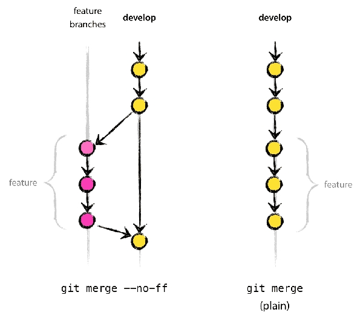
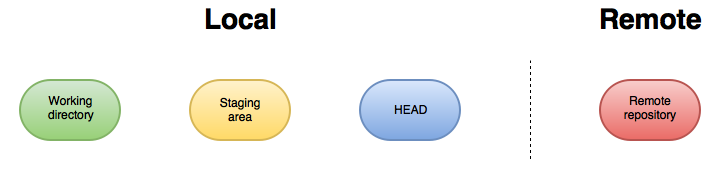
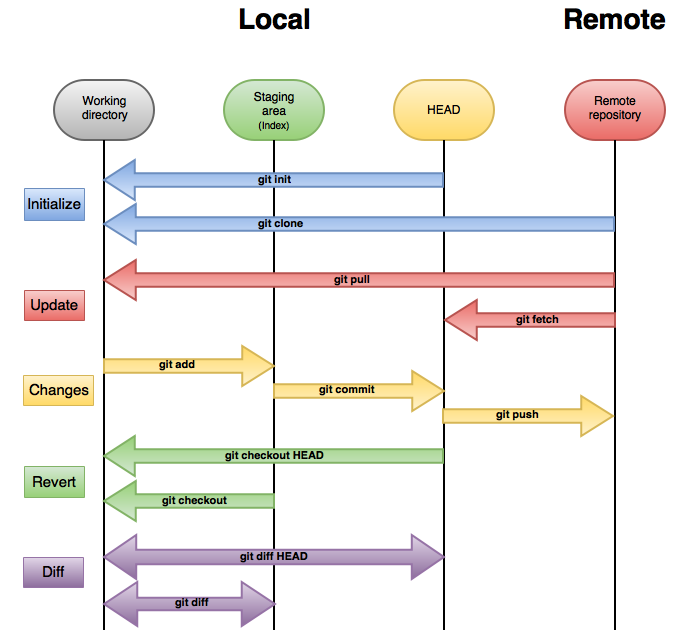

# Git Best Practices Guide
At this point we're going to talk about best practices to work with git.

## Index

* [Prologue](#prologue)
* [Getting Started](#getting-started)
	* [Setting up git](#setting-up-git)
	* [gitignore](#gitignore)
	* [Commit Messages](#commit-messages)
	* [Commit Often](#commit-often)
	* [Push only finished and tested code](#push-only-finished-and-tested-code)
	* [Divide repositories](#divide-repositories)
	* [History](#history)
	* [Use the shell](#use-the-shell)
	* [Moving files](#moving-files)
	* [Large files](#large-files)
	* [README.md](#readme-md)
* [Working Git Project](#working-git-project)
	* [Repositories](#repositories)
	* [Commands](#commands)
		* [Set up repository](#set-up-repository)
		* [Save changes](#save-changes)
		* [Check repository](#check-repository)
		* [Undo changes](#undo-changes)
* [Git Flow](#git-flow)
	* [Git Flow Rules](#git-flow-rules)
	* [Branches](#branches)
	* [Main branches](#main-branches)
		* [Master branch](#master-branch)
		* [Develop branch](#develop-branch)
		* [Support branches](#support-branches)
		* [Feature branches](#feature-branches)
	* [Flow](#flow)
		* [Feature flow](#feature-flow)
		* [Releases](#releases)
		* [Hotfixes](#hotfixes)
	* [Support branches](#support-branches)
* [Tips](#tips)
	* [Versioning](#versioning)
		* [Semantic Versioning](#semantic-versioning)
	* [Redmine's id-track](#redmines-id-track)
	* [Use hooks](#use-hooks)
	* [Use tools](#use-tools)
	* [Use ssh key](#use-ssh-key)
* [References](#references)


## Prologue
This guide try to help to working teams to use git and git flows correctly. Is very recommended that all team's members working with git in the same way, for this goal this guide will contain some usefull advices and tips for the correct use of git and help to unify the way of work with it.

## Getting Started

### Setting up git
 The first thing to do is setting up git.

```
git config --global user.name Nombre
git config --global user.email correo@dominio.com
git config --global core.filemode false
```

### gitignore
When you work with git there are some files that's you shouldn't upload to the repository like configuration files, ide files, files with passwords or connection params, etc. For this goal, exists the .gitignore file, and you need create it and include here the list of files or folders to exclude of the version control.

It's very important **include at .gitignore the files that contains confidential information like credendials** to services, by security reasons these type of information should never be uploaded to the remote repository.

Usually, you can create some templates files for this type of information with its fields empty. For example a file db.config.sample with content:
```
db.host=
db.url=
db.password=
```
Next, there are some folders and files thats usually have to be added at .gitignore list depending on the programming languaje or ide used:

* General files or folders:
	* .log
	* log/
	* tmp/
	* .settings/
* Java applications:
	* target/
	* .project
	* .classpath
	* target/
	* bin/
	* .metadata/
	* RemoteSystemsTempFiles/
	* Servers/
* NodeJS:
	* node_modules/
* Python:
	* Files with pyc extension: .pyc
* The jetbrains ides like Pycharm or WebStorm, have a settings folder  with the name:
	* idea/

### Commit messages
Write descriptive commit messages that explain the changes maked at the commit and his reason. For this goal, is recommended so configure the git repository to force to use messages in commits.

### Commit often
Do commit early and often, have periodic checkpoints help you to have control and solve problems when your code fails, will be easier understand what is different and where the problem may be.

### Push only finished and tested code
Its very important that all code that you push into the remote repository works properly and be tested. All people that synchronize within the repository should be able to execute it without problems.

For ensure this is very recommended using continuous delivery tools for testing code, you can find more information at this [guide](../../qa_testing/sonar/README.md).

### Divide repositories
Often is a good idea create different repositories depending of his functionallity, project or team who work with it. For example, may be interesting have a different repositories for the backend application than the frontend application, and may be interesting have one for the devops configuration files like puppet.

### History
Don't change the history published, for mantain a true traceability of the changes and preserving for problems.

For this goal you should use the option *--no-ff* with merge commands to maintain all commit history in the merged branch. The differences from a merge with --no-ff option and other without it is shown in the next picture:



You should configure your repository against history changes. If you initialize a bare git repository with *--shared* it will automatically get the *git-config "receive.denyNonFastForwards"* set to true.

### Use the shell

There are a lot of IDEs that have its own git plugins, but very often this plugins doesn't works fine in determinated features. The most reliable way to syncronize with git is install git and use the shell to work with git.

### Moving Files
If you need move some file or directory to another path, use the git mv command. For preserving correctly traceability of the changes, you should commit separate the moving of file before make changes of the file, because when you move a file the git internally delete and create new file and you can't see the differences between latest version.

### Large Files
Don't commit binary files or very large files if you can avoid it. Git is not intended for it.

### README.md
Write a text file called README.md in the main directory of project. This file must have the main information about the code, how use and configure it and how can execute it. This file must contains:

* Information about the application configuration, must cover configuration files, dependencies, libraries or tools that are needed for use or install it.
* Information about how install and execute the application.
* Information to test the application and test the qa quality.
* If is a application or library that you can invoke, like an web application or an service web, is important include the information about you can call it.
* For applications which will run on Docker container, is important include here the information necessary to build the Docker image and how run the container.

## Working Git Project

In a real Git project in addition to use [Git Flow](#git-flow), users must know stage where we are working on, that is to say, leads to having to play two different types of repositories.

### Repositories

The purpose of Git is to manage a project or a set of files as they change over time, therefore, Git stores this information in a data structure called a **repository** which often lives in a ``.git`` subdirectory at the root of working tree.



As shown in the image above, Git project is made up of:

* Local repository: local work area is split into:
	* Working directory: folders/files that you are currently working on.
	* Staging area (Index): is a holding area for changes that will be committed, so you can control what parts of the working directory go into the next level.
	* HEAD: a reference to a specific commit (usually points to the most recent commit on the current branch) and it serves two major purposes: it tells Git which commit to take files from when checkout is executed and it tells Git where to put new commits when commit is executed.

* Remote repository: place where code is stored like GitHub, Bitbucket, etc.


### Commands

Once we know the work area of Git project we can start using Git commands, as shown in the image below:



Therefore, we will check each of main Git commands regarding to different cases:

#### Set up repository

##### git init
It creates a new Git repository so that can transform an existing and unversioned project to a Git repository or initialize a new empty repository.
``` sh

$ git init
```

##### git clone
It clones an existing Git repository into a new directory with a isolated environment that has its own history and manages its own files.

``` sh

$ git clone <repository> <directory>
```

##### git remote
It lets users can create, list and delete connections to repositories, so that, users can link a specified URL to quick access.
``` sh

# List all connections.
$ git remote

# lists all connections along with the URL of each one.
$ git remote -v

# creates a new connection called <name> to a remote repository.
$ git remote add <name> <url>

# removes the connection called <name> to the remote repository.
$ git remote rm <name>
```

#### Save changes

##### git add
It adds the new/updated content in the Working directory to the Staging area(Index) for the next commit.

``` sh

$ git add <file/directory>
```

##### git rm
It deletes files from the Staging area(Index) or from Working directory and Staging area(Index).

``` sh

# deletes a single file from Git repository and also deletes from the working directory.
$ git rm <file>

# deletes a single file from Git repository without deleting from working directory.
$ git rm --cached <file>
```

##### git commit 
It stores the current contents of the Staging area to HEAD in a new commit along with a message describing the changes.

``` sh

$ git commit -m <message>
```

##### git push
It transfers commits from Local repository(HEAD) to Remote repository.

``` sh

# Push the work from the specified branch to the named remote repository
$ git push <remote> <branch>
```

##### git pull
It updates Working directory to the newest commit from Remote repository executing a ``git fetch`` and ``git merge`` between the retrieved changes and the current branch.

``` sh

# Update the specified branch from named remote repositoy
$ git pull <remote> <branch>
```

##### git branch
It lets users can create, list, rename and delete branches. A branch stands for an independent line of development but is just pointer to commits.

``` sh

# lists all branches from Git repository
$ git branch -a

# creates a new branch
$ git branch <branch>

# deletes a branch called <branch> in a safe way because Git prevents deleting the branch if it has unmerged changes.
$ git branch -d <branch>

# forces deleting the specified branch
$ it branch -D <branch>
```

##### git checkout
It lets users can navigate between the different branches so that updates files in the Working directory.

``` sh

# Switch from current branch to another
$ git checkout <branch>

# Create a new branch and switch to it
$ git checkout -b <new-branch>
```

##### git fetch
It transfers commits from Remote repository to Local repository(HEAD).

``` sh

# fetch all branches
$ git fetch <remote>

# fetch only the specified branch
$ git fetch <remote> <branch>
```

##### git merge
It combines a development line of a branch into a single branch. Git can execute distinct merge algorithms (**fast-forward** or **non-fast-forward**) according to the state of the branches, in order to display differently the merges.

- Fast-forward merge is applied if the feature branch has not diverged of current branch and will just point to the latest commit, instead of creating a new commit.
- Non-fast-forward merge forces to create a new merge commit if the current branch has diverged regarding feature branch or if there is the same above stage.

At this [section](#history) can visualize the two last algorithms graphically.

``` sh

# Combine the specified branch into the current branch and Git will decide the merge algorithm (by default fast-forward)
$ git merge <branch>

# Combine the specified branch into the current branch but always generate a new commit (non-fast-forward)
$ git merge --no-ff <branch>
```

##### git stash
It stores the current state of the Working directory and Staging area on a stack to get it back later, so that, user can switch branches and it is not necessary to commit half-done work.

``` sh

# Store Working directory and Staging area state
$ git stash

# List the stashes that have been stored
$ git stash list

# Apply the last recent stash that have been stored in the current line of development
$ git stash apply

# Apply the second last recent stash that have been stored in the current line of development
$ git stash apply stash@{1}
```

##### git reset
Reset the Local Repository to the specified state.

``` sh

# Reset the Staging area to the most recent commit but keep the Working directory unchanged
$ git reset

# Reset the specified file from the Staging area and keep the Working directory unchanged
$ git reset <file>

# Reset the Staging area and the Working directory to the most recent commit
$ git reset --hard

# Reset the Staging area to the specified commit but keep the Working directory unchanged
$ git reset <commit>

# Reset the Staging area and the Working directory to the specified commit
$ git reset --hard <commit>
```

#### Check repository

##### git status
It displays the state of the Working directory and Staging area, therefore, users can see which changes have been staged, which have not and which files are not being tracked by Git.

``` sh

$ git status
```

##### git log
It shows commit history

``` sh

# Show commit logs
$ git log

# Show commit logs with a pretty format
$ git log --graph --decorate --pretty=oneline
```

##### git diff
It shows the difference of files between the distinct phases of the Local repository.

``` sh

# Differences between the Working directory and the Staging area(Index)
$ git diff

# Differences between the Staging area and the most recent commit(HEAD)
$ git diff --cached

# Differences between the Working directory and the most recent commit(HEAD)
$ git diff HEAD
```

##### git show
It displays distinct types of objects:

- Commits
- Tags
- Trees
- Plain blobs

``` sh

# Display any object in Git
$ git show <object_id>
```

##### git tag
It lets users can create, list and delete tags. A tag is just a reference which points to the current commit.

The two main types of tags are **lightweight** and **annotated**:

- Lightweight tag is a reference to a specified commit.
- Annotated tag is almost like a lightweight tag but contains a message.

``` sh

# List the available tags in Git.
$ git tag

# Create a lightweight tag
$ git tag <tag_name>

# Create an annotated tag
$ git tag -a -m "<tag_message>" <tag_name>

# Delete a tag
$ git tag -d <tag_name>

# Push all tags to the Remote repository
$ git push origin --tags
```

## Git Flow

It is highly recommended that **all team members follow the same procedural rules** when using git. The workflow described below is an accepted procedure worldwide for small work teams.

![git flow graph][]

[git flow graph]: static/gitflow.jpg "git flow graph"

### Git Flow Rules

Git Flow establishes the following restrictions:

* There are only one central repository: **origin**. Every developer pull and pushes to origin.
* There are only two main branches: **develop** and **master**.
* There are three support branch types: **feature**, **release** and **hotfix**.
* Always merge with --no-ff option.

### Branches

Git Flow defines two branch types, main branches and support branches.

### Main branches

The Main branches are **develop** and **master**.

#### Master branch

The master branch is the default git branch. This is a special branch.
Git flow establishes the following restictions on this branch:

* Never delete this branch.
* Never do commits over this branch directly: only merge commits are allowed.
* Only do merges from release and hotfix branches.

#### Develop branch

The develop branch is a long running branch and must be created from master.

* Never delete this branch.
* Never do commits over this branch directly: only merge commits are allowed.
* All features must be merged in develop
* When develop reaches a stable point, will be merged back into master, throug a release branch.
* Once a release process is finished, the release branch must be merged back into develop.
* Once a hotfix process is finished, the hotfix branch must be merged back into develop.

#### Support branches

The support branches are **short running branches**.
Those branches are created to follow one of the three processes defined on Git Flow.
Every support branch has defined from what branch must be created and on what branch/es must be merged.

#### Feature branch
This is the developer working branch.

* The feature branch always is created from develop branch.
* We can create several feature branches.
* It's recommended to create only a feature for each developer and feature to develop, and to create shorter features as posible.
* The feature branch always must be merged back into develop.
* Don't merge any other branch into feature branch. (i.e.: develop branch)
* The feature branch must be deleted once finished: merged back into develop.

### Flow

Git Flow defines three sub work flows:

#### Feature Flow

Each task of development must be created in a feature branch following the Feature flow.

![git flow feature graph][]

[git flow feature graph]: static/feature-gitflow.jpg "git flow feature graph"

Steps in the feature flow:
``` sh

# gitflow feature Start
git checkout -b feature/lorem-ipsum develop

# Editing
edit, git add .., git commit ..

# gitflow feature Finish
git checkout develop
git merge --no-ff feature/lorem-ipsum
git branch -d feature/lorem-ipsum

# Publish code
git pull origin develop
git push origin develop
```

#### Releases

When the source code in the develop branch reaches a stable point and is ready to be released, all of the changes should be merged back into master somehow and then tagged with a release number.

![git flow release graph][]

[git flow release graph]: static/release.jpg "git flow release graph"

Steps in the release flow:
``` sh

# gitflow release start
git checkout -b release/0.1.0 develop

# Editing
edit, git add .., git commit ..

# gitflow release finish
git checkout master
git merge --no-ff release/0.1.0
git tag -a v0.1.0
git checkout develop
git merge --no-ff release/0.1.0
git branch -d release/0.1.0

git push origin 0.1.0
git push origin develop
git push origin master
```

#### Hotfixes

They arise from the necessity to act immediately upon an undesired state of a live production version.
When a critical bug in a production version must be resolved immediately, a hotfix branch may be branched off from the corresponding tag on the master branch that marks the production version.

![git flow hotfix graph][]

[git flow hotfix graph]: static/hotfix.jpg "git flow hotfix graph"

Steps in the release flow:
``` sh

# gitflow hotfix start
git checkout -b hotfix/0.1.1 master

# Editing
edit, git add .., git commit ..

# gitflow hotfix finish
git checkout master
git merge --no-ff hotfix/0.1.1
git tag -a 0.1.1
git checkout develop
git merge --no-ff hotfix/0.1.1
git branch -d hotfix/0.1.1

git push origin develop
git push origin master
```

## Tips

### Versioning

It's very important to version your tags with a concrete versioning system to made easy  traceability of all your code. We suggest using of a lightweight version specification called [Semantic Versioning](http://semver.org/) thinking to API versiosing, but totally applicable to git tags

#### Semantic Versioning
 This is an specification authored by Tom Preston-Werner based on three digits *MAJOR.MINOR.PATCH*

Theses are the main rules about this specification

* A normal version number MUST take the form X.Y.Z where X, Y, and Z are non-negative integers, and MUST NOT contain leading zeroes. X is the major version, Y is the minor version, and Z is the patch version. Each element MUST increase numerically. For instance: 1.9.0 -> 1.10.0 -> 1.11.0.

* Major version zero (0.y.z) is for initial development. Anything may change at any time. The code of this tag should not be considered stable.

* Version 1.0.0 defines the first tag with stable code. The way in which the version number is incremented after this release is dependent on how your code change.

* Patch version Z (x.y.Z | x > 0) MUST be incremented if only backwards compatible bug fixes are introduced. A bug fix is defined as an internal change that fixes incorrect behavior.

* Minor version Y (x.Y.z | x > 0) MUST be incremented if new, backwards compatible functionality is introduced to the code. It MUST be incremented if any functionality is marked as deprecated. It MAY be incremented if substantial new functionality or improvements are introduced within the private code. It MAY include patch level changes. Patch version MUST be reset to 0 when minor version is incremented.

* Major version X (X.y.z | X > 0) MUST be incremented if any backwards incompatible changes are introduced to the code. It MAY include minor and patch level changes. Patch and minor version MUST be reset to 0 when major version is incremented.

### Redmine's id-track

In order to improve the traceability of our developments and integrate it with project management tools as Jira or Redmine (inside Beeva) you can start each commit messages with *#id_task*. In this way is possible link task description into Redmine to know what commits is associated with this task.

For example, if there is a task into Redmine with id *17025* and we start commit message (commit -m "#17025 change label value") each message that starts with *"#17025..."* can will be shown into Redmine task description

### Use hooks

Hooks are a good tool to customize version control behavior. Using hooks we can intercept each step of git cycle, client-side and server-side, and launch custom scripts when certain important actions occur.

developments, for example, related with Amazon Web Services should use a pre-commit  hook to search for Amazon AWS API keys and to avoid push to the remote repository these credentials, [see the example](https://gist.github.com/DmZ/3a99d829f17af383712b)

To learn deeply about git hooks, please [see documentation](https://git-scm.com/book/en/v2/Customizing-Git-Git-Hooks)

### Use tools
There are a lot of tools and sites to help you to work better with git. List below show you some tools and web sites interesting for work with git:

* [Gitflow tool](https://github.com/nvie/gitflow). A tool that help you to implemet gitflow workflow.
* [Gitignore.io](https://www.gitignore.io/). A website that generate *.gitignore* file for operating systems, IDEs or programming languages.
* [Tips and scrpts](http://git-scm.com/book/es/v1/Fundamentos-de-Git-Consejos-y-trucos). A very interesting collection with scripts to do your git experience easier.
* [.bashrc](static/git_bashrc). Code to add inside *~/.bashrc* file and help you to know in which branch you are.

### Use ssh key
Sometimes when we are using as a remote repository as a github, we must write our password in each commit. It's a good practice configure a ssh key to do this task easier and avoid writing password with each git sentence. See example for [GitHub](https://help.github.com/articles/generating-ssh-keys/)


### References

* [Git official documentation](https://git-scm.com/doc)
* [GitHub Help](https://help.github.com/)
* [Git Cheatsheet](http://www.git-tower.com/blog/git-cheat-sheet/)
* [Git Flow Cheatsheet](http://danielkummer.github.io/git-flow-cheatsheet/)
* [Successful branching model](http://nvie.com/posts/a-successful-git-branching-model/)
* [Seth Robertson Best Practices](https://sethrobertson.github.io/GitBestPractices/)

___

[BEEVA](http://www.beeva.com) | 2016
