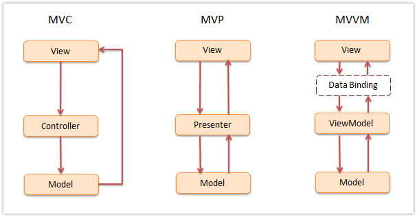

# Front-end BEEVA Best Practices

## 4.- JavaScript

### Patterns

* [1\. What is a pattern](#WhatIsAPattern)
* [2\. Common Patterns](CommonPatterns)
  * [2\.01 Constructor Pattern](ConstructorPattern)
  * [2\.02 Module Pattern](ModulePattern)
  * [2\.03 Revealing Module Pattern](RevealingModulePattern),
  * [2\.04 Singleton Pattern](SingletonPattern) **
  * [2\.05 Observer Pattern](ObserverPattern) **
  * [2\.06 Mediator Pattern](MediatorPattern) **
  * [2\.07 Prototype Pattern](PrototypePattern)
  * [2\.08 Command Pattern](CommandPattern) **
  * [2\.09 Facade Pattern](FacadePattern) **
  * [2\.10 Factory Pattern](FactoryPattern) **
  * [2\.11 Mixin Pattern](MixinPattern)
  * [2\.12 Decorator Pattern](DecoratorPattern) **
  * [2\.13 Flyweight Pattern](FlyweightPattern) **
* [3\. MV* Patterns](ModelViewStarPatterns)
  * [3\.1 MVC Pattern](MVCPattern) **
  * [3\.2 MVP Pattern](MVPPattern)
  * [3\.3 MVVM Pattern](MVVMPattern)
* [4\. Modular Patterns](ModularPatterns)
* [5\. Bonus](Bonus)

## <a name='WhatIsAPattern'>What is a patterm</a>

@TODO review/remove/link to other references

A design Pattern [can be defined](https://en.wikipedia.org/wiki/Design_pattern)
as

> The re-usable form of a solution to a design problem.

or we can see them as templates for how we solve problems having these main
bennefits:

* can be reused
* are proven solutions
* add common vocabulary

** Keep in mind that: **

* patterns are not exact solutions and they don't solve all the problems
* reusing patterns help preventing issues

## <a name='CommonPatterns'>Common Patterns</a>
### <a name='ConstructorPattern'>Constructor Pattern</a>
### <a name='ModulePattern'>Module Pattern</a>
### <a name='RevealingModulePattern'>Revealing Module Pattern</a>
### <a name='PrototypePattern'>Prototype Pattern</a>
### <a name='MixinPattern'>Mixin Pattern</a>

## <a name='ModelViewStarPatterns'>MV* Patterns</a>

A quick overview of the three patterns you can read in this section.

<small>
Image from http://www.dofactory.com/products/javascript-jquery-design-pattern-framework
</small>

### MVC Pattern
@TODO add reference to back end

### MVP Pattern

Model-view-presenter (MVP) is a derivative of the MVC design pattern which
focuses on improving presentation logic.
The **presenter** is a component containing the user-interface business logic
for the view and, opposite to MVC, invocations from the view are delegated to
the presenter - which is decoupled from the view and instead talk to it.

<small>
Image from
https://www.safaribooksonline.com/library/view/learning-javascript-design
</small>

This pattern has been split into Supervising Controller and Passive View.

#### Passive View

The View is as dumb as possible and contains almost zero logic. The Presenter is
a middle man that talks to the View and the Model. The View and Model are
completely shielded from one another. The Model may raise events, but the
Presenter subscribes to them for updating the View. In Passive View there is no
direct data binding, instead the View exposes setter properties which the
Presenter uses to set the data. All state is managed in the Presenter and not
the View.

* Pros: maximum testability surface; clean separation of the View and Model
* Cons: more work (for example all the setter properties) as you are doing all

#### Supervising Controller

The Presenter handles user gestures. The View binds to the Model directly
through data binding. In this case it's the Presenter's job to pass off the
Model to the View so that it can bind to it. The Presenter will also contain
logic for gestures like pressing a button, navigation, etc.

* Pros: by leveraging data-binding, the amount of code is reduced.
* Cons: there is less testable surface (because of data binding), and there's
less encapsulation in the View since it talks directly to the Model.

### MVVM Pattern

Model View ViewModel is a pattern based on MVC and MVP attempting to more
separate the development of user interface (UI) from the business logic. Many
implementations of this pattern make use of declarative data bindings
to separate views from other layers.
This facilitates the development where work occurr almost simultaneously. UI
developers write bindings to the ViewModel within their document markup (i.e.
HTML), where the Model and ViewModel are maintained by developers working on
the logic for the application.

* Pros
  * Parallel development
  * Ease of
    * maintainance
    * testing
  * Re-usability
  * Low Degree of coupling
* Cons
  * Not Suitable for simple applications ( overwork )
  * Not a standardized one (everyone follows their own flavour)
  * Debug can be harder due to declarative data binding

#### Frameworks implementing MV*

##### Angular
##### Ember.js
##### Backbone.js
Although the documentation says it is MVC, the community usually refers to it as
an MVP framework where the views are html templates, the model are
`Backbone.Model` and the presenters are `Backbone.View`. Backbone still adds the
controller - `Backbone.Controller` - if you prefer to go with the MVC approach.

##### Knockout.js
##### Riot.js
Riot.js is a client-side library that weighs less than 1kb. Despite the small
size, all the building blocks are there: a template engine, router, event
library and a strict MVP pattern to keep things organized. On a finished
application the views are automatically updated when the underlying model
changes.

## <a name='Bonus'>Bonus</a>

### Flux
This is an architecture promoted by Facebook and mostly used with React library
but it is not coupled to React. Promotes unidirectional data flow making easier
to reason about the state of application at any point of time.

Flux eschews MVC in favor of a **unidirectional data flow**. When a user
interacts with a view, the view propagates an action through a central
dispatcher, to the various stores that hold the application's data and business
logic, which updates all of the views that are affected. This works especially
well with React's declarative programming style, which allows the store to send
updates without specifying how to transition views between states.

#### Structure and Data Flow

Data in a Flux application flows in a single direction. This is central to the
Flux pattern, and the next  diagram should be the primary mental model for the
Flux programmer. The dispatcher, stores and views are independent nodes with
distinct inputs and outputs. The actions are simple objects containing the new
data and an identifying type property.

The views may cause a new action to be propagated through the system in response
 to user interactions.

 

# References and further reading
* https://en.wikipedia.org/wiki/Model%E2%80%93view%E2%80%93presenter
* https://en.wikipedia.org/wiki/Model%E2%80%93view%E2%80%93viewmodel
* http://addyosmani.com/resources/essentialjsdesignpatterns/book/
* http://www.dofactory.com/products/javascript-jquery-design-pattern-framework
* https://msdn.microsoft.com/en-us/library/ff921132.aspx
* https://msdn.microsoft.com/en-us/magazine/dd419663.aspx
* http://backbonejs.org/
* http://knockoutjs.com/documentation/introduction.html
* http://todomvc.com/
* https://facebook.github.io/flux/
* http://addyosmani.com/blog/understanding-mvvm-a-guide-for-javascript-developers/
* http://www.silverlightshow.net/news/The-Advantages-of-MVVM.aspx
* http://www.quora.com/Pros-and-cons-of-MVVM-framework-and-how-I-can-campare-it-with-MVC
* http://callmenick.com/post/instantiation-patterns-in-javascript
* http://code.tutsplus.com/courses/put-javascript-design-patterns-into-practice
* https://john-dugan.com/object-oriented-javascript-pattern-comparison/
