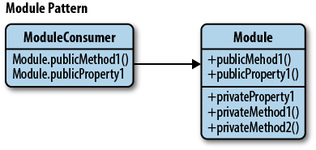
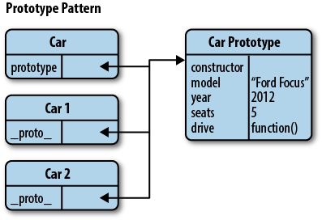

# Front-end BEEVA Best Practices

## 4.- JavaScript

### Patterns

* [1\. What is a pattern](#WhatIsAPattern)
* [2\. Common Patterns](#CommonPatterns)
  * [2\.01 Constructor Pattern](#ConstructorPattern)
  * [2\.02 Module Pattern](#ModulePattern)
  * [2\.03 Revealing Module Pattern](#RevealingModulePattern),
  * [2\.07 Prototype Pattern](#PrototypePattern)
  * [2\.11 Mixin Pattern](#MixinPattern)
* [3\. MV* Patterns](#ModelViewStarPatterns)
  * [3\.2 MVP Pattern](#MVPPattern)
  * [3\.3 MVVM Pattern](#MVVMPattern)
* [4\. Modular Patterns](#ModularPatterns)
* [5\. Bonus](#Bonus)

## <a name='WhatIsAPattern'>What is a patterm</a>

@TODO review/remove/link to other references

A design Pattern [can be defined](https://en.wikipedia.org/wiki/Design_pattern)
as

> The re-usable form of a solution to a design problem.

or we can see them as templates for how we solve problems having these main
bennefits:

* can be reused
* are proven solutions
* add common vocabulary

** Keep in mind that: **

* patterns are not exact solutions and they don't solve all the problems
* reusing patterns help preventing issues

## <a name='CommonPatterns'>Common Patterns</a>
### <a name='ConstructorPattern'>Constructor Pattern</a>

@REVIEW should this be removed? Isn't it too basic?

Object constructors are used to create specific types of objects - both
preparing the object for use and accepting arguments which a constructor can use
to set the values of member properties and methods when the object is first
created.

These are the most common ways of creating an object
```javascript
// Object creation
// -----------------------------------------------------------------------------
var newObject = {};
var newObject = Object.create( Object.prototype );
var newObject = new Object();

// Defining properties
// -----------------------------------------------------------------------------
newObject.someKey = "Hello World";
newObject["someKey"] = "Hello World";
Object.defineProperty( newObject, "someKey", {
  value: "for more control of the property's behavior",
  writable: true,
  enumerable: true,
  configurable: true
});

// Getting properties value
// -----------------------------------------------------------------------------
var key = newObject.someKey;
var key = newObject["someKey"];
```

### <a name='ModulePattern'>Module Pattern</a>

Modules are a good way of keeping the units of a project clean, separated and
organized. It s used to emulate the concept of classes been  able to include
public-private methods and variables inside a single object, thus shielding
parts from the global scope and also preventing name conflicts.



#### Advantages

* cleaner for developers coming from an object-oriented background - provides
the idea of true encapsulation.
* It supports private data. Public parts of our code are able to touch the
private parts but it cannot be modified from the outside.

#### Disadvantages

* Changes of visibility  will require code changes bot in the code of the module
and where it is used (refactor).

### Variations
#### Import mixins
Globals (e.g., jQuery, Underscore) can be passed in as arguments to our module’s
anonymous function. This allows us to import them and locally alias them as
needed.
```javascript
// Global module
var myModule = (function ( jQ, _ ) {

  function privateMethod1(){
    jQ(".container").html("test");
  }
  function privateMethod2(){
    console.log( _.min([10, 5, 100, 2, 1000]) );
  }

  return{
    publicMethod: function(){
      privateMethod1();
  };

}( jQuery, _ )); // Pull in jQuery and Underscore

// Use module
myModule.publicMethod();
```
#### Exports
Allows us to declare globals without consuming them.
```javascript
// Global module
var myModule = (function () {
  // Module object
  var module = {},
      privateVariable = "Hello World";
  function privateMethod() {
    // ...
  }

  module.publicProperty = "Foobar";
  module.publicMethod = function () {
    console.log( privateVariable );
  };

  return module;
}());
```

Some frameworks implementing this pattern would be:

* jQuery
* ExtJS
* Dojo
* ... and many more

#### Options
##### AMD modules
The overall goal for the Asynchronous Module Definition (AMD) format is to
provide a solution for modular JavaScript that developers can use today.

The AMD module format itself is a proposal for defining modules in which both
the module and dependencies can be asynchronously loaded. Among it's advantages
you can find it's asynchronous and highly flexible by nature removing the tight
coupling one might commonly find between code and module identity.

A module can be defined like this
```javascript
define(
  module_id /*optional*/,
  [dependencies] /*optional*/,
  definition function /*function for instantiating the module or object*/
);
```

here is an example
```javascript
define(
  "myModule",
  ["foo", "bar"],

  // module definition function
  // dependencies (foo and bar) are mapped to function parameters
  function ( foo, bar ) {
    // return a value that defines the module export
    // (i.e the functionality we want to expose for consumption)

    var myModule = {
      doStuff:function () {
        console.log( "Yay! Stuff" );
      }
    };

    return myModule;
  }
);
```

To consume a module we use `require`. Here is an example
```javascript
require(["foo", "bar"], function ( foo, bar ) {
  // rest of your code here
  foo.doSomething();
});
```

##### CommonJS modules
Proposes an API - quite simple - for declaring modules that work outside of the
browser. Attempts to cover concerns such as IO, filesystem, promises, and more.

NodeJS is a well know product that supports CommonJS.

Basic example of exposition
```javascript
// behaviour for our module
function foo(){
    lib.log( "hello world!" );
}
// export (expose) foo to other modules
exports.foo = foo;
```

Basic example of exposition and consumption
```javascript
// foo.js
exports.helloWorld = function(){
  return "Hello World!!"
}
// app.js
var modA = require( "./foo" );
exports.foo = function(){
  return modA.helloWorld();
}
```
##### ECMAScript 6 (Harmony) modules
The goal is to create a format that both users of CommonJS and of AMD are happy
with:

* Similar to CommonJS, they have a compact syntax, a preference for single
exports and support for cyclic dependencies.
* Similar to AMD, they have direct support for asynchronous loading and
configurable module loading.

It goes beyond CommonJS and AMD:

* Syntax is even more compact than CommonJS’s
* Structure can be statically analyzed (for static checking, optimization, etc.)
* Support for cyclic dependencies is better than CommonJS’s.

The ES6 module standard has two parts:

* Declarative syntax (for importing and exporting)
* Programmatic loader API: to configure how modules are loaded and to
conditionally load modules

###### ECMAScript 6 module syntax

* Named exports (several per module)
  ```javascript
  //------ lib.js ------
  export const sqrt = Math.sqrt;
  export function square(x) {
    return x * x;
  }
  export function diag(x, y) {
    return sqrt(square(x) + square(y));
  }

  //------ main.js ------
  import { square, diag } from 'lib';
  console.log(square(11)); // 121
  console.log(diag(4, 3)); // 5

  //------ main.js (import everythin variation)  ------
    import * as lib from 'lib';
    console.log(lib.square(11)); // 121
    console.log(lib.diag(4, 3)); // 5
  ```
* Default exports (one per module)
  ```javascript
  //------ myFunc.js ------
  export default function () { ... };     
  //------ main1.js ------
  import myFunc from 'myFunc';
  myFunc();

  //------ MyClass.js ------
  export default class { ... };
  //------ main2.js ------
  import MyClass from 'MyClass';
  let inst = new MyClass();  
  ```

###### ECMAScript 6 module loader API
In addition to the declarative syntax, there is also a programmatic API that
allows us to:

* Programmatically work with modules and scripts
* Configure module loading

```javascript
// import modules via Promises
System.import('some_module').then(some_module => {
  // Use some_module
}).catch(error => {
  ...
});

// example
Promise.all(
  ['module1', 'module2', 'module3'].map(x => System.import(x))
).then(([module1, module2, module3]) => {
  // Use module1, module2, module3
});
```

### <a name='PrototypePattern'>Prototype Pattern</a>
In Prototype pattern we create objects that act as prototypes for other objects.
The prototype object itself is used as a *blueprint* for each object the
constructor creates. If the prototype of the constructor function used contains
a property called, i.e. name, then each object created by that same constructor
will also have this same property.



**One of the benefits of using the Prototype pattern is that we’re working with
the prototypal strengths JavaScript has to offer natively rather than attempting
to imitate features of other languages.**

It also leverages the implementation of inheritance and also provides a
performance boost as well - when defining functions in an object, they’re all
created by reference (so all child objects point to the same function), instead
of creating their own individual copies.

```javascript
var myCar = {
  name: "Ford Escort",
  drive: function () {
    console.log( "Weeee. I'm driving!" );
  },
  panic: function () {
    console.log( "Wait. How do you stop this thing?" );
  }
};
// Use Object.create to instantiate a new car
var yourCar = Object.create( myCar );

// Now we can see that one is a prototype of the other
console.log( yourCar.name );  
```

`Object.create` allows us to implement concepts such as differential inheritance
in which objects are able to directly inherit from other objects.
```javascript
var vehiclePrototype = {
  init: function ( carModel ) {
    this.model = carModel;
  },
  getModel: function () {
    console.log( "The model of this vehicle is.." + this.model);
  }
};


function vehicle( model ) {
  function F() {};
  F.prototype = vehiclePrototype;

  var f = new F();
  f.init( model );
  return f;
}

var car = vehicle( "Ford Escort" );
car.getModel();
```

## <a name='ModelViewStarPatterns'>MV* Patterns</a>

A quick overview of the three patterns you can read in this section.


<small>
Image from http://www.dofactory.com/products/javascript-jquery-design-pattern-framework
</small>


### MVC Pattern
@TODO add reference to back end

### MVP Pattern

Model-view-presenter (MVP) is a derivative of the MVC design pattern which
focuses on improving presentation logic.
The **presenter** is a component containing the user-interface business logic
for the view and, opposite to MVC, invocations from the view are delegated to
the presenter - which is decoupled from the view and instead talk to it.


<small>
Image from
https://www.safaribooksonline.com/library/view/learning-javascript-design
</small>

This pattern has been split into Supervising Controller and Passive View.

#### Passive View

The View is as dumb as possible and contains almost zero logic. The Presenter is
a middle man that talks to the View and the Model. The View and Model are
completely shielded from one another. The Model may raise events, but the
Presenter subscribes to them for updating the View. In Passive View there is no
direct data binding, instead the View exposes setter properties which the
Presenter uses to set the data. All state is managed in the Presenter and not
the View.

* Pros: maximum testability surface; clean separation of the View and Model
* Cons: more work (for example all the setter properties) as you are doing all

#### Supervising Controller

The Presenter handles user gestures. The View binds to the Model directly
through data binding. In this case it's the Presenter's job to pass off the
Model to the View so that it can bind to it. The Presenter will also contain
logic for gestures like pressing a button, navigation, etc.

* Pros: by leveraging data-binding, the amount of code is reduced.
* Cons: there is less testable surface (because of data binding), and there's
less encapsulation in the View since it talks directly to the Model.


### MVVM Pattern

Model View ViewModel is a pattern based on MVC and MVP attempting to more
separate the development of user interface (UI) from the business logic. Many
implementations of this pattern make use of declarative data bindings
to separate views from other layers.
This facilitates the development where work occurr almost simultaneously. UI
developers write bindings to the ViewModel within their document markup (i.e.
HTML), where the Model and ViewModel are maintained by developers working on
the logic for the application.

* Pros
  * Parallel development
  * Ease of
    * maintainance
    * testing
  * Re-usability
  * Low Degree of coupling
* Cons
  * Not Suitable for simple applications ( overwork )
  * Not a standardized one (everyone follows their own flavour)
  * Debug can be harder due to declarative data binding


#### Frameworks implementing MV*

##### Angular
##### Ember.js
##### Backbone.js
Although the documentation says it is MVC, the community usually refers to it as
an MVP framework where the views are html templates, the model are
`Backbone.Model` and the presenters are `Backbone.View`. Backbone still adds the
controller - `Backbone.Controller` - if you prefer to go with the MVC approach.

##### Knockout.js
##### Riot.js
Riot.js is a client-side library that weighs less than 1kb. Despite the small
size, all the building blocks are there: a template engine, router, event
library and a strict MVP pattern to keep things organized. On a finished
application the views are automatically updated when the underlying model
changes.

## <a name='Bonus'>Bonus</a>

### Flux
This is an architecture promoted by Facebook and mostly used with React library
but it is not coupled to React. Promotes unidirectional data flow making easier
to reason about the state of application at any point of time.

Flux eschews MVC in favor of a **unidirectional data flow**. When a user
interacts with a view, the view propagates an action through a central
dispatcher, to the various stores that hold the application's data and business
logic, which updates all of the views that are affected. This works especially
well with React's declarative programming style, which allows the store to send
updates without specifying how to transition views between states.

#### Structure and Data Flow

Data in a Flux application flows in a single direction. This is central to the
Flux pattern, and the next  diagram should be the primary mental model for the
Flux programmer. The dispatcher, stores and views are independent nodes with
distinct inputs and outputs. The actions are simple objects containing the new
data and an identifying type property.

The views may cause a new action to be propagated through the system in response
 to user interactions.

 


# References and further reading
* https://en.wikipedia.org/wiki/Model%E2%80%93view%E2%80%93presenter
* https://en.wikipedia.org/wiki/Model%E2%80%93view%E2%80%93viewmodel
* http://addyosmani.com/resources/essentialjsdesignpatterns/book/
* http://www.dofactory.com/products/javascript-jquery-design-pattern-framework
* https://msdn.microsoft.com/en-us/library/ff921132.aspx
* https://msdn.microsoft.com/en-us/magazine/dd419663.aspx
* http://backbonejs.org/
* http://knockoutjs.com/documentation/introduction.html
* http://todomvc.com/
* https://facebook.github.io/flux/
* http://addyosmani.com/blog/understanding-mvvm-a-guide-for-javascript-developers/
* http://www.silverlightshow.net/news/The-Advantages-of-MVVM.aspx
* http://www.quora.com/Pros-and-cons-of-MVVM-framework-and-how-I-can-campare-it-with-MVC
* http://callmenick.com/post/instantiation-patterns-in-javascript
* http://code.tutsplus.com/courses/put-javascript-design-patterns-into-practice
* https://john-dugan.com/object-oriented-javascript-pattern-comparison/
* https://shichuan.github.io/javascript-patterns/
* http://www.adequatelygood.com/JavaScript-Module-Pattern-In-Depth.html
* http://www.2ality.com/2014/09/es6-modules-final.html
* http://addyosmani.com/writing-modular-js/
