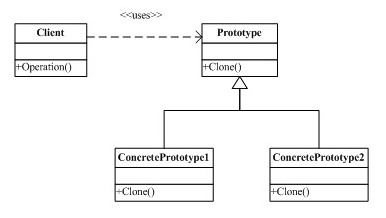
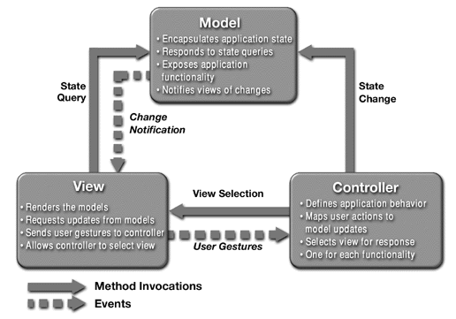

# Code Design Best Practices
At this point we're going to talk about the code design best practices.

## Index

* [Introduction](#introduction)
	* [Format](#format)
	* [Naming](#naming)
	* [Code Documentation](#code-documentation)
	* [Error processing](#error-processing)
	* [Concurrency](#concurrency)
	* [Tools](#tools)
		* [Documentation](#documentation)
		* [Naming and format](#naming-and-format)
* [Code design rules](#code-design-rules)
* [Code design patterns](#code-design-patterns)
	* [Introduction of code design patterns](#introduction-of-code-design-patterns)
	* [Gang of four patterns](#gang-of-four-patterns)
		* [Creational Patterns](#creational-patterns)
		* [Structural Patterns](#structural-patterns)
		* [Behavioral Patterns](#behavioral-patterns)
    * [Model View Controller Pattern](#model-view-controller-pattern)
    * [Integration Patterns](#integration-patterns)
    	* [Integration Styles](#integration-styles)
    	* [Messaging Systems](#messaging-systems)
    	* [Messaging Channels](#messaging-channels)
    	* [Message Construction](#message-construction)
    	* [Message Routing](#message-routing)
    	* [Message Transformation](#message-transformation)
    	* [System Management](#system-management)
    * [Anti-Patterns](#anti-patterns)
    	* [Software Design](#software-design)
    	* [Object Oriented programming](#object-oriented-programming)
    	* [Programming](#programming)
    	* [Methodological](#methodological)
    	* [Configuracion Management](#configuration-management)
* [Agile metodologies implications](#agile-metodologies-implications)
* [References](#references)

## Introduction

This guide's objective is help to developers to write a good code for improve the code readability and help to anybody to understand the code.

 

## Code Design Rules

### Format

* Tab correctly your code for improve the readability.
* Comment your code for tip to understand complex code or bucles.
* Don't use lines too larges.
* Don't use a lot of params in a method or functions. If there are a lot of params the design is bad and you should consider to use one class or object.
* Use with caution the copy & paste. When you copy a portion of code, think about is usefull use a method for it.
* If a method have a lot of lines, probably is better to divide in more methods to improve the readability and reusability of the code.
* Delete the variables not used anywhere, not only for performance reasons, also for readibility reasons.
* Use UTF-8.
* Replace tabs with spaces (Configure the ide or text editor).

### Naming
Use the same naming style for the code variables, functions, objects and constants improve the code readability and help to a team to understand easier the application code.

There are some recommendations dependant of the programming language, and others are common and usefull for all languages.

Some of common recomendations:

* Use english as common language for comments and naming for allow understand the code for everyone, no main where are they from.
* Use only letters (without accents or similar) and numbers and _ as separator.
* Doesn't start with numbers.
* The constants should be writted in upper cases.
* The names should be descriptive about the method, function or variable does.
* Variables should be in lower case.
* Functions and methods with lower case.

Recommendations based on the programming language:

* Java:
	* Classes must start with upper case.
	* For a class name with two or more words separate it with Upper Case. For example a class called "JavaWorker".
	* For a variable, method or function name separes words with upper case, with the first letter in lower case.
	* Separes one word from a number with _
* Python:
	* Separe the words in a variable, function or method name with the character _
	* Class names should be in lower case.

### Code Documentation

It's very important to document the code, to help to anybody to understand the code and how can use it. All programming languages allows document the code using comments in determinated format.

There are some considerations that you must have when you write the documentation:

* All classes and public methods and variables must be documented.
* Write usefull information about what a class or method does and how to use it.
* The functions and methods parameters should be included in the documentation with the possibles values and format expected. For example if is numeric, if is required or not, if is a text with some posible values...
* The posible return values must be included so, including the values returned when something's wrong
* If the function or method throws one or more exceptions is very important include it in the documentation.
* Use UTF-8 characters, don't use accents.
* Include the author of the comments. If one partner need to solve some dubts automatically know who develop it and can ask him for help.

### Error processing

Is very important to have one unique strategy for processing the errors of your application. For this goal, there are some common tips that you can consider to process the errors correctly in all posible situations.

* Define the error detail objetive. It's not the same one error for an developer or sysops person than an error to show to the client. An error for a client should help it about what can do to solve or who have to contact.
* Define a common object error for all project. All methods or function must use it for return the error.
* Define a error code list for the errors.
* If is an error which can be shown to the client, use this code list with a internationalitable file for the descriptions.
* Log correctly the error with all information available about this cause and when it occurred.
* Use a common format for all error logs.

### Concurrency

### Tools
There are a lot of tools that help you to improve your code design for all programming languages. It's very recommended to use them for help to mantain the same format in all project and prevent errors.

#### Documentation
The documentation tools make it possible to generate documentation directly from your source code. Each programming language have its own tools, some of them are:

* **Java**: [Javadoc](http://www.oracle.com/technetwork/articles/java/index-jsp-135444.html) 
* **Python**: [PyDoc](https://wiki.python.org/moin/PyDoc) 
* **Javascript**: [jsdoc toolkit](https://code.google.com/p/jsdoc-toolkit/) 
* **php**: [phpDocumentor](http://www.phpdoc.org/) 
* **Ruby**: [Rubydoc](http://ruby-doc.org/) 

#### Naming and format
There are a lot of tools to help to improve the code's quality and design. These tools allows to review the application code to find naming errors, variables not used, or to force to the developer to comment his methods and classes.

One of the most used tool for this goal is [Sonar](http://www.sonarqube.org/). Normally Sonar is installed in the server, configured for Continuous Integration with other tools (like Jenkins) and ensure that the code must be correct before the deployment.

Other tools that helps you depending on the programming language:

* **Java**: [Checkstyle](http://checkstyle.sourceforge.net/) and [PMD](https://pmd.github.io/) with maven plugin, allow to configure some configuration rules and test that your code is fine when you build your java application, preserving for deployment server errors. You should configure the same rules than sonar. Other usefull tool is [FindBugs](http://findbugs.sourceforge.net/) .
* **Python**: [Pylint](http://www.pylint.org/)
* **PHP**: [PHPCheckstyle](https://github.com/PHPCheckstyle/phpcheckstyle)

## Code Design Patterns
#### Introduction of code design patterns
The design patterns are solutions to common problems in the software development. They are defined by experienced programmers that seen a common ways to solve the similar problems.

A pattern is designed according to a template

In this point we are going to list the most common design patterns, and when we could use them.
#### Gang of four patterns
In 1994, four authors Erich Gamma, Richard Helm, Ralph Johnson and John Vlissides published a book titled Design Patterns - Elements of Reusable Object-Oriented Software which initiated the concept of Design Pattern in Software development.

These authors are collectively known as Gang of Four (GOF). According to these authors design patterns are primarily based on the following principles of object orientated design:

- Program to an interface not an implementation
- Favor object composition over inheritance

If you want more information you can visit the wikipedia page [Gang Of Four](https://en.wikipedia.org/wiki/Design_Patterns)

At this point we can define the following three categories of patterns:

##### Creational Patterns
These design patterns provide a way to create objects while hiding the creation logic, rather than instantiating objects directly using new opreator. This gives program more flexibility in deciding which objects need to be created for a given use case.

- **Abstract factory pattern**
	- ***Definition***

		Abstract Factory patterns work around a super-factory which creates other factories. This factory is also called as factory of factories. This type of design pattern comes under creational pattern as this pattern provides one of the best ways to create an object.

		In Abstract Factory pattern an interface is responsible for creating a factory of related objects without explicitly specifying their classes. Each generated factory can give the objects as per the Factory pattern.

	- ***Design***

		

	- ***Applicability***
		- A system should be independent of how they are created, make up and represent their products.
		- A system must be configured with a family of products from several.
		- A family of related product objects is designed to be used jointly and is necessary to enforce this restriction.

	You can find more detailed explanation in this [link](https://en.wikipedia.org/wiki/Abstract_factory_pattern)
- **Builder pattern**

	- ***Definition***

		Builder pattern builds a complex object using simple objects and using a step by step approach. This type of design pattern comes under creational pattern as this pattern provides one of the best ways to create an object.

		A Builder class builds the final object step by step. This builder is independent of other objects.

	- ***Design***

		

	- ***Applicability***
		- If a class has an internal complex structure.
		- If a class has dependant attributes each other.
		- If a class uses other system objects that are difficult or inconvenient to obtain during its creation.
	You can find more detailed explanation in this [link](https://en.wikipedia.org/wiki/Builder_pattern)
- **Factory method pattern**

	- ***Definition***

		In Factory pattern, we create object without exposing the creation logic to the client and refer to newly created object using a common interface.

	- ***Design***

		

	- ***Applicability***
		- When you want to create an extensible framework.
		- When you want to be a subclass instead of a superclass, that decides what kind of object must be created.
		- When you know when to create an object, but does not know the object type.

	You can find more detailed explanation in this [link](https://en.wikipedia.org/wiki/Factory_method_pattern)
- **Prototype pattern**

	- ***Definition***

		It facilitates dynamic creation to define classes whose objects can create copies of themselves.

	- ***Design***

		

	- ***Applicability***
		- The same as the definition.

	You can find more detailed explanation in this [link](https://en.wikipedia.org/wiki/Prototype_pattern)
- **Singleton pattern**

	- ***Definition***

		It allows a single instance of a class in the system, at a time that allows all classes have access to that **unique** instance.

	- ***Design***

		

	- ***Applicability***
		- To store configurations.
		- To cache objects in memory.

	You can find more detailed explanation in this [link](https://en.wikipedia.org/wiki/Singleton_pattern)

##### Structural Patterns
These design patterns concern class and object composition. Concept of inheritance is used to compose interfaces and define ways to compose objects to obtain new functionalities.

 - **Adapter pattern**

	- ***Definition***

		Adapter pattern works as a bridge between two incompatible interfaces. This type of design pattern comes under structural pattern as this pattern combines the capability of two independent interfaces.

		This pattern involves a single class which is responsible to join functionalities of independent or incompatible interfaces.

	- ***Design***

		

	- ***Applicability***
		- When you want to use an object in an environment that expects a different interface offered by the object.
		- When you need a translation between the interfaces of several objects.
		- When an object must be used like an intermediary for a group of classes, and only is possible to know in execution time what class will be used.

	You can find more detailed explanation in this [link](https://en.wikipedia.org/wiki/Adapter_pattern)

 - **Bridge pattern**

	- ***Definition***

		Bridge pattern is used when we need to decouple an abstraction from its implementation so that the two can vary independently. This type of design pattern comes under structural pattern as this pattern decouples implementation class and abstract class by providing a bridge structure between them.

		This pattern involves an interface which acts as a bridge which makes the functionality of concrete classes independent from interface implementer classes. Both types of classes can be altered structurally without affecting each other.

	- ***Design***

		

	- ***Applicability***
		- When you want flexibility between abstraction and implementation of component, avoiding a static relationship between the two.
		- When the changes in the implementation should not be visible to the clients.
		- When you identify multiple abstractions and implementations of components.
		- When it is appropriate create subclasses, but you want to handle independently the two aspects of the system.

	You can find more detailed explanation in this [link](https://en.wikipedia.org/wiki/Bridge_pattern)

 - **Composite pattern**

	- ***Definition***

		Composite pattern is used where we need to treat a group of objects in similar way as a single object. Composite pattern composes objects in term of a tree structure to represent part as well as whole hierarchy. This type of design pattern comes under structural pattern as this pattern creates a tree structure of group of objects.

		This pattern creates a class that contains group of its own objects. This class provides ways to modify its group of same objects.

	- ***Design***

		

	- ***Applicability***
		- When there is a component modeled as a branch-leaf structure (or part-whole, or contained-container).
		- When the structure can have any level of complexity and be dynamic.
		- When you want to deal uniformly the structure of the component, using common operations in all the hierarchy.

	You can find more detailed explanation in this [link](https://en.wikipedia.org/wiki/Composite_pattern)

 - **Decorator pattern**

	- ***Definition***

		Decorator pattern allows a user to add new functionality to an existing object without altering its structure. This type of design pattern comes under structural pattern as this pattern acts as a wrapper to existing class.

		This pattern creates a decorator class which wraps the original class and provides additional functionality keeping class methods signature intact.

	- ***Design***

		

	- ***Applicability***
		- When you want to make dynamic changes that be transparents to the users, without the restrictions that implies the creation of subclasses.
		- When they may introduce or remove components capabilities at runtime.
		- when there are features which vary independently, to be applied dynamically and can be arbitrarily combined on a component.

	You can find more detailed explanation in this [link](https://en.wikipedia.org/wiki/Decorator_pattern)

 - **Facade pattern**

	- ***Definition***

		Facade pattern hides the complexities of the system and provides an interface to the client using which the client can access the system. This type of design pattern comes under structural pattern as this pattern adds an interface to existing system to hide its complexities.

		This pattern involves a single class which provides simplified methods required by client and delegates calls to methods of existing system classes.

	- ***Design***

		

	- ***Applicability***
		- To simplify the use of the complex systems providing an interface easier without delete the advanced options.
		- To reduce the coupling between the clients and the subsystems.
		- To introduce layers in the subsystems, providing facades to the subsystems groups.

	You can find more detailed explanation in this [link](https://en.wikipedia.org/wiki/Facade_pattern)

 - **Flyweight pattern**

	- ***Definition***

		Flyweight pattern is primarily used to reduce the number of objects created and to decrease memory footprint and increase performance. This type of design pattern comes under structural pattern as this pattern provides ways to decrease object count thus improving the object structure of application.

		Flyweight pattern tries to reuse already existing similar kind objects by storing them and creates new object when no matching object is found.

	- ***Design***

		

	- ***Applicability*** 

		Only when this conditions are true:
		- The application uses a lot of identical objects or almost identical.
		- For all the almost identical objects, the different parts may be separated from the similar parts, allowing the sharing of the common parts.
		- The object groups almost identical may be replaced with a shared object when the differents parts of the state have been removed.
		- The application needs to differentiate between the almost identical objects in their original state.

	You can find more detailed explanation in this [link](https://en.wikipedia.org/wiki/Flyweight_pattern)

 - **Proxy pattern**

	- ***Definition***

		In proxy pattern, we create object having original object to interface its functionality to outer world.

	- ***Design***

		

	- ***Applicability***

		Use this pattern when you need a reference more elaborate to an object rather than a simple reference. There are many different approaches:
		- Remote proxy: when you need a local representative for an remote object, or when reside in a different namespace.
		- Virtual proxy: when it is acting as a representative and delegate the creation of expensive objects.
		- Protector proxy: to establish the access rights to the real object.

	You can find more detailed explanation in this [link](https://en.wikipedia.org/wiki/Proxy_pattern)

##### Behavioral Patterns
These design patterns are specifically concerned with communication between objects.

 - **Chain of responsibility pattern**

	- ***Definition***

		As the name suggests, the chain of responsibility pattern creates a chain of receiver objects for a request. This pattern decouples sender and receiver of a request based on type of request. This pattern comes under behavioral patterns.

		In this pattern, normally each receiver contains reference to another receiver. If one object cannot handle the request then it passes the same to the next receiver and so on.

	- ***Design***

		

	- ***Applicability***

		Use this pattern when:
		- Exists a group of system objects that may respond potentially to the same types of messages.
		- The messages must be handled by one of the several system objects.
		- The messages follow the model "handle or forward", ergo, some events may be handled at the same level where are received or produced, while the others must be forwarded to a other object.

	You can find more detailed explanation in this [link](https://en.wikipedia.org/wiki/Chain-of-responsibility_pattern)

 - **Command pattern**

	- ***Definition***

        A request is wrapped under an object as command and passed to invoker object. Invoker object looks for the appropriate object which can handle this command and passes the command to the corresponding object which executes the command.

	- ***Design***

		

	- ***Applicability***

		Use this pattern when:
		- To provide support for undo commands, identification process and/or transformations.
		- To put in queue and execute commands in different moments.
		- To decouple the source of a request object that satisfies

	You can find more detailed explanation in this [link](https://en.wikipedia.org/wiki/Command_pattern)

 - **Interpreter pattern**

	- ***Definition***

		Interpreter pattern provides a way to evaluate language grammar or expression. This type of pattern comes under behavioral pattern. This pattern involves implementing an expression interface which tells to interpret a particular context. This pattern is used in SQL parsing, symbol processing engine etc.

	- ***Design***

		

	- ***Applicability***

		Use this pattern when:
		- You need to interpret a simple language.
		- The resolution of a problem may be expressed in that language.
		- The efficiency do not be a fundamental aspect.

	You can find more detailed explanation in this [link](https://en.wikipedia.org/wiki/Interpreter_pattern)

 - **Iterator pattern**

	- ***Definition***

		This pattern is used to get a way to access the elements of a collection object in sequential manner without any need to know its underlying representation.

        Also, many languages implements this pattern as the normal way to walk into collections.

	- ***Design***

		

	- ***Applicability***

		Use this pattern when:
		- To provide a uniform way and independent for the implementation, with the goal of walk the collection elements.
		- To allow the travel of multiple collections, allowing to the different clients to access simultaneously to the same collection.

	You can find more detailed explanation in this [link](https://en.wikipedia.org/wiki/Iterator_pattern)

 - **Mediator pattern**

	- ***Definition***

		Mediator pattern is used to reduce communication complexity between multiple objects or classes. This pattern provides a mediator class which normally handles all the communications between different classes and supports easy maintenance of the code by loose coupling.

	- ***Design***

		

	- ***Applicability***

		Use this pattern when:
		- There are complex rules to the object communication in a system.
		- You want simple and handling objects.
		- You want this object classes are redistributable and independent business model of the system.

	You can find more detailed explanation in this [link](https://en.wikipedia.org/wiki/Mediator_pattern)

 - **Memento pattern**

	- ***Definition***

		Memento pattern is used to restore state of an object to a previous state.

	- ***Design***

		

	- ***Applicability***

		Use this pattern when all conditions below are accomplished:
		- It must to take a snapshot of the object state.
		- This snapshot is used to restore the original state of the object.
		- A direct interface that reads the internal state of the object, violates the encapsulation principle, because reveals the internal functionality.

	You can find more detailed explanation in this [link](https://en.wikipedia.org/wiki/Memento_pattern)

 - **Observer pattern**

	- ***Definition***

		Observer pattern is used when there is one-to-many relationship between objects such as if one object is modified, its depenedent objects are to be notified automatically.

	- ***Design***

		

	- ***Applicability***

		Use this pattern generally when a system have:
		- At least one emitter message.
		- One or more message receptors that could vary inside an application or between applications.

	You can find more detailed explanation in this [link](https://en.wikipedia.org/wiki/Observer_pattern)

 - **State pattern**

	- ***Definition***

		In State pattern, we create objects which represent various states and a context object whose behavior varies as its state object changes.

	- ***Design***

		

	- ***Applicability***

		Use this pattern when:
		- The behaviour of the object depends on their state and the state changes frequently.
		- The methods have long conditional sentences that depends on the state of the object.

	You can find more detailed explanation in this [link](https://en.wikipedia.org/wiki/State_pattern)

 - **Strategy pattern**

	- ***Definition***

		In Strategy pattern, we create objects which represent various strategies and a context object whose behavior varies as per its strategy object. The strategy object changes the executing algorithm of the context object.

	- ***Design***

		

	- ***Applicability***

		Use this pattern when:
		- You have many different ways of execute an action.
		- You don't know what approximation use until the execution moment.
		- You want to introduce easily new ways of achieve an action.
		- You want the code to be easily to maintain when you have to add behaviours.

	You can find more detailed explanation in this [link](https://en.wikipedia.org/wiki/Strategy_pattern)

 - **Template method pattern**

	- ***Definition***

		In Template pattern, an abstract class exposes defined way(s)/template(s) to execute its methods. Its subclasses can override the method implementation as per need but the invocation is to be in the same way as defined by an abstract class.

	- ***Design***

		

	- ***Applicability***

		Use this pattern to:
		- To give an skeleton for a method, allowing that the subclasses redefine specific parts of the method.
		- To centralize parts of a method that are defined in all the subtypes classes, but always have a little different on each subclass.
		- To control the operations that is neccesary redefine in the subclass.

	You can find more detailed explanation in this [link](https://en.wikipedia.org/wiki/Template_method_pattern)

 - **Visitor pattern**

	- ***Definition***

		In Visitor pattern, we use a visitor class which changes the executing algorithm of an element class. By this way, execution algorithm of element can vary as and when visitor varies. As per the pattern, element object has to accept the visitor object so that visitor object handles the operation on the element object.

	- ***Design***

		

	- ***Applicability***

		Use this pattern when converge all the following conditions:
		- A System contains a group of related classes.
		- Has to do some non trivial operations over some/all the related classes.
		- The operations must executed in a different way for the distinct classes.

	You can find more detailed explanation in this [link](https://en.wikipedia.org/wiki/Visitor_pattern)

#### Model View Controller Pattern

This pattern separates a component or a subsystem in three logical parts (model, view and controller), doing easier to change each part. For this pattern we are not going to describe with an UML diagram, is more representative and intuitive the graph below:

At this point we are going to describe the three components:

- **Model**

	Model represents the application state. It can also have logic to update controller if its data changes.

- **View**

	View represents the visualization of the data that model contains.
- **Controller**

	Controller acts on both model and view. It controls the data flow into model object and updates the view whenever data changes. It keeps view and model separate.

Although originally developed for desktop computing, there are many implementations of this pattern in the web.

Early web MVC frameworks took a thin client approach that placed almost the entire model, view and controller logic on the server. In this approach, the client sends either hyperlink requests or form input to the controller and then receives a complete and updated web page (or other document) from the view; the model exists entirely on the server.

As client technologies have matured, the new frameworks allow to the MVC components to execute partly on the client.

You can find more information on this [link](https://en.wikipedia.org/wiki/Model%E2%80%93view%E2%80%93controller)

#### Integration Patterns

Enterprise integration is too complex to be solved with a simple 'cookbook' approach. Instead, patterns can provide guidance by documenting the kind of experience that usually lives only in architects' heads: they are accepted solutions to recurring problems within a given context. Patterns are abstract enough to apply to most integration technologies, but specific enough to provide hands-on guidance to designers and architects. Patterns also provide a vocabulary for developers to efficiently describe their solution.

We are going to list the integration patterns, only for searching purposes. It is a good practice to recognize all the integration patterns and know when to use them.

You can find more detailed information in the [http://www.enterpriseintegrationpatterns.com](http://www.enterpriseintegrationpatterns.com) site, or in this [book](http://www.amazon.com/o/asin/0321200683/ref=nosim/enterpriseint-20)

##### Integration Styles
 - **File Transfer**
	- Problem
		How can I integrate multiple applications so that they work together and can exchange information?

		

    - Solution
		Have each application produce files containing information that other applications need to consume. Integrators take the responsibility of transforming files into different formats. Produce the files at regular intervals according to the nature of the business.

 - **Shared Database**
	- Problem
		How can I integrate multiple applications so that they work together and can exchange information?

        

    - Solution
		Integrate applications by having them store their data in a single Shared Database.

 - **Remote Procedure**
	- Problem
		How can I integrate multiple applications so that they work together and can exchange information?

        

    - Solution
		Develop each application as a large-scale object or component with encapsulated data. Provide an interface to allow other applications to interact with the running application.

 - **Messaging**
	- Problem
		How can I integrate multiple applications so that they work together and can exchange information?

        

    - Solution
		Use Messaging to transfer packets of data frequently, immediately, reliably, and asynchronously, using customizable formats.

##### Messaging Systems
 - **Message Channel**
	- Problem
		How does one application communicate with another using messaging?

        

    - Solution
		Connect the applications using a Message Channel, where one application writes information to the channel and the other one reads that information from the channel.

 - **Message**
	- Problem
		How can two applications connected by a message channel exchange a piece of information?

        

    - Solution
		Package the information into a Message, a data record that the messaging system can transmit through a message channel.

 - **Pipes and Filters**
	- Problem
		How can we perform complex processing on a message while maintaining independence and flexibility?

        

    - Solution
		Use the Pipes and Filters architectural style to divide a larger processing task into a sequence of smaller, independent processing steps (Filters) that are connected by channels (Pipes).

 - **Message Router**
	- Problem
		How can you decouple individual processing steps so that messages can be passed to different filters depending on a set of conditions?

        

    - Solution
		Insert a special filter, a Message Router, which consumes a Message from one Message Channel and republishes it to a different Message Channel channel depending on a set of conditions.

 - **Message Translator**
	- Problem
		How can systems using different data formats communicate with each other using messaging?

        

    - Solution
		Use a special filter, a Message Translator, between other filters or applications to translate one data format into another.

 - **Message Endpoint**
	- Problem
		How does an application connect to a messaging channel to send and receive messages?

        

    - Solution
		Connect an application to a messaging channel using a Message Endpoint, a client of the messaging system that the application can then use to send or receive messages.

##### Messaging Channels
 - **Point-to-Point Channel**
	- Problem
		How can the caller be sure that exactly one receiver will receive the document or perform the call?

        

    - Solution
		Send the message on a Point-to-Point Channel, which ensures that only one receiver will receive a particular message.

 - **Publish-Subscribe Channel**
	- Problem
		How can the sender broadcast an event to all interested receivers?

        

    - Solution
		Send the event on a Publish-Subscribe Channel, which delivers a copy of a particular event to each receiver.

 - **Datatype Channel**
	- Problem
		How can the application send a data item such that the receiver will know how to process it?

        

    - Solution
		Use a separate Datatype Channel for each data type, so that all data on a particular channel is of the same type.

 - **Invalid Message Channel**
	- Problem
		How can a messaging receiver gracefully handle receiving a message that makes no sense?

        

    - Solution
		The receiver should move the improper message to an Invalid Message Channel, a special channel for messages that could not be processed by their receivers.

 - **Dead Letter Channel**
	- Problem
		What will the messaging system do with a message it cannot deliver?

        

    - Solution
		When a messaging system determines that it cannot or should not deliver a message, it may elect to move the message to a Dead Letter Channel.

 - **Guaranteed Delivery**
	- Problem
		How can the sender make sure that a message will be delivered, even if the messaging system fails?

        

    - Solution
		Use Guaranteed Delivery to make messages persistent so that they are not lost even if the messaging system crashes.

 - **Channel Adapter**
	- Problem
		How can you connect an application to the messaging system so that it can send and receive messages?

        

    - Solution
		Use a Channel Adapter that can access the application's API or data and publish messages on a channel based on this data, and that likewise can receive messages and invoke functionality inside the application.

 - **Messaging Bridge**
	- Problem
		How can multiple messaging systems be connected so that messages available on one are also available on the others?

        

    - Solution
		Use a Messaging Bridge, a connection between messaging systems, to replicate messages between systems.

 - **Message Bus**
	- Problem
		What is an architecture that enables separate applications to work together, but in a decoupled fashion such that applications can be easily added or removed without affecting the others?

        

    - Solution
		Structure the connecting middleware between these applications as a Message Bus that enables them to work together using messaging.

##### Message Construction
 - **Command Message**
	- Problem
		How can messaging be used to invoke a procedure in another application?

        

    - Solution
		Use a Command Message to reliably invoke a procedure in another application.

 - **Document Message**
	- Problem
		How can messaging be used to transfer data between applications?

        

    - Solution
		Use a Document Message to reliably transfer a data structure between applications.

 - **Event Message**
	- Problem
		How can messaging be used to transmit events from one application to another?

        

    - Solution
		Use an Event Message for reliable, asynchronous event notification between applications.

 - **Request-Reply**
	- Problem
		When an application sends a message, how can it get a response from the receiver?

        

    - Solution
		Send a pair of Request-Reply messages, each on its own channel.

 - **Return Address**
	- Problem
		How does a replier know where to send the reply?

        

    - Solution
		The request message should contain a Return Address that indicates where to send the reply message.

 - **Correlation Identifier**
	- Problem
		How does a requestor that has received a reply know which request this is the reply for?

        

    - Solution
		Each reply message should contain a Correlation Identifier, a unique identifier that indicates which request message this reply is for.

 - **Message Sequence**
	- Problem
		How can messaging transmit an arbitrarily large amount of data?

        

    - Solution
		Whenever a large set of data may need to be broken into message-size chunks, send the data as a Message Sequence and mark each message with sequence identification fields.

 - **Message Expiration**
	- Problem
		How can a sender indicate when a message should be considered stale and thus shouldn’t be processed?

        

    - Solution
		Set the Message Expiration to specify a time limit how long the message is viable.

 - **Format Indicator**
	- Problem
		How can a message’s data format be designed to allow for possible future changes?

    - Solution
		Design a data format that includes a Format Indicator, so that the message specifies what format it is using.

##### Message Routing
 - **Content-Based Router**
	- Problem
		How do we handle a situation where the implementation of a single logical function (e.g., inventory check) is spread across multiple physical systems? 

        

    - Solution
		Use a Content-Based Router to route each message to the correct recipient based on message content.

 - **Message Filter**
	- Problem
		How can a component avoid receiving uninteresting messages?

        

    - Solution
		Use a special kind of Message Router, a Message Filter, to eliminate undesired messages from a channel based on a set of criteria.

 - **Dynamic Router**
	- Problem
		How can you avoid the dependency of the router on all possible destinations while maintaining its efficiency?

        

    - Solution
		Use a Dynamic Router, a Router that can self-configure based on special configuration messages from participating destinations.

 - **Recipient List**
	- Problem
		How do we route a message to a list of dynamically specified recipients?

        

    - Solution
		Define a channel for each recipient. Then use a Recipient List to inspect an incoming message, determine the list of desired recipients, and forward the message to all channels associated with the recipients in the list.

 - **Splitter**
	- Problem
		How can we process a message if it contains multiple elements, each of which may have to be processed in a different way?

        

    - Solution
		Use a Splitter to break out the composite message into a series of individual messages, each containing data related to one item.

 - **Aggregator**
	- Problem
		How do we combine the results of individual, but related messages so that they can be processed as a whole?

        

    - Solution
		Use a stateful filter, an Aggregator, to collect and store individual messages until a complete set of related messages has been received. Then, the Aggregator publishes a single message distilled from the individual messages.

 - **Resequencer**
	- Problem
		How can we get a stream of related but out-of-sequence messages back into the correct order?

        

    - Solution
		Use a stateful filter, a Resequencer, to collect and re-order messages so that they can be published to the output channel in a specified order.

 - **Composed Message Processor**
	- Problem
		How can you maintain the overall message flow when processing a message consisting of multiple elements, each of which may require different processing?

        

    - Solution
		Use Composed Message Processor to process a composite message. The Composed Message Processor splits the message up, routes the sub-messages to the appropriate destinations and re-aggregates the responses back into a single message.

 - **Scatter-Gather**
	- Problem
		How do you maintain the overall message flow when a message needs to be sent to multiple recipients, each of which may send a reply?

        

    - Solution
		Use a Scatter-Gather that broadcasts a message to multiple recipients and re-aggregates the responses back into a single message.

 - **Routing Slip**
	- Problem
		How do we route a message consecutively through a series of processing steps when the sequence of steps is not known at design-time and may vary for each message?

        

    - Solution
		Attach a Routing Slip to each message, specifying the sequence of processing steps. Wrap each component with a special message router that reads the Routing Slip and routes the message to the next component in the list.

 - **Process Manager**
	- Problem
		How do we route a message through multiple processing steps when the required steps may not be known at design-time and may not be sequential?

        

    - Solution
		Use a central processing unit, a Process Manager, to maintain the state of the sequence and determine the next processing step based on intermediate results.

 - **Message Broker**
	- Problem
		How can you decouple the destination of a message from the sender and maintain central control over the flow of messages?

        

    - Solution
		Use a central Message Broker that can receive messages from multiple destinations, determine the correct destination and route the message to the correct channel. Implement the internals of the Message Broker using the design patterns presented in this chapter.

##### Message Transformation
 - **Envelope Wrapper**
	- Problem
		How can existing systems participate in a messaging exchange that places specific requirements on the message format, such as message header fields or encryption?

        

    - Solution
		Use a Envelope Wrapper to wrap application data inside an envelope that is compliant with the messaging infrastructure. Unwrap the message when it arrives at the destination.

 - **Content Enricher**
	- Problem
		How do we communicate with another system if the message originator does not have all the required data items available?

        

    - Solution
		Use a specialized transformer, a Content Enricher, to access an external data source in order to augment a message with missing information.

 - **Content Filter**
	- Problem
		How do you simplify dealing with a large message, when you are interested only in a few data items?

        

    - Solution
		Use a Content Filter to remove unimportant data items from a message leaving only important items.

 - **Claim Check**
	- Problem
		How can we reduce the data volume of message sent across the system without sacrificing information content?

        

    - Solution
		Store message data in a persistent store and pass a Claim Check to subsequent components. These components can use the Claim Check to retrieve the stored information.

 - **Normalizer**
	- Problem
		How do you process messages that are semantically equivalent, but arrive in a different format?

        

    - Solution
		Use a Normalizer to route each message type through a custom Message Translator so that the resulting messages match a common format.

 - **Canonical Data Model**
	- Problem
		How can you minimize dependencies when integrating applications that use different data formats?

        

    - Solution
		Therefore, design a Canonical Data Model that is independent from any specific application. Require each application to produce and consume messages in this common format.

##### Messaging Endpoints
 - **Messaging Gateway**
	- Problem
		How do you encapsulate access to the messaging system from the rest of the application?

        

    - Solution
		Use a Messaging Gateway, a class than wraps messaging-specific method calls and exposes domain-specific methods to the application.

 - **Messaging Mapper**
	- Problem
		How do you move data between domain objects and the messaging infrastructure while keeping the two independent of each other?

        

    - Solution
		Create a separate Messaging Mapper that contains the mapping logic between the messaging infrastructure and the domain objects. Neither the objects nor the infrastructure have knowledge of the Messaging Mapper's existence.

 - **Transactional Client**
	- Problem
		How can a client control its transactions with the messaging system?

        

    - Solution
		Use a Transactional Client—make the client’s session with the messaging system transactional so that the client can specify transaction boundaries.

 - **Polling Consumer**
	- Problem
		How can an application consume a message when the application is ready?

        

    - Solution
		The aplication should use a Polling Consumer, one that explicitly makes a call when it wants to receive a message.

 - **Event-Driven Consumer**
	- Problem
		How can an application automatically consume messages as they become available?

        

    - Solution
		The application should use an Event-Driven Consumer, one that is automatically handed messages as they’re delivered on the channel.

 - **Competing Consumers**
	- Problem
		How can a messaging client process multiple messages concurrently?

        

    - Solution
		Create multiple Competing Consumers on a single channel so that the consumers can process multiple messages concurrently.

 - **Message Dispatcher**
	- Problem
		How can multiple consumers on a single channel coordinate their message processing?

        

    - Solution
		Create a Message Dispatcher on a channel that will consume messages from a channel and distribute them to performers.

 - **Selective Consumer**
	- Problem
		How can a message consumer select which messages it wishes to receive?

        

    - Solution
		Make the consumer a Selective Consumer, one that filteres the messages delivered by its channel so that it only receives the ones that match its criteria.

 - **Durable Subscriber**
	- Problem
		How can a subscriber avoid missing messages while it’s not listening for them?

        

    - Solution
		Use a Durable Subscriber to make the messaging system save messages published while the subscriber is disconnected.

 - **Idempotent Receiver**
	- Problem
		How can a message receiver deal with duplicate messages?

    - Solution
		Design a receiver to be an Idempotent Receiver--one that can safely receive the same message multiple times.

 - **Service Activator**
	- Problem
		How can an application design a service to be invoked both via various messaging technologies and via non-messaging techniques?

        

    - Solution
		Design a Service Activator that connects the messages on the channel to the service being accessed.

##### System Management
 - **Control Bus**
	- Problem
		How can we effectively administer a messaging system that is distributed across multiple platforms and a wide geographic area?

        

    - Solution
		Use a Control Bus to manage an enterprise integration system. The Control Bus uses the same messaging mechanism used by the application data, but uses separate channels to transmit data that is relevant to the management of components involved in the message flow.

 - **Detour**
	- Problem
		How can you route a message through intermediate steps to perform validation, testing or debugging functions?

        

    - Solution
		Construct a Detour with a context-based router controlled via the Control Bus. In one state the router routes incoming messages through additional steps while in the other it routes messages directly to the destination channel.

 - **Wire Tap**
	- Problem
		How do you inspect messages that travel on a point-to-point channel?

        

    - Solution
		Insert a simple Recipient List into the channel that publishes each incoming message to the main channel and a secondary channel.

 - **Message History**
	- Problem
		How can we effectively analyze and debug the flow of messages in a loosely coupled system?

        

    - Solution
		Therefore, attach a Message History to the message. The Message History is a list of all applications that the message passed through since its origination.

 - **Message Store**
	- Problem
		How can we report against message information without disturbing the loosely coupled and transient nature of a messaging system?

        

    - Solution
		Use a Message Store to capture information about each message in a central location.

 - **Smart Proxy**
	- Problem
		How can you track messages on a service that publishes reply messages to the Return Address specified by the requestor?

        

    - Solution
		Use a Smart Proxy to store the Return Address supplied by the original requestor and replace it with the address of the Smart Proxy. When the service sends the reply message route it to the original Return Address.

 - **Test Message**
	- Problem
		What happens, though, if a component is actively processing messages, but garbles outgoing messages due to an internal fault?

        

    - Solution
		Therefore, use Test Message to assure the health of message processing components.

 - **Channel Purger**
	- Problem
		How can you keep 'left-over' messages on a channel from disturbing tests or running systems?

        

    - Solution
		Use a Channel Purger to remove unwanted messages from a channel.

#### Anti-Patterns
An anti-pattern (or antipattern) is a common response to a recurring problem that is usually ineffective and risks being highly counterproductive.

According to the authors of Design Patterns, there must be at least two key elements present to formally distinguish an actual anti-pattern from a simple bad habit, bad practice, or bad idea:

 - A commonly used process, structure or pattern of action that despite initially appearing to be an appropriate and effective response to a problem, typically has more bad consequences than beneficial results, and
 - A good alternative solution exists that is documented, repeatable and proven to be effective.

In this chapter we are going to list the anti-patterns. You can find more detailed information in the [Wikipedia](https://en.wikipedia.org/wiki/Anti-pattern).

##### Software design
 - **Abstraction inversion**

	Not exposing implemented functionality required by callers of a function/method/constructor, so that the calling code awkwardly re-implements the same functionality in terms of those calls.
 - **Ambiguous viewpoint**

	Presenting a model (usually Object-oriented analysis and design (OOAD)) without specifying its viewpoint.
 - **Big ball of mud**

	A system with no recognizable structure.
 - **Database-as-IPC**

	Using a database as the message queue for routine interprocess communication where a much more lightweight mechanism would be suitable
 - **Gold plating**

	Continuing to work on a task or project well past the point at which extra effort is adding value.
 - **Inner-platform effect**

	A system so customizable as to become a poor replica of the software development platform.
 - **Input kludge**

	Failing to specify and implement the handling of possibly invalid input
 - **Interface bloat**

	Making an interface so powerful that it is extremely difficult to implement
 - **Magic pushbutton**

    A form with no dynamic validation, or input assistance such as dropdowns
 - **Race hazard**

	Failing to see the consequences of events that can sometimes interfere with each other
 - **Stovepipe system**

	A barely maintainable assemblage of ill-related components

##### Object-oriented programming

 - **Anemic Domain Model**

	The use of the domain model without any business logic. The domain model's objects cannot guarantee their correctness at any moment, because their validation and mutation logic is placed somewhere outside (most likely in multiple places). Martin Fowler considers this to be an anti-pattern, but some disagree that it is always an anti-pattern.
 - **BaseBean**

	Inheriting functionality from a utility class rather than delegating to it
 - **Call super**

	Requiring subclasses to call a superclass's overridden method
 - **Circle-ellipse problem**

	Subtyping variable-types on the basis of value-subtypes
 - **Circular dependency**

    Introducing unnecessary direct or indirect mutual dependencies between objects or software modules
 - **Constant interface**

	Using interfaces to define constants
 - **God object**

	Concentrating too many functions in a single part of the design (class)
 - **Object cesspool**

	Reusing objects whose state does not conform to the (possibly implicit) contract for re-use
 - **Object orgy**

	Failing to properly encapsulate objects permitting unrestricted access to their internals
 - **Poltergeists**

	Objects whose sole purpose is to pass information to another object
 - **Sequential coupling**

    A class that requires its methods to be called in a particular order
 - **Yo-yo problem**

	A structure (e.g., of inheritance) that is hard to understand due to excessive fragmentation

##### Programming

 - **Accidental complexity**

	Programming tasks which could be eliminated with better tools (as opposed to essential complexity inherent in the problem being solved)
 - **Action at a distance**

	Unexpected interaction between widely separated parts of a system
 - **Blind faith**

    Lack of checking of (a) the correctness of a bug fix or (b) the result of a subroutine
 - **Boat anchor**

	Retaining a part of a system that no longer has any use
 - **Busy waiting**

	Consuming CPU while waiting for something to happen, usually by repeated checking instead of messaging
 - **Caching failure**

	Forgetting to clear a cache that holds a negative result (error) after the error condition has been corrected
 - **Cargo cult programming**

	Using patterns and methods without understanding why
 - **Coding by exception**

	Adding new code to handle each special case as it is recognized
 - **Design pattern**

    The use of patterns has itself been called an anti-pattern, a sign that a system is not employing enough abstraction
 - **Error hiding**

	Catching an error message before it can be shown to the user and either showing nothing or showing a meaningless message. Also can refer to erasing the Stack trace during exception handling, which can hamper debugging.
 - **Hard code**

	Embedding assumptions about the environment of a system in its implementation
 - **Lasagna code**

	Programs whose structure consists of too many layers
 - **Lava flow**

	Retaining undesirable (redundant or low-quality) code because removing it is too expensive or has unpredictable consequences
 - **Loop-switch sequence**

	Encoding a set of sequential steps using a switch within a loop statement
 - **Magic numbers**

	Including unexplained numbers in algorithms
 - **Magic strings**

	Implementing presumably unlikely input scenarios, such as comparisons with very specific strings, to mask functionality.
 - **Repeating yourself**

	Writing code which contains repetitive patterns and substrings over again; avoid with once and only once (abstraction principle)
 - **Shotgun surgery**

	Developer adds features to an application codebase which span a multiplicity of implementors or implementations in a single change
 - **Soft code**

	Storing business logic in configuration files rather than source code[8]
 - **Spaghetti code**

	Programs whose structure is barely comprehensible, especially because of misuse of code structures

##### Methodological

 - **Copy and paste programming**

	Copying (and modifying) existing code rather than creating generic solutions
 - **Golden hammer**

	Assuming that a favorite solution is universally applicable (See: Silver bullet)
 - **Improbability factor**

	Assuming that it is improbable that a known error will occur
 - **Not Invented Here (NIH) syndrome**

	The tendency towards reinventing the wheel (failing to adopt an existing, adequate solution)
 - **Invented here**

	The tendency towards dismissing any innovation or less than trivial solution originating from inside the organization, usually because of lack of confidence in the staff
 - **Premature optimization**

	Coding early-on for perceived efficiency, sacrificing good design, maintainability, and sometimes even real-world efficiency
 - **Programming by permutation (or "programming by accident", or "programming by coincidence")**

    Trying to approach a solution by successively modifying the code to see if it works
 - **Reinventing the square wheel**

	Failing to adopt an existing solution and instead adopting a custom solution which performs much worse than the existing one
 - **Silver bullet**

	Assuming that a favorite technical solution can solve a larger process or problem
 - **Tester Driven Development**

	Software projects in which new requirements are specified in bug reports

##### Configuration management

 - **Dependency hell**

    Problems with versions of required products
 - **DLL hell**

    Inadequate management of dynamic-link libraries (DLLs), specifically on Microsoft Windows
 - **Extension conflict**

    Problems with different extensions to pre-Mac OS X versions of the Mac OS attempting to patch the same parts of the operating system
 - **JAR hell**

    Overutilization of multiple JAR files, usually causing versioning and location problems because of misunderstanding of the Java class loading model

## Agile metodologies implications
---

## [References](references)

* [Link](http://www.url.to) Description
* [oficialsite.org](http://www.oficialwebsite.org) API & Docs
* [Overapi Cheatsheet](http://overapi.com/example/) Cheatsheet

___

[BEEVA](http://www.beeva.com) | 2015
