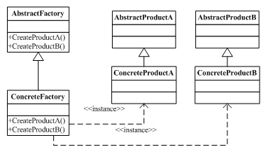

# Code Design Best Practices
At this point we're going to talk about the code design best practices.

## Index

* [Introduction](#introduction)
	* [Format](#format)
	* [Naming](#naming)
	* [Code Documentation](#code-documentation)
	* [Error processing](#error-processing)
	* [Concurrency](#concurrency)
	* [Tools](#tools)
		* [Documentation](#documentation)
		* [Naming and format](#naming-and-format)
* [Code design rules](#code-design-rules)
* [Code design patterns](#code-design-patterns)
* [Agile metodologies implications](#agile-metodologies-implications)
* [References](#references)

## Introduction

This guide's objective is help to developers to write a good code for improve the code readability and help to anybody to understand the code.

 

## Code Design Rules

### Format

* Tab correctly your code for improve the readability.
* Comment your code for tip to understand complex code or bucles.
* Don't use lines too larges.
* Don't use a lot of params in a method or functions. If there are a lot of params the design is bad and you should consider to use one class or object.
* Use with caution the copy & paste. When you copy a portion of code, think about is usefull use a method for it.
* If a method have a lot of lines, probably is better to divide in more methods to improve the readability and reusability of the code.
* Delete the variables not used anywhere, not only for performance reasons, also for readibility reasons.
* Use UTF-8.
* Replace tabs with spaces (Configure the ide or text editor).

### Naming
Use the same naming style for the code variables, functions, objects and constants improve the code readability and help to a team to understand easier the application code.

There are some recommendations dependant of the programming language, and others are common and usefull for all languages.

Some of common recomendations:

* Use english as common language for comments and naming for allow understand the code for everyone, no main where are they from.
* Use only letters (without accents or similar) and numbers and _ as separator.
* Doesn't start with numbers.
* The constants should be writted in upper cases.
* The names should be descriptive about the method, function or variable does.
* Variables should be in lower case.
* Functions and methods with lower case.

Recommendations based on the programming language:

* Java:
	* Classes must start with upper case.
	* For a class name with two or more words separate it with Upper Case. For example a class called "JavaWorker".
	* For a variable, method or function name separes words with upper case, with the first letter in lower case.
	* Separes one word from a number with _
* Python:
	* Separe the words in a variable, function or method name with the character _
	* Class names should be in lower case.

### Code Documentation

It's very important to document the code, to help to anybody to understand the code and how can use it. All programming languages allows document the code using comments in determinated format.

There are some considerations that you must have when you write the documentation:

* All classes and public methods and variables must be documented.
* Write usefull information about what a class or method does and how to use it.
* The functions and methods parameters should be included in the documentation with the possibles values and format expected. For example if is numeric, if is required or not, if is a text with some posible values...
* The posible return values must be included so, including the values returned when something's wrong
* If the function or method throws one or more exceptions is very important include it in the documentation.
* Use UTF-8 characters, don't use accents.
* Include the author of the comments. If one partner need to solve some dubts automatically know who develop it and can ask him for help.

### Error processing

Is very important to have one unique strategy for processing the errors of your application. For this goal, there are some common tips that you can consider to process the errors correctly in all posible situations.

* Define the error detail objetive. It's not the same one error for an developer or sysops person than an error to show to the client. An error for a client should help it about what can do to solve or who have to contact.
* Define a common object error for all project. All methods or function must use it for return the error.
* Define a error code list for the errors.
* If is an error which can be shown to the client, use this code list with a internationalitable file for the descriptions.
* Log correctly the error with all information available about this cause and when it occurred.
* Use a common format for all error logs.

### Concurrency

### Tools
There are a lot of tools that help you to improve your code design for all programming languages. It's very recommended to use them for help to mantain the same format in all project and prevent errors.

#### Documentation
The documentation tools make it possible to generate documentation directly from your source code. Each programming language have its own tools, some of them are:

* **Java**: [Javadoc](http://www.oracle.com/technetwork/articles/java/index-jsp-135444.html) 
* **Python**: [PyDoc](https://wiki.python.org/moin/PyDoc) 
* **Javascript**: [jsdoc toolkit](https://code.google.com/p/jsdoc-toolkit/) 
* **php**: [phpDocumentor](http://www.phpdoc.org/) 
* **Ruby**: [Rubydoc](http://ruby-doc.org/) 

#### Naming and format
There are a lot of tools to help to improve the code's quality and design. These tools allows to review the application code to find naming errors, variables not used, or to force to the developer to comment his methods and classes.

One of the most used tool for this goal is [Sonar](http://www.sonarqube.org/). Normally Sonar is installed in the server, configured for Continuous Integration with other tools (like Jenkins) and ensure that the code must be correct before the deployment.

Other tools that helps you depending on the programming language:

* **Java**: [Checkstyle](http://checkstyle.sourceforge.net/) and [PMD](https://pmd.github.io/) with maven plugin, allow to configure some configuration rules and test that your code is fine when you build your java application, preserving for deployment server errors. You should configure the same rules than sonar. Other usefull tool is [FindBugs](http://findbugs.sourceforge.net/) .
* **Python**: [Pylint](http://www.pylint.org/) 
* **PHP**: [PHPCheckstyle](https://github.com/PHPCheckstyle/phpcheckstyle) 

## Code Design Patterns
---
#### Introduction
The design patterns are solutions to common problems in the software development. They are defined by experienced programmers that seen a common ways to solve the similar problems.

A pattern is designed according to a template

In this point we are going to list the most common design patterns, and when we could use them.
#### Gang of four patterns
In 1994, four authors Erich Gamma, Richard Helm, Ralph Johnson and John Vlissides published a book titled Design Patterns - Elements of Reusable Object-Oriented Software which initiated the concept of Design Pattern in Software development.

These authors are collectively known as Gang of Four (GOF). According to these authors design patterns are primarily based on the following principles of object orientated design:

- Program to an interface not an implementation
- Favor object composition over inheritance

If you want more information you can visit the wikipedia page [Gang Of Four](https://en.wikipedia.org/wiki/Design_Patterns)

At this point we can define the following three categories of patterns:

##### Creational Patterns
These design patterns provide a way to create objects while hiding the creation logic, rather than instantiating objects directly using new opreator. This gives program more flexibility in deciding which objects need to be created for a given use case.

- **Abstract factory pattern**
 - Definition: abstract Factory patterns work around a super-factory which creates other factories. This factory is also called as factory of factories. This type of design pattern comes under creational pattern as this pattern provides one of the best ways to create an object.

   In Abstract Factory pattern an interface is responsible for creating a factory of related objects without explicitly specifying their classes. Each generated factory can give the objects as per the Factory pattern.
 
 - Design:
 
 
 - Applicability:
   - A system should be independent of how they are created, make up and represent their products.
   - A system must be configured with a family of products from several.
   - A family of related product objects is designed to be used jointly and is necessary to enforce this restriction.

 You can find more detailed explanation in this [link](https://en.wikipedia.org/wiki/Abstract_factory_pattern)
- **Builder pattern**
  - Definition: builder pattern builds a complex object using simple objects and using a step by step approach. This type of design pattern comes under creational pattern as this pattern provides one of the best ways to create an object.

   A Builder class builds the final object step by step. This builder is independent of other objects.

  - Design:
  

  - Applicability:
   - If a class has an internal complex structure.
   - If a class has dependant attributes each other
   - If a class uses other system objects that are difficult or inconvenient to obtain during its creation.

  You can find more detailed explanation in this [link](https://en.wikipedia.org/wiki/Builder_pattern)
- **Factory method pattern**
  - Definition: this type of design pattern comes under creational pattern as this pattern provides one of the best ways to create an object.

   In Factory pattern, we create object without exposing the creation logic to the client and refer to newly created object using a common interface.
 - Design:
  
 - Applicability:
   - When you want to create an extensible framework.
   - When you want to be a subclass instead of a superclass, that decides what kind of object must be created.
   - When you know when to create an object, but does not know the object type.

  You can find more detailed explanation in this [link](https://en.wikipedia.org/wiki/Factory_method_pattern)
- **Prototype pattern**
  - Definition: it facilitates dynamic creation to define classes whose objects can create copies of themselves.
  - Design:
  
  - Applicability:
    - The same as the definition.

 You can find more detailed explanation in this [link](https://en.wikipedia.org/wiki/Prototype_pattern)
- **Singleton pattern**
  - Definition: it allows a single instance of a class in the system, at a time that allows all classes have access to that **unique** instance.
  - Design:
  
  - Applicability:
    - To store configurations.
    - To cache objects in memory.

 You can find more detailed explanation in this [link](https://en.wikipedia.org/wiki/Singleton_pattern)

##### Structural Patterns
These design patterns concern class and object composition. Concept of inheritance is used to compose interfaces and define ways to compose objects to obtain new functionalities.

 - **Adapter pattern**
 - **Bridge pattern**
 - **Composite pattern**
 - **Decorator pattern**
 - **Facade pattern**
 - **Flyweight pattern**
 - **Proxy pattern**

##### Behavioral Patterns
These design patterns are specifically concerned with communication between objects.

 - **Chain of responsibility pattern**
 - **Command pattern**
 - **Interpreter pattern**
 - **Iterator pattern**
 - **Mediator pattern**
 - **Memento pattern**
 - **Observer pattern**
 - **State pattern**
 - **Strategy pattern**
 - **Template method pattern**
 - **Visitor pattern**

#### Integration Patterns
Introduction TO-DO

##### Integration Styles
TO-DO
##### Messaging Systems
TO-DO
##### Messaging Channels
TO-DO
##### Message Construction
TO-DO
##### Message Routing
TO-DO
##### Message Transformation
TO-DO
##### Messaging Endpoints
TO-DO
##### System Management
TO-DO

#### Anti-Patterns
Introduccion TO-DO
##### Software design
 - Abstraction inversion: Not exposing implemented functionality required by callers of a function/method/constructor, so that the calling code awkwardly re-implements the same functionality in terms of those calls
 - Ambiguous viewpoint: Presenting a model (usually Object-oriented analysis and design (OOAD)) without specifying its viewpoint
 - Big ball of mud: A system with no recognizable structure
 - Database-as-IPC: Using a database as the message queue for routine interprocess communication where a much more lightweight mechanism would be suitable
 - Gold plating: Continuing to work on a task or project well past the point at which extra effort is adding value
 - Inner-platform effect: A system so customizable as to become a poor replica of the software development platform
 - Input kludge: Failing to specify and implement the handling of possibly invalid input
 - Interface bloat: Making an interface so powerful that it is extremely difficult to implement
 - Magic pushbutton: A form with no dynamic validation, or input assistance such as dropdowns
 - Race hazard: Failing to see the consequences of events that can sometimes interfere with each other
 - Stovepipe system: A barely maintainable assemblage of ill-related components

##### Object-oriented programming

 - Anemic Domain Model: The use of the domain model without any business logic. The domain model's objects cannot guarantee their correctness at any moment, because their validation and mutation logic is placed somewhere outside (most likely in multiple places). Martin Fowler considers this to be an anti-pattern, but some disagree that it is always an anti-pattern.
 - BaseBean: Inheriting functionality from a utility class rather than delegating to it
 - Call super: Requiring subclasses to call a superclass's overridden method
 - Circle-ellipse problem: Subtyping variable-types on the basis of value-subtypes
 - Circular dependency: Introducing unnecessary direct or indirect mutual dependencies between objects or software modules
 - Constant interface: Using interfaces to define constants
 - God object: Concentrating too many functions in a single part of the design (class)
 - Object cesspool: Reusing objects whose state does not conform to the (possibly implicit) contract for re-use
 - Object orgy: Failing to properly encapsulate objects permitting unrestricted access to their internals
 - Poltergeists: Objects whose sole purpose is to pass information to another object
 - Sequential coupling: A class that requires its methods to be called in a particular order
 - Yo-yo problem: A structure (e.g., of inheritance) that is hard to understand due to excessive fragmentation

##### Programming

 - Accidental complexity: Programming tasks which could be eliminated with better tools (as opposed to essential complexity inherent in the problem being solved)
 - Action at a distance: Unexpected interaction between widely separated parts of a system
 - Blind faith: Lack of checking of (a) the correctness of a bug fix or (b) the result of a subroutine
 - Boat anchor: Retaining a part of a system that no longer has any use
 - Busy waiting: Consuming CPU while waiting for something to happen, usually by repeated checking instead of messaging
 - Caching failure: Forgetting to clear a cache that holds a negative result (error) after the error condition has been corrected
 - Cargo cult programming: Using patterns and methods without understanding why
 - Coding by exception: Adding new code to handle each special case as it is recognized
 - Design pattern: The use of patterns has itself been called an anti-pattern, a sign that a system is not employing enough abstraction
 - Error hiding: Catching an error message before it can be shown to the user and either showing nothing or showing a meaningless message. Also can refer to erasing the Stack trace during exception handling, which can hamper debugging.
 - Hard code: Embedding assumptions about the environment of a system in its implementation
 - Lasagna code: Programs whose structure consists of too many layers
 - Lava flow: Retaining undesirable (redundant or low-quality) code because removing it is too expensive or has unpredictable consequences
 - Loop-switch sequence: Encoding a set of sequential steps using a switch within a loop statement
 - Magic numbers: Including unexplained numbers in algorithms
 - Magic strings: Implementing presumably unlikely input scenarios, such as comparisons with very specific strings, to mask functionality.
 - Repeating yourself: Writing code which contains repetitive patterns and substrings over again; avoid with once and only once (abstraction principle)
 - Shotgun surgery: Developer adds features to an application codebase which span a multiplicity of implementors or implementations in a single change
 - Soft code: Storing business logic in configuration files rather than source code[8]
 - Spaghetti code: Programs whose structure is barely comprehensible, especially because of misuse of code structures

##### Methodological

 - Copy and paste programming: Copying (and modifying) existing code rather than creating generic solutions
 - Golden hammer: Assuming that a favorite solution is universally applicable (See: Silver bullet)
 - Improbability factor: Assuming that it is improbable that a known error will occur
 - Not Invented Here (NIH) syndrome: The tendency towards reinventing the wheel (failing to adopt an existing, adequate solution)
 - Invented here: The tendency towards dismissing any innovation or less than trivial solution originating from inside the organization, usually because of lack of confidence in the staff
 - Premature optimization: Coding early-on for perceived efficiency, sacrificing good design, maintainability, and sometimes even real-world efficiency
 - Programming by permutation (or "programming by accident", or "programming by coincidence"): Trying to approach a solution by successively modifying the code to see if it works
 - Reinventing the square wheel: Failing to adopt an existing solution and instead adopting a custom solution which performs much worse than the existing one
 - Silver bullet: Assuming that a favorite technical solution can solve a larger process or problem
 - Tester Driven Development: Software projects in which new requirements are specified in bug reports

##### Configuration management

 - Dependency hell: Problems with versions of required products
 - DLL hell: Inadequate management of dynamic-link libraries (DLLs), specifically on Microsoft Windows
 - Extension conflict: Problems with different extensions to pre-Mac OS X versions of the Mac OS attempting to patch the same parts of the operating system
 - JAR hell: Overutilization of multiple JAR files, usually causing versioning and location problems because of misunderstanding of the Java class loading model

## Agile metodologies implications
---

## [References](references)

* [Link](http://www.url.to) Description
* [oficialsite.org](http://www.oficialwebsite.org) API & Docs
* [Overapi Cheatsheet](http://overapi.com/example/) Cheatsheet

___

[BEEVA](http://www.beeva.com) | 2015
