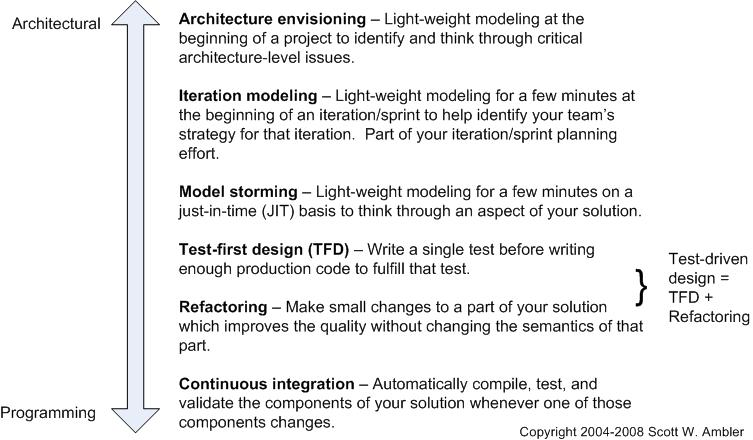
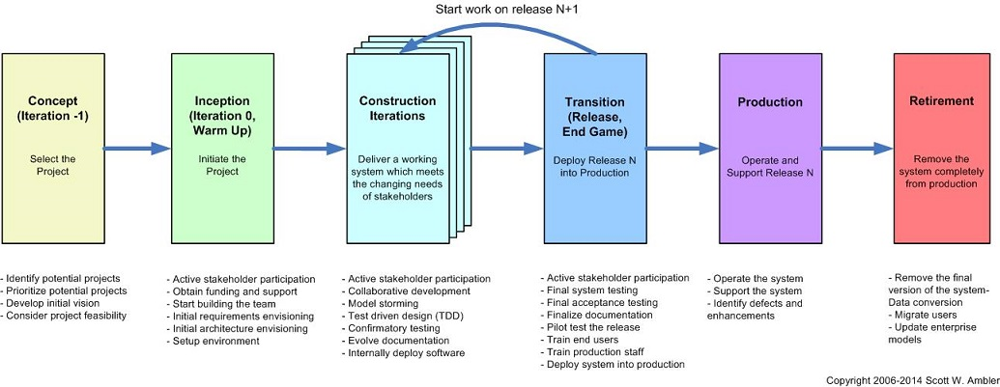
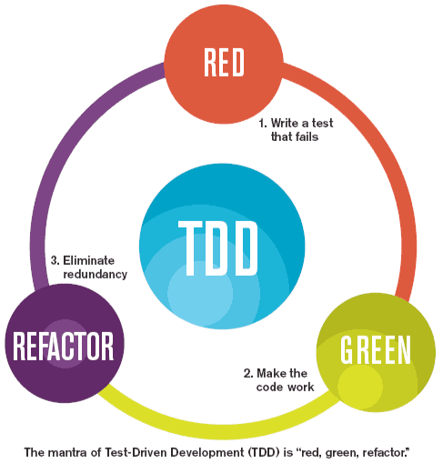

# Code Design Best Practices
At this point we're going to talk about the code design best practices.

## Index

* [Introduction](#introduction)
	* [Format](#format)
	* [Naming](#naming)
	* [Code Documentation](#code-documentation)
	* [Error processing](#error-processing)
	* [Concurrency](#concurrency)
	* [Tools](#tools)
		* [Documentation](#documentation)
		* [Naming and format](#naming-and-format)
* [Code design rules](#code-design-rules)
* [Code design patterns](#code-design-patterns)
* [Agile metodologies implications](#agile-metodologies-implications)
    * [Agile Design](#agile-design)
        * [Agile Design Practices](#agile-design-practices)
        * [Agile Design Philosophies](#agile-design-philosophies)
        * [Design Throughout The Agile Lifecycle](#design-throughout-the-agile-lifecycle)
    * [TDD](#tdd)
        * [The importance of testing](#the-importance-of-testing)
        * [How to make a correct application design](how-to-make-a-correct-application-design)
    * [BDD](#bdd)
* [References](#references)

## Introduction

This guide's objective is help to developers to write a good code for improve the code readability and help to anybody to understand the code.

 

## Code Design Rules

### Format

* Tab correctly your code for improve the readability.
* Comment your code for tip to understand complex code or bucles.
* Don't use lines too larges.
* Don't use a lot of params in a method or functions. If there are a lot of params the design is bad and you should consider to use one class or object.
* Use with caution the copy & paste. When you copy a portion of code, think about is usefull use a method for it.
* If a method have a lot of lines, probably is better to divide in more methods to improve the readability and reusability of the code.
* Delete the variables not used anywhere, not only for performance reasons, also for readibility reasons.
* Use UTF-8.
* Replace tabs with spaces (Configure the ide or text editor).

### Naming
Use the same naming style for the code variables, functions, objects and constants improve the code readability and help to a team to understand easier the application code.

There are some recommendations dependant of the programming language, and others are common and usefull for all languages.

Some of common recomendations:

* Use english as common language for comments and naming for allow understand the code for everyone, no main where are they from.
* Use only letters (without accents or similar) and numbers and _ as separator.
* Doesn't start with numbers.
* The constants should be writted in upper cases.
* The names should be descriptive about the method, function or variable does.
* Variables should be in lower case.
* Functions and methods with lower case.

Recommendations based on the programming language:

* Java:
	* Classes must start with upper case.
	* For a class name with two or more words separate it with Upper Case. For example a class called "JavaWorker".
	* For a variable, method or function name separes words with upper case, with the first letter in lower case.
	* Separes one word from a number with _
* Python:
	* Separe the words in a variable, function or method name with the character _
	* Class names should be in lower case.

### Code Documentation

It's very important to document the code, to help to anybody to understand the code and how can use it. All programming languages allows document the code using comments in determinated format.

There are some considerations that you must have when you write the documentation:

* All classes and public methods and variables must be documented.
* Write usefull information about what a class or method does and how to use it.
* The functions and methods parameters should be included in the documentation with the possibles values and format expected. For example if is numeric, if is required or not, if is a text with some posible values...
* The posible return values must be included so, including the values returned when something's wrong
* If the function or method throws one or more exceptions is very important include it in the documentation.
* Use UTF-8 characters, don't use accents.
* Include the author of the comments. If one partner need to solve some dubts automatically know who develop it and can ask him for help.

### Error processing

Is very important to have one unique strategy for processing the errors of your application. For this goal, there are some common tips that you can consider to process the errors correctly in all posible situations.

* Define the error detail objetive. It's not the same one error for an developer or sysops person than an error to show to the client. An error for a client should help it about what can do to solve or who have to contact.
* Define a common object error for all project. All methods or function must use it for return the error.
* Define a error code list for the errors.
* If is an error which can be shown to the client, use this code list with a internationalitable file for the descriptions.
* Log correctly the error with all information available about this cause and when it occurred.
* Use a common format for all error logs.

### Concurrency

### Tools
There are a lot of tools that help you to improve your code design for all programming languages. It's very recommended to use them for help to mantain the same format in all project and prevent errors.

#### Documentation
The documentation tools make it possible to generate documentation directly from your source code. Each programming language have its own tools, some of them are:

* **Java**: [Javadoc](http://www.oracle.com/technetwork/articles/java/index-jsp-135444.html) 
* **Python**: [PyDoc](https://wiki.python.org/moin/PyDoc) 
* **Javascript**: [jsdoc toolkit](https://code.google.com/p/jsdoc-toolkit/) 
* **php**: [phpDocumentor](http://www.phpdoc.org/) 
* **Ruby**: [Rubydoc](http://ruby-doc.org/) 

#### Naming and format
There are a lot of tools to help to improve the code's quality and design. These tools allows to review the application code to find naming errors, variables not used, or to force to the developer to comment his methods and classes.

One of the most used tool for this goal is [Sonar](http://www.sonarqube.org/). Normally Sonar is installed in the server, configured for Continuous Integration with other tools (like Jenkins) and ensure that the code must be correct before the deployment.

Other tools that helps you depending on the programming language:

* **Java**: [Checkstyle](http://checkstyle.sourceforge.net/) and [PMD](https://pmd.github.io/) with maven plugin, allow to configure some configuration rules and test that your code is fine when you build your java application, preserving for deployment server errors. You should configure the same rules than sonar. Other usefull tool is [FindBugs](http://findbugs.sourceforge.net/) .
* **Python**: [Pylint](http://www.pylint.org/) 
* **PHP**: [PHPCheckstyle](https://github.com/PHPCheckstyle/phpcheckstyle) 

## Code design patterns
---

## Agile metodologies implications

### Agile Design
Exist strategies that are critical for scaling agile software development to meet the real-world needs of modern IT organizations. The Agile approach to design is very different than the traditional approach, and apparently more effective too.

#### Agile Design Practices
There is a range of agile design practices, see Figure 1, from high-level architectural practices to low-level programming practices. Each of these practices are important, and each are needed if your team is to be effective at agile design.

#### Agile Design Philosophies

* **Agile designs are emergent, they’re not defined up front**. Your overall system design will emerge over time, evolving to fulfill new requirements and take advantage of new technologies. Although you will often do some initial architectural modeling at the very beginning of a project during “iteration 0” this will be just enough to get your team going. Agilists don’t need to get a fully documented set of models in place before you may begin coding.

* **Your unit tests form much of your detailed design documentation**. With a test-driven development (TDD) approach to development you write a test and then you write just enough domain code to fulfill that test. An important side effect of this approach is that your unit tests not only validate your code, they also form the majority of your design documentation in the form of executable specifications. 

* **Design models need** to be just barely good enough. You don’t need to model every single detail in your models, the models don’t need to be perfect, and they certainly don’t need to be complete. Remember the last time you coded from a design spec (if you ever did)? Did you really look at all the fine-grained details? No, because you were competent enough to handle the details yourself.

* **Multiple models** . Effective developers realize that each type of model has its strengths and weaknesses, therefore they need to apply the right model(s) for the job at hand. Because software development is complex you quickly realize that you need to know about a wide range of models in order to be effective. 

* **You typically only need a subset of the models.** Although there are many modeling techniques available to your, the fact is that any given project team will only require a subset. Think of it like this: in your toolbox at home you have a wide array of screwdrivers, wrenches, pliers, and so on. For any given repair job you will use only a few of the tools. Different jobs, different tools. You never need all of your tools at once, but over time you will use them in a variety of manners.

* **Each model can be used for a variety of purposes.** A UML class diagram can be used to depict a high-level domain model or a low-level design, not to mention things in between. Use cases can be used to model the essential nature of a process or the detailed system usage description which takes into account architectural decisions. Never underestimate how flexible you can be with models.

* **Designers should also code.** Whenever a model is handed over to someone else to code there is significant danger that the programmer will not understand the model, will miss some of its nuances, or may even ignore the model completely in favor of their own approach. Furthermore, even when hand-offs are successful you will discover that you need far more details in your models than if you had simply coded it yourself. In short, separating design from programming is a risky and expensive proposition. It is far more effective to have generalizing specialists on your team that can both design and code.

* **Prove it with code.** Never assume your design works; instead, obtain concrete feedback by writing code to determine if it does in fact work.

* **Feedback is your friend.** Never forget that you are a mere mortal just like everyone else on your team. Expect to receive feedback -- I suggest you actively seek it -- about your work and be prepared to consider it and act accordingly. Not only will your system be the better for it, you will likely learn something in the process.

* **Sometimes the simplest tool is a complex CASE tool.** When it comes to requirements I prefer inclusive tools such as paper and whiteboards, but when it comes to design I tend to lean towards sophisticated tools which (re)generate code for me. 

* **Iterate, iterate, iterate.** With an iterative approach to development you work a bit on requirements, do a bit of analysis, do a bit of design, some coding, some testing, and iterate between these activities as needed. You will also iterate back and forth between working on various artifacts, working on the right artifact at the right time. 

* **Design is so important you should do it every day.** It is critical to think through how you’re going to build something, to actually design it, before you build it. Your design efforts may take on the form of a sketch on a whiteboard, a detailed model created with a sophisticated modeling tool, or a simple test that you write before you write business code. Agile developers realize that design is so important that they do it every day, that design isn’t just a phase that you do early in the project before getting to the “real work” of writing the source code. 

* **Design for your implementation environment judiciously.** Take advantage of features of your implementation environment, but be smart about it. Trade-offs are normal, but understand the implications and manage the risks involved. Every time you take advantage of a unique performance enhancement in a product (such as a database, operating system, or middleware tool) you are likely coupling your system to that product and, thus, reducing its portability. To minimize the impact of your implementation environment on your systems, you can layer your software and wrap specific features to make them appear general to their users.

* **Document complicated things.** If it is complicated, then document it thoroughly. Better yet, invest the time to design it so it is simple.

* **Do not over document.** You need to document your design, but you shouldn’t over document either. Remember, users pay you to build systems, not to document them. There is a fine line between under documenting and over documenting, and only through experience are you able to find it. Be as agile as possible when it comes to documentation.

* **Don't get sidetracked by the data community.** Unfortunately many within the data community believe that you require a serial approach to design, particularly when it comes to databases. This belief is the result of either not understanding evolutionary development or some misguided need to identify the "one truth above all else". Evolutionary database design techniques such as agile data modeling, database refactoring, and database regression testing work incredibly well in practice. 

#### Design Throughout The Agile Lifecycle

Figure 2 depicts the generic agile software development lifecycle. For the sake of discussion, the important thing to note is that there is no design phase, nor a requirements phase for that matter, which traditionalists are familiar with. Agile developers will do some high-level architectural modeling during Iteration 0, also known as the warm-up phase, and detailed design during development iterations and even during the end game (if needed).

When a developer has a new requirement to implement they ask themselves if they understand what is being asked for. If not, then they do some just-in-time (JIT) "model storming" to identify a strategy for implementing the requirement. This model storming is typically done at the beginning of an iteration during the detailed planning effort for that iteration, or sometime during the iteration if they realize that they need to explore the requirement further. Part of this modeling effort will be analysis of the requirement as well as design of the solution, something that will typically occur on the order of minutes. In Extreme Programming (XP) they refer to this as a "quick design session".

If the team is taking a Test-Driven Development (TDD) approach the detailed design is effectively specified as developer tests, not as detailed models. Because you write a test before you write enough production code to fulfill that test you in effect think through the design of that production code as you write the test. Instead of creating static design documentation, which is bound to become out of date, you instead write an executable specification which developers are motivated to keep up to date because it actually provides value to them. This strategy is an example of the AM practice of single sourcing information, where information is captured once and used for multiple purposes. In this case for both detailed specification and for confirmatory testing.

When you stop and think about it, particularly in respect to Figure 2, TDD is a bit of a misnomer. Although your developer tests are "driving" the design of your code, your agile models are driving your overall thinking.

If you want more information you can read the book **Disciplined Agile Delivery** by Scott W. Ambler and Mark Lines.

### TDD

Test-driven development (TDD), also called test-driven design, is a method of software development in which unit testing is repeatedly done on source code. The concept is to "get something working now and perfect it later." After each test, refactoring is done and then the same or a similar test is performed again. The process is iterated as many times as necessary until each unit is functioning according to the desired specifications. Test-driven development is part of a larger software design paradigm known as Extreme Programming (XP).

#### The importance of testing

Any IT solution that is implemented without the proper amount of testing performed throughout the project is a definite recipe for disaster. Testing is an ongoing process. It happens in development, it happens in the actual testing phase, it happens just prior to deployment and it happens post-deployment.

Without a well-thought testing effort, the project will undoubtedly fail overall and will impact the entire operational performance of the solution. With a poorly tested solution, the support and maintenance cost will escalate exponentially, and the reliability of the solution will be poor. Therefore, project managers need to realize that the testing effort is a necessity, not merely as an ad hoc task that is the last hurdle before deployment.

Clients do not want a costly and stressful problem with software that doesn't work, isn't ready on time, does not meet specifications, impacts customers adversely.

Releasing any software with so many bugs into it may affects the user experience which makes bad impact on quality impression of your company brand. They will remember about the delivered bad quality product, so there will be Importance of testing which makes vital.

The aim of software testing is to ensure good quality software. Good quality software means it has less defects or issues, it works well, and does what it needs to do.

When you do software testing as part of a development project, you are aiming to pick up and find all of the issues in the system before it is release to the end users as part of the project deployment.

The best results for a project occur when testing is planned and related activities commenced at the start of a project.

In summary, the importance of software testing can be attributed to three areas – less maintenance, increased user morale, and matching to requirements. It results in high quality software which should be something all of us are aiming for.

#### How to make a correct application design
We propose TDD Mantra: **"red, green, refactor, repeat"**:

* **Adding a test**

    In the TDD process, each new feature begins with a developer writing a test. This test must inevitably fail because it is written before the feature has been implemented. If it does not fail, then either the proposed new feature already exists or the test is defective.

* **Running all tests to see if the new one fails**
    
    This validates that the test harness is working correctly and that the new test does not mistakenly pass without requiring any new code. The new test should fail for the expected reason.

* **Writing code**

    The next step is to write some code that will cause the test to pass. The new code written at this stage may not be perfect, however this is acceptable because steps made later will improve and hone it. It is important that the code written is only designed to pass the test.

* **Running successful automated tests**

    If all test cases now pass, the developer can be confident that the code meets all the tested requirements. This is a good point from which to begin the final step of the cycle - refactoring.

* **Refactoring the code**

    Now the code can be cleaned up (refactored) as necessary. By re-running the test cases, the developer can be confident that refactoring is not damaging any existing functionality. The concept of removing duplication is an important aspect of any software design.

* **Repeat**
    
    Starting with another new test, the cycle is then repeated to push forward the functionality. 

## [References](references)

* [Link](http://www.url.to) Description
* [oficialsite.org](http://www.oficialwebsite.org) API & Docs
* [Overapi Cheatsheet](http://overapi.com/example/) Cheatsheet

___

[BEEVA](http://www.beeva.com) | 2015
