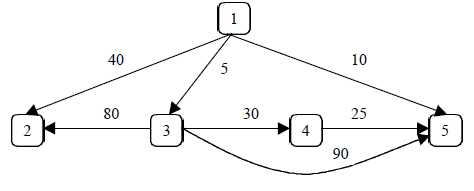
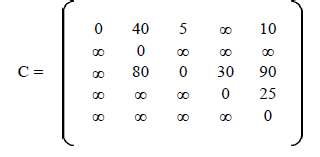
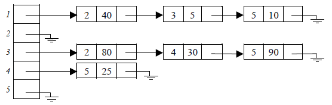
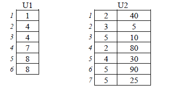

# Code Optimization Best Practices
At this point we're going to talk about the best practices for optimize the code.

## Index

* [Introduction](#introduction)
* [Concepts](#concepts)
	* [O Notation](#o-notation)
	* [Unnecessary code](#unnecessary-code)
		* [Dead store](#dead-store)
		* [Redundant code](#redundant-code)
		* [Duplicate code](#duplicate-code)
		* [Unreachable code](#unreachable-code)
		* [Oxbow code](#oxbow-code)
* [Simple Data Structures](#simple-data-structures)
	* [Route](#route)
	* [Searching](#searching)
		* [Sequential Search](#sequential-search)
		* [Probability Search](#probability-search)
	* [Ordering](#ordering)
	* [Constants propagation](#constants-propagation)
* [Recursivity](#recursivity)
* [Complex Data Structures](#complex-data-structures)
	* [Hash tables](#hash-tables)
	* [Trees](#trees)
	* [Graphs](#graphs)
* [Profiling](#profiling)
* [Instrumentation](#instrumentation)
* [Loop Optimization](#loop-optimization)
  * [Common Tips](#common-tips)
  * [Optimization via a sequence of loop transformations](#optimization-via a-sequence-of-loop-transformations)
    * [Common transformations](#common-transformations)
    * [Other transformations](#other-transformations)
  * [The unimodular transformation framework](#the-unimodular-transformation-framework)
  * [The polyhedral or constraint-based framework](#the-polyhedral-or-constraint-based-framework)
* [Efficient Exceptions Management](#efficient-exceptions-management)
* [Tools](#tools)
  * [Loggers](#loggers)
  * [Dead code detection](#dead-code-detection)
* [References](#references)


## Introduction

In computer science, program optimization or software optimization is the process of modifying a software system to make some aspect of it work more efficiently or use fewer resources.In general, a computer program may be optimized so that it executes more rapidly, or is capable of operating with less memory storage or other resources, or draw less power.
Therefore we must try to convert existing programs in other programs that perform the same tasks in less time, with less memory requirements, or generally use resources optimally. Optimization can make sense on several levels, from the lowest (circuit development, code writing machine designed especially for architecture) to the highest levels of processing implementation, use and design of algorithms.
One might reduce the amount of time that a program takes to perform some task at the price of making it consume more memory or an application where memory space is at a premium, one might deliberately choose a slower algorithm in order to use less memory always thinking what best fits our needs.

**Levels of optimization**

- Design level.

- Algorithms and data structures.

- Source code level.

- Build level.

- Compile level.

- Assembly level.

- Run time.

We mention some **techniques for optimizing software**:

- Adequately designing applications

- Choose good algorithms

- Choose an appropriate data structure.

- Try to squeeze the full potential of the hardware used.

- Reuse of code.

- Types of variables used.

- Clean code.

- Strength Reduction.

- Perspective.

- Know the compiler to optimize.

- Loop unrolling.

- Merger of cycles.

- Distribution of cycles.

- Exchange of cycles.


## Concepts

### O Notation

The O (pronounced big-oh) is the formal method of expressing the upper bound of an algorithm's running time. It's a measure of the longest amount of time it could possibly take for the algorithm to complete.

More formally, for non-negative functions, f(n) and g(n), if there exists an integer n_{0} and a constant c > 0 such that for all integers n>n_{0}, f(n) ≤ cg(n), then f(n) is Big O of g(n). This is denoted as "f(n) = O(g(n))". If graphed, g(n) serves as an upper bound to the curve you are analyzing, f(n).

Note that if f can take on finite values only (as it should happen normally) then this definition implies that there exists some constant C (potentially larger than c) such that for all values of n, f(n) ≤ Cg(n). An appropriate value for C is the maximum of c and  \max_{1\le n\le n_0} f(n)/g(n).

Some examples of Big O notation include:

| Notation | Name | Examples |
|:-------------------|:--------|:-------------------:|
|  O(1) 	|  constant 	|   Determining if a number is even or odd; Using a constant-size lookup table; Using a suitable hash function for looking up an item. |
|O(log n)| 	logarithmic | 	Finding an item in a sorted array with a binary search or a balanced search tree as well as all operations in a Binomial heap.|
|O(n) | 	linear | Finding an item in an unsorted list or a malformed tree (worst case) or in an unsorted array; Adding two n-bit integers by ripple carry.|
| O(n log n) | 	linearithmic, loglinear, or quasilinear|Performing a Fast Fourier transform; heapsort, quicksort (best and average case), or merge sort|
|O(n^2) | 	quadratic |	Multiplying two n-digit numbers by a simple algorithm; bubble sort (worst case or naive implementation), Shell sort, quicksort (worst case), selection sort or insertion sort|
| O(c^n) , c>1 |	exponential | Finding the (exact) solution to the travelling salesman problem using dynamic programming; determining if two logical statements are equivalent using brute-force search |


Big O notation characterizes functions according to their growth rates: different functions with the same growth rate may be represented using the same O notation. The letter O is used because the growth rate of a function is also referred to as order of the function. A description of a function in terms of big O notation usually only provides an upper bound on the growth rate of the function. Associated with big O notation are several related notations, using the symbols o, Ω, ω, and Θ, to describe other kinds of bounds on asymptotic growth rates.

Big O notation is also used in many other fields to provide similar estimates

For more information click [here][linkonotation] .

[linkonotation]: https://en.wikipedia.org/wiki/Big_O_notation


### Unnecessary code

Several types of unnecessary code which would have to proceed to its removal:

#### Dead store

In computer programming, a local variable that is assigned a value but is not read by any subsequent instruction is referred to as a dead store. Dead stores waste processor time and memory, and may be detected through the use of static program analysis.

```Java
        DeadStoreExample

        import java.util.ArrayList;
        import java.util.Arrays;
        import java.util.List;

        public class DeadStoreExample {
         public static void main(String[] args) {
           List list = new ArrayList(); // This is a Dead Store, as the ArrayList is never read.
           list = getList();
           System.out.println(list);
         }

         private static List getList() {
           return new ArrayList(Arrays.asList("Hello"));
         }
        }

```

#### Redundant code

Redundant code is source code or compiled code in a computer program that is unnecessary, such as recomputing a value that has previously been calculated[1] and is still available, code that is never executed (known as unreachable code), or code which is executed but has no external effect (e.g., does not change the output produced by a program; known as dead code).

```Java
        int foo(int iX)
        {
            int iY = iX*2;

            return iX*2;
        }
```

The second iX\*2 expression is redundant code and can be replaced by a reference to the variable iY. Alternatively, the definition int iY = iX\*2 can instead be removed.

#### Duplicate code

Duplicate code is a sequence of source code that occurs more than once, either within a program or across different programs owned or maintained by the same entity. Duplicate code is generally considered undesirable for a number of reasons.A minimum requirement is usually applied to the quantity of code that must appear in a sequence for it to be considered duplicate rather than coincidentally similar. Sequences of duplicate code are sometimes known as code clones or just clones, the automated process of finding duplications in source code is called clone detection.

#### Unreachable code

Unreachable code is part of the source code of a program which can never be executed because there exists no control flow path to the code from the rest of the program.

Unreachable code is sometimes also called dead code, although dead code may also refer to code that is executed but has no effect on the output of a program.

```Java
        int foo (int iX, int iY)
         {
          return iX + iY;
          int iZ = iX*iY;
         }
```

The definition int iZ = iX\*iY; is never reached as the function returns before the definition is reached. Therefore the definition of iZ can be discarded.

#### Oxbow code

Oxbow code refers to fragments of program code that were once needed but which are now never used. Such code is typically formed when a program is modified, either when an item is superseded with a newer version but the old version is not removed, or when an item is removed or replaced, but the item's supporting code is not removed.

## Simple Data Structures

### Route

Traversing a singly linked list is the same as that of traversing a doubly linked
list . You start at the head of the list and continue until you
come across a node that is ∅. The two cases are as follows:
1. node = ∅, we have exhausted all nodes in the linked list; or
2. we must update the node reference to be node.Next.
The algorithm described is a very simple one that makes use of a simple
while loop to check the first case.

```
	1. algorithm Traverse(head)
	2. 	Pre: head is the head node in the list
	3. 	Post: the items in the list have been traversed
	4. 	n ← head
	5. 	while n 6= 0
	6. 		yield n.Value
	7. 		n ← n.Next
	8. 	end while
	9. end Traverse
```
### Searching

#### Sequential Search

A simple algorithm that search for a specific item inside a list. It operates looping on each element O(n) until a match occurs or the end is reached.

```
	1.  algorithm SequentialSearch(list, item)
	2. 	 Pre: list 6= ∅
	3. 	 Post: return index of item if found, otherwise −1
	4.	 index ← 0
	5.	 while index < list.Count and list[index] 6= item
	6. 		 index ← index + 1
	7.	 end while
	8.	 if index < list.Count and list[index] = item
	9. 		 return index
	10.	end if
	11.	return −1
	12. end SequentialSearch
```
#### Probability Search

Probability search is a statistical sequential searching algorithm. In addition to    searching for an item, it takes into account its frequency by swapping it with it’s predecessor in the list. The algorithm complexity still remains at O(n) but in a non-uniform items search the more frequent items are in the first positions, reducing list scanning time.

```
	1.	 algorithm ProbabilitySearch(list, item)
	2.		 Pre: list 6= ∅
	3.		 Post: a boolean indicating where the item is found or not; in the former case swap 				founded item with its predecessor
	4.		 index ← 0
	5.		 while index < list.Count and list[index] 6= item
	6.			 index ← index + 1
	7.		 end while
	8.		 if index ≥ list.Count or list[index] 6= item
	9.			 return false
	10.		end if
	11.		if index > 0
	12.			Swap(list[index], list[index − 1])
	13.		end if
	14.		return true
	15.	end ProbabilitySearch
```

### Ordering

The most popular algorithms are, click on each to learn more about them:

[Bubble Sort][linkbubbleSort] , [Merge Sort][linkmergeSort] , [Quick Sort][linkquickSort] , [Insertion Sort][linkinsertionSort], [Shell Sort][linkshellSort] and
[Radix Sort][linkradixSort] .

[linkbubbleSort]: https://en.wikipedia.org/wiki/Bubble_sort
[linkmergeSort]: https://en.wikipedia.org/wiki/Merge_sort
[linkquickSort]: https://en.wikipedia.org/wiki/Quicksort
[linkinsertionSort]: https://en.wikipedia.org/wiki/Insertion_sort
[linkshellSort]: https://en.wikipedia.org/wiki/Shellsort
[linkradixSort]: https://en.wikipedia.org/wiki/Radix_sort


### Constants propagation

Constant propagation is the process of substituting the values of known constants in expressions at compile time. Such constants include those defined above, as well as intrinsic functions applied to constant values.

Example:

In the code fragment below, the value of x can be propagated to the use of x.

```Java
        x = 4;
        y = x + 5;
```

Below is the code fragment after constant propagation and constant folding.

```Java
        x = 4;
        y = 9;
```

Some compilers perform constant propagation within basic blocks; some compilers perform constant propagation in more complex control flow.

Some compilers perform constant propagation for integer constants, but not floating-point constants.

Few compilers perform constant propagation through bitfield assignments.
Few compilers perform constant propagation for address constants through pointer assignments.

For more information click [here][linkconstantspropagation] .

[linkconstantspropagation]: https://en.wikipedia.org/wiki/Constant_folding


## Recursivity

Recursion in computer science is a method where the solution to a problem depends on solutions to smaller instances of the same problem (as opposed to iteration).The approach can be applied to many types of problems, and recursion is one of the central ideas of computer science.

"The power of recursion evidently lies in the possibility of defining an infinite set of objects by a finite statement. In the same manner, an infinite number of computations can be described by a finite recursive program, even if this program contains no explicit repetitions."

Most computer programming languages support recursion by allowing a function to call itself within the program text. Some functional programming languages do not define any looping constructs but rely solely on recursion to repeatedly call code. Computability theory proves that these recursive-only languages are Turing complete; they are as computationally powerful as Turing complete imperative languages, meaning they can solve the same kinds of problems as imperative languages even without iterative control structures such as “while” and “for”.

When we write a method for solving a particular problem, one of the basic design techniques is to break the task into smaller subtasks. For example, the problem of adding (or multiplying) n consecutive integers can be reduced to a problem of adding (or multiplying) n-1consecutive integers:

```Java
        1 + 2 + 3 +... + n = n + [1 + 2 + 3 + .. + (n-1)]

        1 * 2 * 3 *... * n = n * [1 * 2 * 3 * .. * (n-1)]
```

Therefore, if we introduce a method sumR(n) (or timesR(n)) that adds (or multiplies) integers from 1 to n, then the above arithmetics can be rewritten as

```Java
        sumR(n) = n + sumR(n-1)

        timesR(n) = n * timesR(n-1)
```

Such functional definition is called a recursive definition, since the definition contains a call to itself. On each recursive call the argument of sumR(n) (or timesR(n)) gets smaller by one. It takes n-1 calls until we reach the base case - this is a part of a definition that does not make a call to itself. Each recursive definition requires base cases in order to prevent infinite recursion.
In the following example we provide iterative and recursive implementations for the addition and multiplication of n natural numbers.

```Java

        public int sum(int n)                   public int sumR(int n)
        {                                       {
           int res = 0;                           if(n == 1)
           for(int i = 1; i = n; i++)                return 1;
              res = res + i;                      else
                                                     return n + sumR(n-1);
           return res;                          }
        }

```

To solve a problem recursively means that you have to first redefine the problem in terms of a smaller subproblem of the same type as the original problem. In the above summation problem, to sum-up n integers we have to know how to sum-up n-1 integers. Next, you have to figure out how the solution to smaller subproblems will give you a solution to the problem as a whole. This step is often called as a recursive leap of faith. Before using a recursive call, you must be convinced that the recursive call will do what it is supposed to do. You do not need to think how recursive calls works, just assume that it returns the correct result.

For more information click [here][linkrecursivity] .

[linkrecursivity]: https://en.wikipedia.org/wiki/Recursion_(computer_science)

## Complex Data Structures
### Hash tables

A Hash table is simply an array that is addressed via a hash function.

Hash tables are a simple and effective method to implement dictionaries. Average time to search for an element is **O(1)**, while worst-case time is **O(n)**.

A Hash table needs the following:

 - A data structure to hold the data.
 - A hashing function to map keys to locations in the data structure.
 - A collision-resolution policy that specifies what should be done when keys collide.

It is recommended to use Hash tables when you need faster searches in your data with this conditions:

 - The hash table occupation is not elevated.
 - We use a function that generates uniformly distributed keys.

This operations may be slower in Hash tables:

 - Browse all elements of the Hash.
 - Rescaling the Hash size.

You can find more information [here][linkhashtable]

[linkhashtable]:https://en.wikipedia.org/wiki/Hash_table

### Trees

Trees are highly recursive data structures that you can use to store **hierarchical data and model decision processes**.

A tree is a structure compounded with nodes, each node have the data and the relations with others nodes:

 - **Root** (or actual node if we are walking on the tree).
 - **Children** (relationship with their lower nodes).
 - **Leaf** is a node without children.

All the trees have a principal **root node**, that is the upper node in the tree.

The common cases of use are:

 - File systems.
 - Ordering lists.
 - Binary indexes in databases.
 - Decision trees.

There are different types of trees based on their use. We are not going to describe how to implement this data structure, we will only talk about the performance properties.

You can find more information [here][linktrees]
[linktrees]: https://en.wikipedia.org/wiki/Tree_(data_structure)

#### Binary trees

In this design we only have two children per node.

Binary trees are useful in many algorithms, partly because lots of problems can be modeled using binary choices and partly because binary trees are relatively easy to understand.

 - Searching operations on a **perfect tree** (a full tree where all the leaves are at the same level). that contains N nodes from the root to a leaf node, you must know that the algorithm needs only **O(log(N))** steps.
 - For randomly inserted data, search time is **O(lgn)**.
 - Worst-case behavior occurs when ordered data is inserted. In this case the search time is **O(n)**.

You can find more information [here][linkbinarytrees]
[linkbinarytrees]: https://en.wikipedia.org/wiki/Binary_tree

#### Balanced trees (AVL)

An AVL tree is a sorted binary tree in which the heights of two subtrees at any given node differ by at most 1. When a node is added or removed, the tree is rebalanced if necessary to ensure that the subtrees again have heights differing by at most 1.

Like other sorted trees, balanced trees let a program store and find values quickly. By keeping themselves balanced, ensure that they don’t grow too tall and thin, which would ruin their performance.

The better property of this types of trees is in their design, they are optimized for searches, trying to get the **perfect tree** approaching and their benefits.

Adding and removing values in a balanced tree takes longer than it does in an ordinary (nonbalanced) sorted tree. Those operations still take only **O(log N)** time, however, so the theoretical run time is the same even if the actual time is slightly longer. Spending that extra time lets the algorithm guarantee that those operations don’t grow to linear time.

You can find more information [here][linkavltrees]
[linkavltrees]: https://en.wikipedia.org/wiki/AVL_tree

#### Decision trees

You can use to model situations where you can solve a problem by making a series of decisions.

 1. Each branch in the tree represents a single choice.
 2. A leaf node represents a complete set of decisions that produces a final solution.
 3. The goal is to find the best possible set of choices or the best leaf node in the tree.

Decision trees are extremely useful and can model all sorts of situations where you can use a series of steps to produce a solution. Unfortunately, decision trees are often truly enormous.

Thinking about the problem as a general decision tree may be a mistake, because it might make you miss the simplifications that let you solve the problem efficiently.

Still, decision trees are a powerful technique that you should at least consider if you don’t know of a better approach to a problem.

You can find more information [here][linkdecisiontrees]
[linkdecisiontrees]: https://en.wikipedia.org/wiki/Decision_tree

### Graphs

#### Undirected Graphs

A graph is a set of **vertices** and a collection of **edges** that each connect a pair of **vertices**.

If vertices A and vertices B are directly connected by a edges, they are adjacent and are called neighbors.

Unlike the case with a tree, a graph has no root node, although there may be particular vertices of interest, depending on the graph. Essentially, a tree is a special type of graph.

A **path** in a graph is a sequence of vertices connected by edges:

 - A **simple path** is one with no repeated vertices.
 - A **cycle** is a path with at least one edge whose first and last vertices are the same.
 - A **simple cycle** is a cycle with no repeated edges or vertices (except the requisite repetition of the first and last vertices).
 - The length of a path or a cycle is its number of edges.

There are algorithms commonly used in graphs for search vertices based on our interests:

 - **Depth-first search**

	First we choose any vertex and expand the adjacent vertices. Next the process repeats for each adjacent until all the nodes in this path are visited, and then select another path until all vertices are visited.

	The execution time is **O(|V|+|E|)** where V are the number of vertices and E the number of edges.

 - **Breadth-first search**

	First we choose any vertex and then visit all the adjacent vertices. Next the process repeats for each adjacent until all the vertices are visited.

	The execution time is **O(|V|+|E|)** where V are the number of vertices and E the number of edges.

#### Directed Graphs

A directed graph (or digraph) is a set of vertices and a collection of directed edges. Each directed edge connects an ordered pair of vertices.

This can be represented in many ways. For the following directed graph:



 - **Adjacent Matrix**

	

    Each element in the matrix have the weight of the edge, the file represent the origin vertex, and the column the destination vertex.

	- Advantages

		 - The access time to an element of the adjacency matrix is independent of the number of vertices and edges: **O(1)**.
		 - It supports adding and deleting arcs.
		 - Besides representing simple graphs, can represent some multiple graphs (which they are as much a loop at its vertices).

	- Disavantages

		- It is a system that applies only to graphs in which the number of vertices is not changed (in a parent can not add or delete rows and columns).
		- It can produce a great waste of memory in sparse directed graph, that is, those graphs that possess a large number of vertices and a small number of arcs, as the adjacency matrix n<sup>2</sup> always occupy memory elements, regardless of the number Arch. Also, examine the entire array will take time **O(n<sup>2</sup>)**, which invalidates algorithms **O(n)** for handling directed graphs with **O(n)** arches.

 - **Adjacent Lists**

	

	In this representation, each vertex of the graph will have an associated adjacency list, which contains all those vertices that are adjacent to it.

	- Advantages

		- The representation of a directed graph with adjacency lists requires a space proportional to the sum of the number of vertices plus the number of arcs: **O(n + a)**, which makes it use enough when the graph is sparse.
		- It supports adding and deleting arcs.
		- You can add and delete vertices of the graph if a variant is used: the list of lists adjacency. In this case, the vertices are in a list instead of an array, which makes possible to insert new vertices.
		- Can represent any multiple graph.

	- Disavantages

		- Takes **O(n)** to determine if there is an arc from vertex i to vertex j, as it can be **O(n)** vertices in the adjacency list associated with the vertex i.
		- Because pointers and tags the vertices on the arches, this representation may come to occupy more memory than the adjacency matrix for dense graphs.

 - **Two vectors**

	

	This system of representation is very suitable for static graphs. Two vectors are used, U1 and U2. If the graph is of order n (has n vertices), the vector U1 will be n + 1 elements, which shall be to U2 vector positions. The vector U2 have as many elements (labels of adjacent vertices and weight corresponding) arc as arcs have the graph. Vertices adjacent to vertex i will find one after another in the vector U2 from the position U1 [i] and to U1 [i + 1] -1 position.

	- Advantages

		- Especially suitable for static and sparse graphs by saving memory provided in this case (greater than the adjacency list).
		- Can represent any multiple graph.

	- Disavantages

		- Takes **O(n)** to determine if there is an arc from vertex i to vertex j.
		- Can occupy more memory than the adjacency matrix for dense graphs.
		- Only applicable for static graphs: You can not add or vertices or arcs.


You can find more information about graphs [here][linkundirectedgraph]
[linkundirectedgraph]: https://en.wikipedia.org/wiki/Graph_(abstract_data_type)

## Profiling

Profiling is a set of techniques/tools that may help with software optimization. This is a technology based on tracking all the program parts, that may help us to find bottlenecks in our code.

Normally we may have different approaches:

1. Analize an application/software code executions in stress tests:
	 - The process must be executed **before** launch an application/software in production.
	 - The process must be launched until the critical bottlenecks are solved.

2. Active profiling or software of introspection.
	- This is a kind of software that makes an introspection over the existent production code and system, this means that you can track every software components in real-time.
	- The analysis of this metrics have a direct impact on the overall execution code (+/-5%).
	- There are many hardware dedicated to minimize the impact on the execution application.

This kind of software makes easier to find performance issues in our programs, and it helps also to make more accurate decisions about the infrastructures, because we can know how the application system requirements grow in time.

You can find more information in [wikipedia](linkprofiling)
[linkprofiling]: https://en.wikipedia.org/wiki/Profiling_(computer_programming)

## Loop Optimization
Loop optimization is the process of the increasing execution speed and reducing the overheads associated of loops. As the most execution time of a application is spent on loops,  a lot of optimization techniques have been developed to make them faster.

### Common tips

* Try to avoid ending conditions of loops with unnecessary calculations, because its will be calculated in each loop iteration.
* By the same reason, is interesting initialize the common variables out of the loop.

### Optimization via a sequence of loop transformations
Loop optimization can be defined like the application of a sequence of loop transformations. A transformation or sequence of them must preserve the temporal sequence of all dependencies to preserve the result of the application. Is difficult to evaluate the benefits of a transformations and the use of one beneficial transformation may require to use of other transformations that by themselves may result in reduced performance.

#### Common transformations

* **[fission/distribution](https://en.wikipedia.org/wiki/Loop_fission)**: Attempts to break a loop into multiple loops over the same index range but each taking only a part of the loop's body. This can improve locality of reference, both of the data being accessed in the loop and the code in the loop's body.
* **[fusion/combining](https://en.wikipedia.org/wiki/Loop_fusion)**: Attempts to reduce loop overhead. When two adjacent loops would iterate the same number of times (whether or not that number is known at compile time), their bodies can be combined as long as they make no reference to each other's data.
* **[interchange/permutation](https://en.wikipedia.org/wiki/Loop_interchange)**: Exchanges inner loops with outer loops. When the loop variables index into an array, such a transformation can improve locality of reference, depending on the array's layout.
* **[inversion](https://en.wikipedia.org/wiki/Loop_inversion)**: Changes a standard while loop into a do/while (repeat/until) loop wrapped in an if conditional, reducing the number of jumps by two for cases where the loop is executed. Doing so duplicates the condition check (increasing the size of the code) but is more efficient because jumps usually cause a pipeline stall. Additionally, if the initial condition is known at compile-time and is known to be side-effect-free, the if guard can be skipped.
* **[loop-invariant code motion](https://en.wikipedia.org/wiki/Loop-invariant_code_motion)** : If a quantity is computed inside a loop during every iteration, and its value is the same for each iteration, it can vastly improve efficiency to hoist it outside the loop and compute its value just once before the loop begins. This is particularly important with the address-calculation expressions generated by loops over arrays. For correct implementation, this technique must be used with loop inversion, because not all code is safe to be hoisted outside the loop.
* **[parallelization](https://en.wikipedia.org/w/index.php?title=Loop_parallelization&action=edit&redlink=1)**: A special case for automatic parallelization focusing on loops, restructuring them to run efficiently on multiprocessor systems. It can be done automatically by compilers (named automatic parallelization) or manually (inserting parallel directives like OpenMP).
* **[reversal](https://en.wikipedia.org/w/index.php?title=Loop_reversal&action=edit&redlink=1)**: Reverses the order in which values are assigned to the index variable. This is a optimization which can help eliminate dependencies and thus enable other optimizations. Also, certain architectures utilize looping constructs at assembly language level that count in a single direction only (e.g. decrement-jump-if-not-zero (DJNZ)).
* **[scheduling](https://en.wikipedia.org/wiki/Loop_scheduling)**: Divides a loop into multiple parts that may be run concurrently on multiple processors.
* **[skewing](https://en.wikipedia.org/wiki/Loop_skewing)**: Loop skewing takes a nested loop iterating over a multidimensional array, where each iteration of the inner loop depends on previous iterations, and rearranges its array accesses so that the only dependencies are between iterations of the outer loop.
* **[software pipelining](https://en.wikipedia.org/wiki/Software_pipelining)**: A type of out-of-order execution of loop iterations to hide the latencies of processor function units.
* **[splitting/peeling](https://en.wikipedia.org/wiki/Loop_splitting)**: Loop splitting attempts to simplify a loop or eliminate dependencies by breaking it into multiple loops which have the same bodies but iterate over different contiguous portions of the index range. A useful special case is loop peeling, which can simplify a loop with a problematic first iteration by performing that iteration separately before entering the loop.
* **[tiling/blocking](tiling/blocking)**: Loop tiling reorganizes a loop to iterate over blocks of data sized to fit in the cache.
* **[vectorization](https://en.wikipedia.org/wiki/Automatic_vectorization)**: Attempts to run as many of the loop iterations as possible at the same time on a multiple-processor system.
* **[unrolling](https://en.wikipedia.org/wiki/Loop_unrolling)**: Duplicates the body of the loop multiple times, in order to decrease the number of times the loop condition is tested and the number of jumps, which may degrade performance by impairing the instruction pipeline. Completely unrolling a loop eliminates all overhead (except multiple instruction fetches & increased program load time), but requires that the number of iterations be known at compile time. Care must also be taken to ensure that multiple re-calculation of indexed variables is not a greater overhead than advancing pointers within the original loop.
* **[unswitching](https://en.wikipedia.org/wiki/Loop_unswitching)**: Moves a conditional inside a loop outside of it by duplicating the loop's body, and placing a version of it inside each of the if and else clauses of the conditional.

#### Other transformations

* **[sectioning](https://en.wikipedia.org/w/index.php?title=Loop_sectioning&action=edit&redlink=1)**: The loop-sectioning (also called strip-mining) is a loop-transformation technique for enabling SIMD-encodings of loops and improving memory performance. This technique involves each vector operation being done for a size less than or equal to the maximum vector length on a given vector machine.

### The unimodular transformation framework

The unimodular transformation approach uses a single unimodular matrix to describe the combined result of a sequence of many of the above transformations. Central to this approach is the view of the set of all executions of a statement within n loops as a set of integer points in an n-dimensional space, with the points being executed in lexicographical order. For example, the executions of a statement nested inside an outer loop with index i and an inner loop with index j can be associated with the pairs of integers (i, j). The application of a unimodular transformation corresponds to the multiplication of the points within this space by the matrix.

A unimodular transformation is legal if it preserves the temporal sequence of all dependencies; measuring the performance impact of a unimodular transformation is more difficult. Imperfectly nested loops and some transformations (such as tiling) do not fit easily into this framework.

### The polyhedral or constraint-based framework

The polyhedral model handles a wider class of programs and transformations than the unimodular framework. The set of executions of a set of statements within a possibly imperfectly nested set of loops is seen as the union of a set of polytopes representing the executions of the statements. Affine transformations are applied to these polytopes, producing a description of a new execution order. The boundaries of the polytopes, the data dependencies, and the transformations are often described using systems of constraints, and this approach is often referred to as a constraint-based approach to loop optimization. For example, a single statement within an outer loop 'for i := 0 to n' and an inner loop 'for j := 0 to i+2' is executed once for each (i, j) pair such that 0 <= i <= n and 0 <= j <= i+2.

You can find more information at [Wikipedia](https://en.wikipedia.org/wiki/Loop_optimization).

## Efficient Exceptions Management
The exception management may be performance expensive, is better write proactive code which verifies some conditions that eventually may produces exceptions. There are some examples for this:

* If you need divide by a variable, is more efficient test if the divider is 0 than management an exception.
* Also is better test a correct format for a variable than make a cast and catch the error.

## Tools

### Loggers
All programming languages have systems to print information, but in the most of cases isn't efficient use it for print information, because these operations are synchronous and slow. Each programming language have its own libraries to process log messages and allows to save it at disk and/or screen and configure a determined format. Its very recommended use these libraries for improve the performance and manage the log levels unifying the log styles.

For improve the performance of your application is recommended that in production environments only show logs with level INFO, WARN and ERROR. For this goal its important that when you develop your application and you want to log something think about if is usefull information and if is better use debug or info level. Try to avoid print large objects or huge amount information if isn't really necesary, this type of information may be usefull when you are trying your code in local mode or development environments, but in production environments normally penalize the performance and complicate the understanding or reading of the logs.

### Dead code detection
At above section we talk about [dead code or unreachable code](#unreachable-code). There are some tools can you help to discover and remove it in all programming languages. There are some of them:

* **Java**:
  * For dynamic code analysis exists a tool [Cobertura](http://cobertura.github.io/cobertura/) that is easy to configure in maven and Jenkins tools.
  * [UCDetector](http://www.ucdetector.org/) is a Eclipse Plugin to find unnecesary public java code like classes methods or fields which have no references.
* **Python**: [coverage.py](http://coverage.readthedocs.org/en/latest/) is a dynamic code analyzer thats call the code to detect unreachable code.
* **JavaScript**: There are some tools that help to detect unreachable code:
  * [JSHint](http://jshint.com/about/) is a static code analysis tool for JavaScript.
  * [Closure](https://developers.google.com/closure/compiler/) is a compiler for JavaScript that parses your JavaScript, analyzes it, removes dead code and rewrites and minimizes what's left. It also checks syntax, variable references, and types, and warns about common JavaScript pitfalls.


### References

* [O Notation](https://en.wikipedia.org/wiki/Big_O_notation)
* [Sorting Algoritms](https://en.wikipedia.org/wiki/Sorting_algorithm)
* [Recursion](https://en.wikipedia.org/wiki/Recursion_(computer_science))
* [Hashtable](https://en.wikipedia.org/wiki/Hash_table)
* [Trees](https://en.wikipedia.org/wiki/Tree_(data_structure))
* [Graphs](https://en.wikipedia.org/wiki/Graph_(abstract_data_type))
* [Profiling](https://en.wikipedia.org/wiki/Profiling_(computer_programming))
* [Loop optimization](https://en.wikipedia.org/wiki/Loop_optimization)

___

[BEEVA](http://www.beeva.com) | 2015
